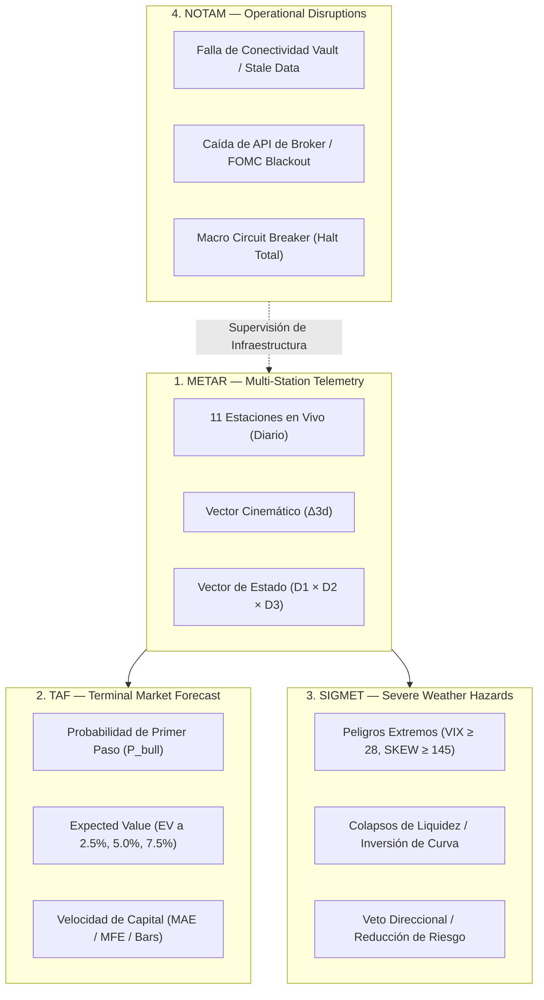

# Mapa de Arquitectura del METAR y Mediciones de Señales (v2.0)

> **Status:** `PRODUCTION & RESEARCH CALIBRATED`  
> **Última Actualización:** 01-Sep-2026 (Post-Auditoría y Corrección Consolidada)  
> **Alcance:** Sistema METAR, Estaciones de Telemetría, Arnés de Medición y Catálogo de Señales Derivadas.

---

## 1. Jerarquía Aeronáutica de 4 Niveles (Standard Operacional)

Todo el subsistema de telemetría de mercado, pronóstico de horizonte, alertas de peligro y control de disrupción se rige por la taxonomía aeronáutica institucional:



| Nivel | Propósito | Frecuencia | Salida Operacional | Endpoint REST |
|---|---|---|---|---|
| **`METAR`** | Observación objetiva del clima financiero multivariable. | Continua / Diaria | Vector tridimensional ($D1 \times D2 \times D3$) por estación + Z-scores crudos. | `/api/metar/{station}`, `/api/metar/all` |
| **`TAF`** | Pronóstico estocástico de resolución a corto/mediano plazo. | Derivado de METAR | $P_{\text{bull}}$, EV neto, Profit Factor, Horizontes temporales (zz25, zz50, zz75). | Integrado en payload de `/api/metar/*` |
| **`SIGMET`** | Boletines de clima severo y anomalías meteorológicas. | Event-driven (umbral) | `CLEAR` (vacío) o lista de amenazas activas (VIX $\ge 28$, SKEW $\ge 145$, etc.). | `/api/sigmet/active` |
| **`NOTAM`** | Disrupción operativa e incidentes de infraestructura. | Event-driven (fallas) | Alertas de desconexión, datos desactualizados, periodos de blackout FOMC. | `/api/notam/incidents`, `/api/notam/circuit-breaker` |

---

## 2. Las 11 Estaciones de Telemetría METAR

Cada estación representa un eje ortogonal de física de mercado y se clasifica mediante una escala gaussiana histórica sobre la población completa en Neon Vault:

```
State Key Canónico: "{d1}__{d2}__{d3}"
                      │    │    └─ D3 (0..4): Estabilidad / Vol-of-Vol (5 bines)
                      │    └────── D2 (0..4): Velocidad Cinemática Δ3d (5 bines)
                      └─────────── D1 (0..5): Magnitud Absoluta σ-percentil (6 bines)
```

| # | Estación | Ticker en Vault | Polaridad (`d1_vote`) | Eje Físico / Fenómeno Medido | Bins Extremos ($D1 \in \{0, 5\}$) |
|---|---|---|:---:|---|---|
| **1** | **`VIX`** | `VIX` | $-1$ (Bearish) | Miedo y demanda de cobertura a corto plazo en S&P 500. | $0=$ Extrema Complacencia, $5=$ Pánico Extremo |
| **2** | **`VVIX`** | `VVIX` | $-1$ (Bearish) | Inestabilidad del régimen de volatilidad (Vol-of-Vol). | $0=$ Estabilidad Absoluta, $5=$ Inestabilidad Extrema |
| **3** | **`PCR`** | `CBOE_PCR` | $-1$ (Bearish) | Ratio Put/Call de renta variable (posicionamiento de retail e inst.). | $0=$ Euforia en Calls, $5=$ Pánico en Puts |
| **4** | **`SKEW`** | `SKEW` | $-1$ (Bearish) | Demanda de Puts Out-of-the-Money (cobertura de cola / Black Swan). | $0=$ Confianza Plena, $5=$ Paranoia de Cola |
| **5** | **`SV5_TURBULENCE`** | `SV5_TURBULENCE` | $-1$ (Bearish) | Erraticidad en la rotación de volumen institucional ($\text{std}(\Delta_{\text{SV5TW}}, 10d)$). | $0=$ Calma Absoluta, $5=$ Turbulencia Crítica |
| **6** | **`CREDIT`** | `CREDIT_RATIO` | $+1$ (Bullish) | Ratio HYG/LQD (estrés crediticio corporativo sin distorsión de tasas). | $0=$ Estrés Crediticio, $5=$ Facilidad / Liquidez |
| **7** | **`ROTATION`** | `ROTATION_INDEX` | $+1$ (Risk-On) | Rotación institucional entre sectores cíclicos y defensivos ($z(\frac{\text{XLY}}{\text{XLP}}) + z(\frac{\text{XLK}}{\text{XLU}})$). | $0=$ Refugio Defensivo, $5=$ Ofensiva Cíclica |
| **8** | **`YIELD_CURVE`** | `YIELD_SPREAD` | $+1$ (Expansión) | Diferencial de tasas macro (TNX − IRX, 10Y − 13W). | $0=$ Inversión Profunda, $5=$ Empinamiento Expansivo |
| **9** | **`BSI`** | `S5TW` | $+1$ (Bullish) | Breadth Shock Index (% de acciones del S&P 500 sobre su 20-DMA). | $0=$ Breadth Aniquilado, $5=$ Sobrecompra Extrema |
| **10** | **`FG`** | `FG` | Contrarian | CNN Fear & Greed Index ($0-100$). Polaridad contraria al extremo. | $0=$ Miedo Extremo (Buy), $5=$ Codicia Extrema (Sell) |
| **11** | **`DXY`** | `DXY` | $-1$ (Bearish p/EQ) | Índice del Dólar estadounidense (condiciones globales de liquidez). | $0=$ Dólar Débil (Risk-on), $5=$ Vuelo a la Calidad (Crash) |

---

## 3. Arquitectura del Flujo de Datos y Arnés de Medición

```mermaid
flowchart LR
    subgraph DataVault["Neon PostgreSQL (TimescaleDataStore)"]
        V1["market.ohlcv_bars<br/>(5.8M+ barras, Medianoche UTC)"]
        V2["market.ticker_metadata<br/>(Clasificación STOCK / ETF / INDICATOR)"]
    end

    subgraph EvaluationHarness["Arnés de Medición y Calificación Continua"]
        E1["Evaluador Continuo Lake<br/>(8,453 barras, First-Passage)"]
        E2["Evaluador Vela a Vela<br/>(1,354 pivotes, Perfil 3D)"]
        E3["ejercicios_regimen.py<br/>(Batería E1-E6 Dinámica)"]
        E4["consolidar_ranking.py<br/>(Ranking Maestro v2.0)"]
    end

    subgraph StatisticalGovernance["Gobernanza Estadística y Múltiples Pruebas"]
        S1["Clopper-Pearson Exact CI95"]
        S2["Benjamini-Hochberg FDR (q=0.05)"]
        S3["Bonferroni Strict (α'=0.05/N)"]
        S4["Deflated Sharpe Ratio (DSR Δ=+1.803)"]
    end

    DataVault --> EvaluationHarness
    EvaluationHarness --> StatisticalGovernance
```



### Componentes Clave del Arnés de Medición

1. **Evaluador Continuo Lake (`evaluador_general.py`):**
   - Evalúa cada episodio en todas las barras del histórico ($8,453$ velas de SPY).
   - **First-Passage con 3 Barreras (Triple Barrier):**
     - Barrera Superior: $+scale$ ($2.5\%, 5.0\%, 7.5\%$).
     - Barrera Inferior: $-scale$.
     - **Tercera Barrera (Time-Stop C9):** $\text{max\_barras} = \lceil \frac{2.0}{\text{scale}} \rceil$ (zz25 $\to 80$ barras, zz50 $\to 40$ barras, zz75 $\to 27$ barras). Timeouts se contabilizan como fallas de señal, impidiendo el sesgo por operaciones no resueltas.
   - **Métricas:** Hit Rate, Lift vs Incondicional, Expected Value (EV), Profit Factor, MAE (Maximum Adverse Excursion), MFE (Maximum Favorable Excursion), Cadencia.

2. **Evaluador Vela a Vela de Pivotes (`evaluador_vela_a_vela.py`):**
   - Evalúa el comportamiento condicionado a $1,354$ pivotes ZigZag deduplicados.
   - Desglosa el edge en el perfil tridimensional: $\text{Escala} \times \text{Régimen Macro (ALZA / BAJA)} \times \text{Dirección (MIN / MAX)}$.

3. **Gobernanza de Múltiples Pruebas (`consolidar_ranking.py`):**
   - Ajuste de $p$-values mediante **Benjamini-Hochberg (BH)** para control de False Discovery Rate ($q=0.05$).
   - Ajuste estricto de **Bonferroni** ($p_{\text{bonf}} = \min(p \times N, 1.0)$).
   - Verificación de significancia mediante **Deflated Sharpe Ratio (DSR)** contra el máximo $Z$ esperado bajo $H_0$.

---

## 4. Catálogo Homologado de Señales METAR (Ranking Maestro v2.0)

Distribución de las 37 señales evaluadas según los 4 cuadrantes operacionales:

### A. Táctica Rápida (Edge concentrado en escala rápida $\le 10$ velas / zz25-zz50)

| Señal | Blanco | Escala | N (Ep) | Cadencia | Hit Rate | Lift | EV Neto | $p_{\text{raw}}$ | $p_{\text{BH}}$ | Estatus |
|---|:---:|:---:|:---:|:---:|:---:|:---:|:---:|:---:|:---:|:---:|
| `defensive_rotation_divergence` | EXIT | zz50 | 180 | 47v | 58% | **+38.0%** | **+2.14%** | $0.0000$ | $0.0000$ | ✅ VALIDADA Grade A |
| `credit_equity_divergence` | EXIT | zz25 | 112 | 44v | 73% | **+32.4%** | **+1.97%** | $0.0000$ | $0.0000$ | ✅ VALIDADA Grade A |
| `credit_easing_k1` | ENTRY | zz25 | 110 | 44v | 74% | **+18.7%** | **+0.95%** | $0.0000$ | $0.0000$ | ✅ VALIDADA Grade A |
| `vvix_entry` | ENTRY | zz50 | 56 | 92v | 38% | **+19.5%** | **+0.50%** | $0.0005$ | $0.0026$ | ✅ VALIDADA Grade A |
| `pcr_put_panic` | ENTRY | zz50 | 41 | 122v | 34% | **+15.6%** | **+0.30%** | $0.0128$ | $0.0474$ | ✅ VALIDADA Grade A |
| `neutral_crush_entry` | ENTRY | zz25 | 60 | 65v | 68.3% | **+11.7%** | **+0.58%** | $0.0429$ | $0.1221$ | ✅ VALIDADA Grade B |
| `credit_stress` | ENTRY | zz25 | 27 | 181v | 63% | +7.1% | +0.95% | $0.2938$ | $0.4916$ | Monitorear (Coincidente) |
| `capitulacion` | ENTRY | zz25 | 98 | 86v | 59% | +4.3% | +0.00% | $0.2228$ | $0.4580$ | Candidata Táctica |
| `bsi_washed_out` | ENTRY | zz25 | 104 | 81v | 59% | +3.8% | -0.01% | $0.2474$ | $0.4619$ | Candidata Táctica |
| `vix_instability_warning` | ENTRY | zz25 | 136 | 62v | 58% | +3.3% | +0.04% | $0.2497$ | $0.4619$ | Candidata D3 (Req. D2) |

### B. Estructural (Edge de fondo en escala macro zz75 / multi-semana)

| Señal | Blanco | Escala | N (Ep) | Cadencia | Hit Rate | Lift | EV Neto | $p_{\text{raw}}$ | $p_{\text{BH}}$ | Estatus |
|---|:---:|:---:|:---:|:---:|:---:|:---:|:---:|:---:|:---:|:---:|
| `sv5t_silent_distribution` | EXIT | zz75 | 22 | 384v | 23% | **+15.4%** | **+2.04%** | $0.0190$ | $0.0639$ | ✅ VALIDADA Grade B |
| `panico_total` | ENTRY | zz75 | 55 | 71v | 14% | **+11.3%** | **+0.20%** | $0.0004$ | $0.0025$ | ✅ VALIDADA Grade A |
| `vix_crisis_spike` | ENTRY | zz75 | 83 | 102v | 14% | **+10.4%** | **+0.13%** | $0.0001$ | $0.0007$ | ✅ VALIDADA Grade A |
| `cascade_reversal` | EXIT | zz75 | 219 | 39v | 13% | **+5.5%** | **+0.71%** | $0.0028$ | $0.0115$ | ✅ Condicionada a ALZA |
| `bsi_compression_entry` | ENTRY | zz75 | 348 | 24v | 9% | **+4.9%** | **+0.03%** | $0.0000$ | $0.0000$ | ✅ VALIDADA Grade A |
| `dxy_bearish` | ENTRY | zz75 | 38 | 222v | 8% | +3.9% | +0.74% | $0.1966$ | $0.4279$ | Macro Trend Follower |

### C. Diamante de Cola (Eventos raros de alta convexidad, $N < 21$, Protocolo §3.3)

| Señal | Blanco | Escala | N (Ep) | Cadencia | Hit Rate | Lift | EV Neto | $p_{\text{raw}}$ | $p_{\text{BH}}$ | Estatus |
|---|:---:|:---:|:---:|:---:|:---:|:---:|:---:|:---:|:---:|:---:|
| `fg_extreme_fear` 💎 | ENTRY | zz75 | 18 | 218v | 22% | **+19.0%** | **+2.53%** | $0.0023$ | $0.0106$ | ✅ DIAMANTE VALIDADO |
| `credit_capitulation_entry` 💎 | ENTRY | zz25 | 4 | 1220v | 50% | -5.9% | +0.12% | $0.7699$ | $0.9495$ | Diamante en Observación |
| `fg_extreme_greed` 💎 | EXIT | zz25 | 18 | 218v | 22% | -17.2% | -0.31% | $0.9634$ | $1.0000$ | Inefectiva en Bull Trend |

---

## 5. Principios Científicos y Reglas Operacionales

1. **Dato Mata Relato:** Ninguna regla heurística se acepta sin validación empírica en el evaluador continuo. La confluencia lineal ingenua ($\sum D1 \ge 2$) demostró lift negativo ($-7.2\%$), invalidando la suma lineal de pánico.
2. **Prioridad por $p_{\text{BH}}$ y DSR:** Una señal solo pasa a producción si supera la prueba Benjamini-Hochberg ($q=0.05$) o cumple los criterios del Protocolo Diamante §3.3 con análisis de convexidad individual.
3. **Persist-Then-Read:** Las estaciones METAR y las señales generadas se persisten en la Vault antes de ser consumidas por los componentes de decisión.
4. **Time-Stop Integrado:** Ninguna evaluación asume horizontes infinitos; el time-stop a $\lceil \frac{2.0}{\text{scale}} \rceil$ barras es la cota superior determinista.

---

## 6. Mejoras Arquitectónicas Identificadas (Roadmap)

| Mejora | Descripción | Impacto | Prioridad |
|---|---|---|:---:|
| **M1: Confluencia Vectorial Acoplada ($D1 \times D2 \times D3$)** | Reemplazar la confluencia lineal aditiva por firmas de estado específicas en el espacio tensorial $\text{VIX} \otimes \text{BSI} \otimes \text{CREDIT}$ (ejercicio E7). | Supera el fracaso de E5 y aísla micro-estados de alta convicción ($HR > 65\%$). | ALTA |
| **M2: Filtros Cinemáticos $D2$ en Señales $D3$** | Añadir filtros de velocidad $D2$ a señales como `vix_instability_warning` para eliminar ruido de transición y llevar su significancia bajo $p_{\text{BH}} < 0.05$. | Convierte señales candidatas en señales Grado A. | MEDIA |
| **M3: Canalización Nativa TAF en API REST** | Exponer métricas de resolución temporal ($P_{\text{bull}}$, EV, barras P90) directamente en `/api/metar/{station}` para consumo de la UI y los agentes de departamento. | Alinea la capa de presentación Next.js con el motor estocástico. | MEDIA |
| **M4: Calibración Dinámica de `skew_complacencia_exit`** | Corregir la definición de la señal para capturar episodios OTM de complacencia que no se registraron en la corrida anterior ($N=0$). | Completa el cuadrante de salida por complacencia. | BAJA |
