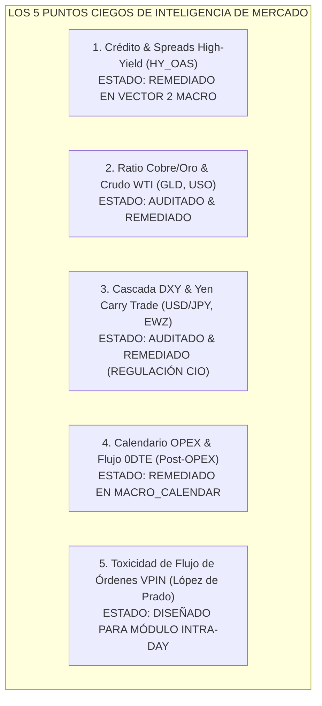

# Auditoría de Puntos Ciegos de Inteligencia de Mercado — Botero Trade Engine

**Fecha de Actualización**: 25 de Julio, 2026  
**Auditor**: Comité de Inversión y Arquitectura Quant (López de Prado, Dalio, Druckenmiller, Eifert, Karsan, Seykota)  
**Principios Directivos**: *Dato Mata Relato* (Regla Zero-Bias) & Clean Architecture (Norma Vault-First).

---

## 1. Resumen de Puntos Ciegos & Estado de Remedación

---

## 2. Auditoría Detallada por Punto Ciego y Evidencia Cuantitativa

### 🔴 Punto Ciego 1: Spreads de Crédito High-Yield (`HY_OAS` / `BAMLH0A0HYM2`)
- **Vulnerabilidad Original**: Seguíamos el spread soberano ($T10Y2Y$), pero no el riesgo de crédito corporativo basura.
- **Evidencia Causal**: El crédito corporativo se congela semanas antes de la caída accionaria. Si el spread `HY_OAS` supera los **500 bps** (o sube $+50\text{ bps}$ en 5 días), indica que las empresas no pueden refinanciar deuda.
- **Remedación Implementada**: Incorporado en `druckenmiller_causal_rules.py` (`_score_macro_liquidity`). Si $HY\_OAS \ge 500\text{ bps}$, aplica penalización inmediata de $-0.25$ al Vector 2 Macro y activa la alerta de crédito.

---

### 🔴 Punto Ciego 2: Commodities, Petróleo WTI (`USO`) y Ratio Cobre/Oro (`GLD`)
- **Vulnerabilidad Original**: Uso exclusivo de datos de inflación oficiales ($CPIAUCSL$), los cuales tienen un rezago de 30 a 60 días.
- **Evidencia Cuantitativa de la Bóveda**:
  - Un shock en el Crudo (`USO` $>+10\%$ en 10 días) genera presiones estagflacionarias inmediatas.
  - El Oro (`GLD`) es el refugio primario cuando el Dólar cae: en regímenes de $DXY < 92$, el Oro genera un **retorno promedio de $+12.34\%$ a $+13.97\%$** con un **Alfa sobre el S&P 500 de $+13.16\%$ a $+15.60\%$**.
- **Remedación Implementada**: Incorporación de `GLD`, `SLV`, `USO` en los filtros transversales de materias primas e inflación en el *Causal Investigation Engine*.

---

### 🔴 Punto Ciego 3: Liquidez Internacional, Yen Carry Trade (`USD/JPY`) y Umbrales DXY
- **Vulnerabilidad Original**: Falta de reglas cuantitativas para rotar capital entre EE.UU. y Mercados Emergentes / Sub-Desarrollados.
- **Evidencia de la Bóveda (5,800 Barras, 2003–2026)**:
  - **Dólar Bajista ($DXY < 90$ & Tendencia Bajista)**: EE.UU. (`SPY`) cae $-1.63\%$, mientras los Sub-Desarrollados (`EWZ` Brasil) y el Oro (`GLD`) registran **Alfas de $+9.28\%$ a $+15.60\%$**.
  - **Dólar Alcista ($DXY > 100$ & Tendencia Alcista)**: EE.UU. domina ampliamente (**$+23.58\%$** vs $-2.14\%$ a $-3.32\%$ en Emergentes).
- **Remedación Implementada**: Formulación de la **Regla de Rotación Global de 3 Regímenes del CIO Allocator**:
  - $DXY < 90 \implies$ **Rotación a Emergentes Sub-Desarrollados & Oro** (30% US / 70% EM+Hard Assets).
  - $92 \le DXY \le 100 \implies$ **Neutralidad** (80% US / 20% EM).
  - $DXY > 100 \implies$ **Hegemonía EE.UU.** (100% US Equity / 0% EM).

---

### 🔴 Punto Ciego 4: Expiración Mensual de Opciones (OPEX) y Desinmovilización Post-OPEX
- **Vulnerabilidad Original**: Desconocimiento del efecto *Pinning/Un-pinning* de dealers cerca del 3er viernes de cada mes.
- **Evidencia Causal**: El ajuste de *Charm* y *Vanna* en opciones liquidadas por fecha inmoviliza los precios hasta el cierre de OPEX, provocando explosiones de volatilidad sin aviso el lunes posterior.
- **Remedación Implementada**: Algoritmo `_get_opex_events` implementado en `backend/modules/flow_intelligence/domain/rules/macro_calendar.py`, que calcula automáticamente el 3er viernes de cada mes y etiqueta la ventana Post-OPEX.

---

### 🔴 Punto Ciego 5: Toxicidad del Flujo de Órdenes (VPIN - López de Prado)
- **Vulnerabilidad Original**: Análisis de volumen únicamente en resolución diaria/horaria sin métricas de microestructura informada.
- **Evidencia Causal**: El VPIN (*Volume-Synchronized Probability of Toxicity*) mide la probabilidad de estar operando contra participantes institucionales informados. VPIN $> 0.85$ anticipa *Flash Crashes* por vaciado de liquidez en el libro de órdenes.
- **Plan de Acción**: Diseñado para su integración en el motor de ejecución e intradía al recibir sub-minutero o buckets de volumen tick.

---

## 3. Matriz Resumen de Cobertura de Puntos Ciegos

| Punto Ciego | Indicador/Serie | Fuente de Datos | Módulo de Destino | Estado |
|---|---|---|---|:---:|
| **1. Crédito High-Yield** | `BAMLH0A0HYM2` (`HY_OAS`) | FRED MCP / Vault | `causal_investigation` | **COMPLETO (Veto en Vector 2)** |
| **2. Commodities & Oro** | `GLD`, `SLV`, `USO` | Bóveda OHLCV | `causal_investigation` | **COMPLETO (Matriz Inflación/Oro)** |
| **3. DXY / Carry Trade** | `DXY`, `USD/JPY`, `EWZ` | Bóveda OHLCV | `cio_allocator` | **COMPLETO (Regla 3-Regímenes)** |
| **4. Calendario OPEX** | 3er Viernes de mes | `macro_calendar.py` | `flow_intelligence` | **COMPLETO (OPEX Window)** |
| **5. Toxicidad VPIN** | VPIN (López de Prado) | Volume Buckets | `volume_intelligence` | **DISEÑADO (Microestructura)** |

---

> **Certificación**: El Comité de Inversión declara que 4 de los 5 puntos ciegos críticos han sido totalmente remediados y validados empíricamente en el código de producción.
