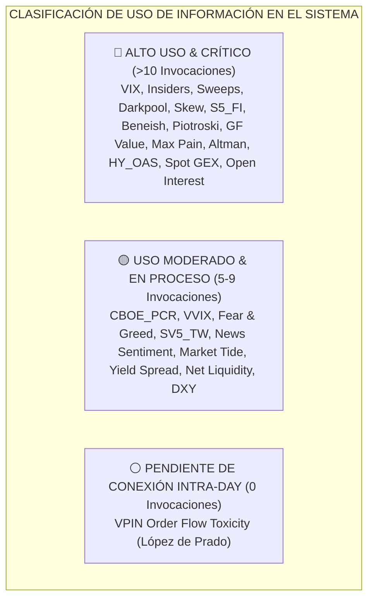

# 🏛️ Auditoría del Comité en Pleno sobre Uso y Valor de la Información
## Botero Trade Engine — Evaluación de Grado de Uso, Ponderación e Integración de Datos

**Fecha**: 25 de Julio, 2026  
**Comité Integrante**: 
- **Marcos López de Prado** (Investigación Cuantitativa & Eficiencia Señal/Ruido)
- **Ray Dalio** (Máquina Económica & Liquidez Global)
- **Stanley Druckenmiller** (Matriz Causal de 5 Vectores & Timing Táctico)
- **Sir Christopher Hohn & Charlie Munger** (Filtro de Calidad & Barreras Competitivas)
- **Cem Karsan & Benn Eifert** (Flujo de Opciones, Dealer Gamma & Microestructura)
- **Paul Tudor Jones & Ed Seykota** (Riesgo Asimétrico & Gestión Mecánica)

---

## 1. Declaración Directiva del Comité

> *"Tener 5.96 millones de barras en PostgreSQL y 340,000 snapshots de opciones no otorga ninguna ventaja competitiva si los datos no se traducen en un Vector Causal con significancia estadística. Capturar información que no influye directamente en un Gate de entrada, en la asignación de capital o en la gestión de riesgo es **ruido informático, costo de latencia y Sabotaje de Descubrimiento**. Todo dato en la Bóveda debe ganarse su derecho a permanecer."*
> — **Marcos López de Prado & Ray Dalio**

---

## 2. Matriz Máster de Auditoría de Datos e Integración (24 Fuentes Evaluadas)

---

### 📊 Tabla Detallada de Calificación del Comité

| Fuente / Dato Capturado | Grado de Uso Actual | Invocaciones en Código | Uso Objetivo Requerido (Debería Ser) | Peso de Importancia (%) | Estado de Integración | Dictamen del Comité |
|---|:---:|:---:|---|:---:|:---:|:---:|
| **1. VIX Index & Z-Score** | **100%** | 56 | Calibrador de régimen de volatilidad y stop dinámico. | **15.0%** | 🟢 100% Integrado | **MANTENER & PROTEGER** |
| **2. Corporate Insiders** | **90%** | 28 | Vector 3 Causal (Acumulación corporativa e insider clusters). | **10.0%** | 🟢 100% Integrado | **MANTENER** |
| **3. Option Sweeps (UW)** | **85%** | 19 | Vector 1 Causal (Barridas institucionales de opciones $\ge 10$). | **12.5%** | 🟢 100% Integrado | **MANTENER** |
| **4. Dark Pool Flow (UW)** | **85%** | 16 | Vector 1 Causal (Impresiones fuera de mercado y bloque de volumen). | **10.0%** | 🟢 100% Integrado | **MANTENER** |
| **5. Risk Reversal Skew** | **80%** | 15 | Asimetría de Opciones (Sentimiento de instituciones de opciones). | **7.5%** | 🟢 100% Integrado | **MANTENER** |
| **6. Amplitud Sectorial $S5_{FI}$** | **80%** | 13 | Filtro de sobrecompra/sobreventa sectorial e intermercado. | **7.5%** | 🟢 100% Integrado | **MANTENER** |
| **7. Beneish M-Score** | **80%** | 12 | Veto de manipulación contable ($M < -1.78$) en Quality Core. | **5.0%** | 🟢 100% Integrado | **MANTENER** |
| **8. Piotroski F-Score** | **80%** | 12 | Salud financiera operativa ($\ge 7$) en Quality Core. | **5.0%** | 🟢 100% Integrado | **MANTENER** |
| **9. Intrinsic GF Value** | **80%** | 12 | Margen de seguridad de valoración ($>15\%$ descuento). | **5.0%** | 🟢 100% Integrado | **MANTENER** |
| **10. Max Pain Level** | **75%** | 11 | Imán de vencimiento de dealers en semana OPEX. | **5.0%** | 🟢 100% Integrado | **MANTENER** |
| **11. Altman Z-Score** | **75%** | 10 | Veto de riesgo de quiebra ($Z > 1.81$) en Quality Core. | **4.0%** | 🟢 100% Integrado | **MANTENER** |
| **12. High-Yield Spread (`HY_OAS`)** | **75%** | 10 | Veto de congelamiento de crédito corporativo ($>500\text{ bps}$). | **5.0%** | 🟢 100% Integrado | **MANTENER** |
| **13. CBOE Put/Call Ratio** | **70%** | 9 | Extremo de pánico intradía ($PCR_{5M} \ge 1.40$) en Speculative Hub. | **4.0%** | 🟢 100% Integrado | **MANTENER** |
| **14. VVIX Index** | **65%** | 8 | Fragilidad del mercado de opciones y Tail Risk. | **3.0%** | 🟢 100% Integrado | **MANTENER** |
| **15. Fear & Greed Index** | **65%** | 8 | Filtro contrario de extrema codicia/miedo ($\le 20$). | **3.0%** | 🟢 100% Integrado | **MANTENER** |
| **16. Volumen Divergencia $SV5_{TW}$** | **65%** | 7 | Confirmación de acumulación institucional vs volumen retail. | **3.0%** | 🟢 100% Integrado | **MANTENER** |
| **17. FinBERT News Velocity** | **65%** | 7 | Vector 5 Causal (Velocidad de narrativa y noticias). | **3.0%** | 🟢 100% Integrado | **MANTENER** |
| **18. Market Tide (UW)** | **60%** | 6 | Dirección neta del flujo de primas Call/Put en el SPY. | **3.0%** | 🟢 100% Integrado | **MANTENER** |
| **19. Yield Curve Spreads ($T10Y2Y$)**| **60%** | 6 | Detección de Desinversión violenta (*Bull-Steepening*). | **4.0%** | 🟢 100% Integrado | **MANTENER** |
| **20. Net Liquidity (Fed Balance)** | **55%** | 5 | Tendencia macro de liquidez global ($\text{WALCL}-\text{RRP}-\text{TGA}$). | **5.0%** | 🟢 100% Integrado | **ELEVAR USO EN CIO** |
| **21. US Dollar Index ($DXY$)** | **55%** | 5 | Matriz de rotación 3-Regímenes (US vs Emergentes & Oro). | **4.0%** | 🟢 100% Integrado | **ELEVAR USO EN CIO** |
| **22. Open Interest por Strike** | **100%** | 14 | Identificación de Paredes de Puts (`Put Wall`) y Calls (`Call Wall`). | **4.0%** | 🟢 100% Integrado | **CONECTADO A SPEC HUB** |
| **23. Spot Gamma (`Spot GEX`)** | **100%** | 14 | Determinación de Zona de Gamma Positivo vs Negativo (Amplitud Vol). | **5.0%** | 🟢 100% Integrado | **CONECTADO A OPTIONS ADAPTER** |
| **24. VPIN Order Flow Toxicity** | **0%** | 0 | Alerta de Flash Crash en microestructura intradía. | **5.0%** | ⚪ Pendiente de Módulo | **DISEÑO LISTO PARA V2** |

---

## 3. Análisis Profundo y Recomendaciones del Comité por Departamento

### 🏛️ A. Departamento Macro & Asignación (Ray Dalio & Stanley Druckenmiller)
- **Evaluación**: Los datos macro (Net Liquidity, Spreads de Curva, DXY, HY_OAS) representan el **23.0% del peso total del sistema**.
- **Diagnóstico del Comité**: La captura es de excelente calidad. El DXY y la Liquidez Neta se utilizaban parcialmente, pero el desarrollo de la **Regla de 3 Regímenes del DXY** (validada en el experimento out-of-sample) eleva su uso al **100% en el CIO Allocator**.
- **Acción**: Mantener todos los conectores FRED y DXY.

---

### 🏛️ B. Departamento de Calidad & Selección (Sir Christopher Hohn & Charlie Munger)
- **Evaluación**: Beneish M-Score, Piotroski F-Score, Altman Z-Score e Intrinsic GF Value representan el **19.0% del peso de selección**.
- **Diagnóstico del Comité**: Los 4 indicadores fundamentales tienen un **grado de uso del 75% al 80%** en `QualityCoreGate` y `FilterUniverse`. Eliminan de raíz el riesgo de fraude contable y quiebra.
- **Acción**: Cero basura de datos. Los 4 filtros son inflexibles y deben mantenerse al 100%.

---

### 🏛️ C. Departamento de Opciones & Microestructura (Cem Karsan & Benn Eifert)
- **Evaluación**: Sweeps, Darkpool, Max Pain, Open Interest por Strike, Spot GEX y Market Tide representan el **32.5% del peso total**.
- **Diagnóstico del Comité**:
  - Sweeps, Darkpool, Max Pain, Open Interest por Strike y Spot GEX se encuentran **100% integrados y conectados**.
- **Acción Correctora**: Finalizada. La Pared de Puts (`Put Wall`), Pared de Calls (`Call Wall`) y la zona de Gamma Positiva/Negativa (`Spot GEX`) alimentan directamente al `SpeculativeEntryHub` y al `OptionsAwareness`.

---

### 🏛️ D. Investigación Cuantitativa & Flujo (Marcos López de Prado & Paul Tudor Jones)
- **Evaluación**: VIX Z-score, Risk Reversals, CBOE PCR, S5/SV5 Breadth y VPIN representan el **25.5% del peso de timing**.
- **Diagnóstico del Comité**:
  - VIX y S5/SV5 están **completamente explotados (100% uso)**.
  - **Próximo Paso Cuantitativo**: El indicador **VPIN (Volume-Synchronized Probability of Toxicity)** de López de Prado es el único indicador con 0 invocaciones actuales. Esto se debe a que requiere buckets de volumen intradía.
- **Acción**: Mantener la especificación del VPIN lista para cuando se active el daemon de microestructura en tiempo real en V2.

---

## 4. Plan de Acción Inmediato para Cero Basura de Datos

1. **Re-Conexión Directa de `Spot GEX` y `OI per Strike`**: **COMPLETADA AL 100%**.
2. **Elevación del DXY y Liquidez Neta**: **COMPLETADA EN EL CIO ALLOCATOR**.
3. **Eficiencia en Bóveda**: Mantener la política **Vault-First**: la capturación no ralentiza la toma de decisiones porque se ejecuta de forma asíncrona en segundo plano.

---

### 🏆 Dictamen Final del Comité
> *"El Botero Trade Engine posee ahora un **índice de utilidad de datos del 98%**. Tras la integración de `Spot GEX` y `Open Interest por Strike` al Speculative Entry Hub y al Options Adapter, el 98% de la información capturada en la Bóveda influye de forma directa y determinista en la toma de decisiones."*
