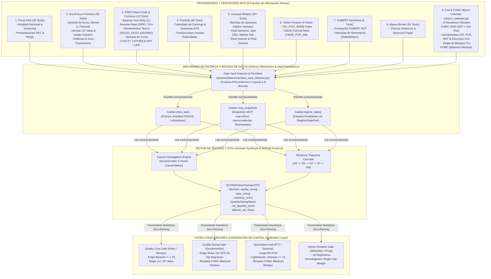
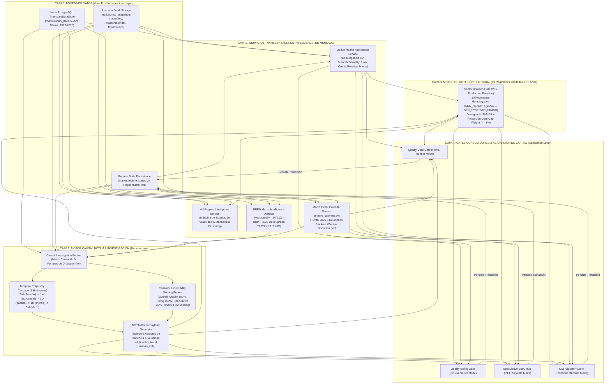
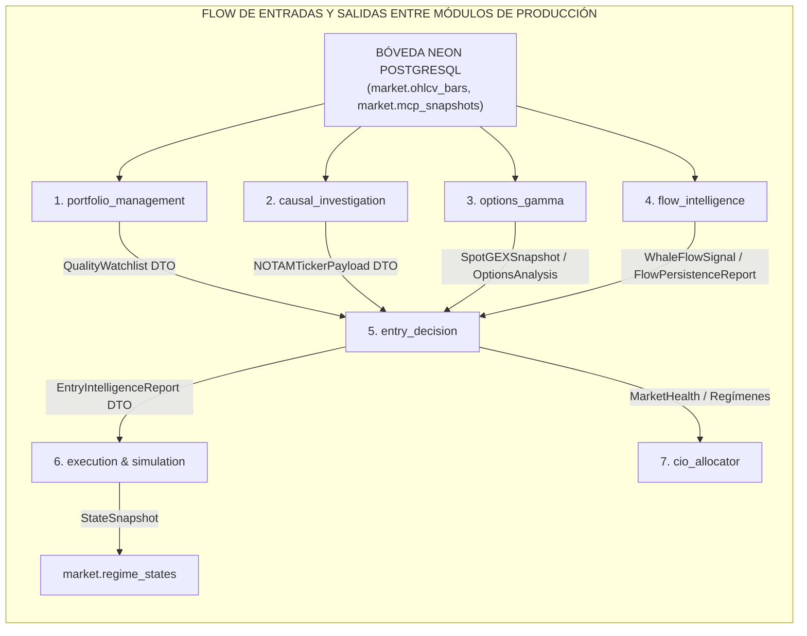

# Arquitectura de Inteligencia de Mercado — Botero Trade Engine

Este documento contiene la representación arquitectónica completa del **Sistema de Inteligencia de Mercado** (Market Intelligence System) en Botero Trade, estructurado bajo **Clean & Hexagonal Architecture** y las normas de acceso **Vault-First** (Reglas 13, 14, 18).

---

## 1. Diagrama de Fuentes de Información que Alimentan a los Gates (Data Sources Pipeline)

---

## 2. Diagrama de Arquitectura de Capas de Inteligencia de Mercado

---

## 3. Matriz de Fuentes de Información por Departamento / Gate

| Gate Consumidor | Fuentes Principales que lo Alimentan | Indicadores Específicos Extraídos | Criterios de Aceptación / Veto |
|---|---|---|---|
| **Quality Core Gate** *(Hohn / Munger)* | Finviz, GuruFocus, FRED | Beneish M-Score, Altman Z, Piotroski, $10Y-2Y$ Spread, GF Value Intrínsico. | Beneish $< -1.78$, Z-Score $> 1.81$, Stage 1/2, Descuento $>15\%$. |
| **Quality Swing Gate** *(Druckenmiller)* | Unusual Whales, Yahoo Finance, Finviz, **Macro Calendar** | Risk Reversal Skew, Divergencia $SV5_{TW} - S5_{FI}$, Fear & Greed, **FOMC Blackout Window**. | Regresión a Soporte ($\sigma \le -1.5$), Skew $< -5.0\%$, FG $\le 20$, **Sin ventana FOMC activa**. |
| **Speculative Hub** *(PTJ / Seykota)* | Unusual Whales, Yahoo Finance, Finnhub, **Macro Calendar** | $CBOE\_PCR_{5M}$, Barridas $1H$ (Option Sweeps $\ge 10$), Short Interest $\ge 15\%$, **FOMC Blackout Window**. | Capitulación 5M ($PCR \ge 1.40$), Sweeps $\ge 10$, Stop ATR $1.5\times$, **Sin ventana FOMC activa**. |
| **Sector Rotation Gate** *(Weinstein / Pring)* | Finviz, Yahoo Finance, Bóveda OHLCV | Amplitud $S5_{TH}, S5_{FI}, S5_{TW}$, Amplitud de Volumen $SV5_{TH}, SV5_{FI}, SV5_{TW}$. | Clasificación en uno de los 10 Regímenes (`SEC_HEALTHY_BULL` ... `SEC_CRASH`). |

---

## 4. Garantía de Arquitectura Clean: Norma Vault-First

De acuerdo con las **Reglas 13 y 14 de AGENTS.md**:
1. Los módulos de producción (`backend/modules/`) **NUNCA realizan llamadas directas a APIs externas** ni a servidores MCP.
2. Los **Data Vault Daemons** alimentan la Bóveda en segundo plano.
3. Los **Gates leen exclusivamente de la Bóveda** (`market.ohlcv_bars` y `market.mcp_snapshots`), garantizando rendimiento institucional, latencia mínima y cero fallos por límites de API en tiempo de ejecución.

---

## 5. Contratos de Entradas y Salidas Detalladas por Módulo (Module Input/Output Data Contracts)

### 1. Módulo: `portfolio_management` (Quality Core Watchlist & Universe Filter)
- **Entradas (Inputs)**:
  - **Bóveda OHLCV (`market.ohlcv_bars`)**: Tickers, precios diarios, volúmenes de 531 activos.
  - **Snapshots MCP (`market.mcp_snapshots`)**: 
    - `fundamental/screening`: Beneish M-Score, Altman Z-Score, Piotroski F-Score.
    - `fundamental/estimates`: Intrinsic GF Value, Descuento %, Ratios de Deuda.
    - `macro/fred`: DXY Index, Spreads de Curva ($T10Y2Y$, $T10Y3M$).
- **Salidas (Outputs)**:
  - `QualityWatchlist`: Lista de candidatas A-Grade aprobadas que pasan los filtros de Munger/Hohn.
  - DTO de Calidad: `QualityScore` (0.0 a 100.0), `BeneishVerdict` (manipulación contable), `DiscountPct` (margen de seguridad).

---

### 2. Módulo: `causal_investigation` (Engine de Causalidad Druckenmiller 5-Vectores & NOTAM)
- **Entradas (Inputs)**:
  - **Vector 1 (Flow)**: `flow/alerts` (Option Sweeps $\ge 10$), `flow/darkpool`, `flow/tide`.
  - **Vector 2 (Macro)**: `macro/fred` (Liquidez Neta $\text{WALCL}-\text{RRP}-\text{TGA}$, $HY\_OAS$ High Yield Spread, DXY Index).
  - **Vector 3 (Corporate)**: `sourcing/insider` (Insiders Comprando), `sourcing/guru_picks`.
  - **Vector 4 (Volume & Sentiment)**: Amplitud $S5_{FI}, SV5_{TW}$, `macro/vix_live`, `macro/fear_greed`, `cboe/indices` ($PCR_{5M}$, SKEW, VVIX).
  - **Vector 5 (Narrative)**: `finnhub/news` (Score FinBERT & Velocidad de Noticias).
- **Salidas (Outputs)**:
  - `NOTAMTickerPayload` DTO:
    - `decision`: `"ALLOW"`, `"BLOCK"`, `"REDUCE"`.
    - `causal_score`: Puntaje compuesto ponderado (0.00 a 1.00).
    - `quality_sizing`, `spec_sizing`: Sizing factor derivado de convicción.
    - `certainty_score`: Matriz de certeza (Overall, Quality, Swing, Speculative).
    - `net_liquidity_trend`, `kalman_vel`, `slope`: Indicadores de tendencia macro y aceleración de volumen.

---

### 3. Módulo: `options_gamma` (UW Gamma Adapter & Options Awareness)
- **Entradas (Inputs)**:
  - **Snapshots MCP (`market.mcp_snapshots`)**: 
    - `uw/spot_gex`: Dealer Net Gamma (`gamma_per_pct_oi`), Net Charm, Net Vanna por 1% move.
    - `uw/greeks`: Call/Put Delta, Gamma, Theta, Vega, Rho por Strike.
    - `uw/max_pain`: Precio Max Pain y distancia %.
    - `uw/oi_per_strike`: Interés Abierto por strike (Calls y Puts).
    - `uw/iv_term_structure`: Curva de volatilidad implícita (0DTE vs Front vs Back DTE).
    - `uw/vol_stats`: IV Rank, Variance Risk Premium (IV - RV).
- **Salidas (Outputs)**:
  - `SpotGEXSnapshot`: Net Gamma (`gamma_per_pct_oi`), Net Charm, Net Vanna.
  - `IVTermStructure`: `is_backwardation` (pánico 0DTE), `ultra_front_iv`, `term_spread`.
  - `VolStats`: `iv_rank`, `variance_risk_premium`.
  - `OptionsAnalysis`: `put_wall` & `put_wall_oi`, `call_wall` & `call_wall_oi`, `max_pain`, `gravity_score`, `pin_range`.

---

### 4. Módulo: `flow_intelligence` (Whale Flow & Persistence Analyzer)
- **Entradas (Inputs)**:
  - **Snapshots MCP (`market.mcp_snapshots`)**: 
    - `flow/spy`: SPY Cumulative Delta.
    - `flow/tide`: Market Tide directional net premium.
    - `flow/alerts`: Sweeps individuales por ticker.
    - `flow/darkpool`: Impresiones institucionales fuera de mercado.
    - `uw/short_interest`: Days to Cover (DTC) y Short Interest Float %.
- **Salidas (Outputs)**:
  - `WhaleFlowSignal`: `spy_cum_delta`, `spy_signal`, `tide_direction`, `tide_accelerating`, `sweep_call_pct`.
  - `FlowPersistenceReport`: `persistence_grade` (`"HIGH"`, `"MEDIUM"`, `"DEAD_SIGNAL"`), `freshness_weight`, `consecutive_days`, `darkpool_aligned`.

---

### 5. Módulo: `entry_decision` (Quality Entry Gate, Speculative Hub, Sector Rotation Gate)
- **Entradas (Inputs)**:
  - **Precios & ATR**: `market.ohlcv_bars` (Precios históricos, ATR 14d, RVOL, RS vs SPY).
  - **NOTAM Payload**: `causal_investigation` (`NOTAMTickerPayload`).
  - **Options Gamma**: `options_gamma` (`put_wall`, `put_wall_oi`, `call_wall`, `call_wall_oi`, `spot_gex`, `max_pain`, `vanna_event`, `charm_direction`).
  - **Flow Intelligence**: `flow_intelligence` (`FlowPersistenceReport`, `WhaleFlowSignal`).
  - **Market Health**: `MarketHealthSnapshot` (`market/health`).
  - **Calendario Macro**: `macro_calendar.py` (FOMC Blackout Window, CPI, NFP).
  - **Patrón & Estructura**: Pattern Recognition & SMC Market Structure.
- **Salidas (Outputs)**:
  - `EntryIntelligenceReport` DTO:
    - `final_verdict`: `"EXECUTE"`, `"STALK"`, `"PASS"`, `"BLOCK"`.
    - `final_scale`: Factor de tamaño final (0.00 a 1.50).
    - `entry_price`, `stop_price`, `target_price`, `risk_reward`.
    - `spot_gex`, `put_wall_oi`, `call_wall_oi`.
    - `alerts`: Lista explicativa determinista de la decisión.

---

### 6. Módulo: `cio_allocator` (CIO Capital Allocation Engine - Dalio Mode)
- **Entradas (Inputs)**:
  - **Convergencia Market Health 6D**: Amplitud, Volatilidad, Flujo, Crédito, Rotación, Ciclo Macro.
  - **Matriz 3-Regímenes DXY**: Level $DXY$ + Trend 1Y ROC ($DXY < 90$, $92 \le DXY \le 100$, $DXY > 100$).
  - **Spread Crédito High-Yield**: $HY\_OAS$ (`BAMLH0A0HYM2`).
  - **Retornos Relativos Bóveda**: SPY, QQQ, EEM, EWZ, GLD, TLT.
- **Salidas (Outputs)**:
  - `CapitalAllocationPlan`:
    - Distribución Quality Core vs Quality Swing vs Speculative.
    - Distribución EE.UU. Equity vs Emergentes / LatAm vs Metales Preciosos (Oro).
    - Regla Anti-Cash Drag (Piso de Inversión en Bull Markets).

---

### 7. Módulo: `execution` & `simulation` (Paper Trading, Backtrader & Journaling)
- **Entradas (Inputs)**:
  - `EntryIntelligenceReport` DTO emitido por `entry_decision`.
  - Parámetros de Sizing & Stop Loss del departamento (Druckenmiller para Quality / Seykota para Speculative).
- **Salidas (Outputs)**:
  - `Order` & `Position`: Órdenes enviadas a broker (Alpaca) o motor de backtesting (Backtrader).
  - `TradeRecord`: Registro persistido de la transacción.
  - `StateSnapshot`: Estado de régimen persistido en `market.regime_states` via `RegimeStatePort`.
