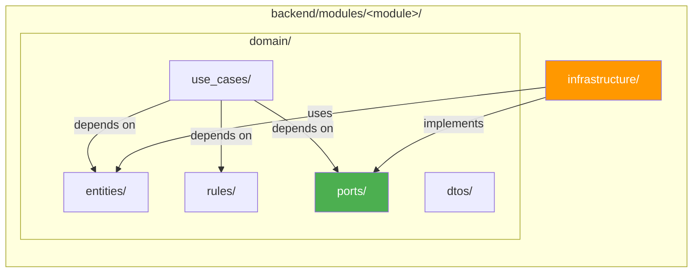
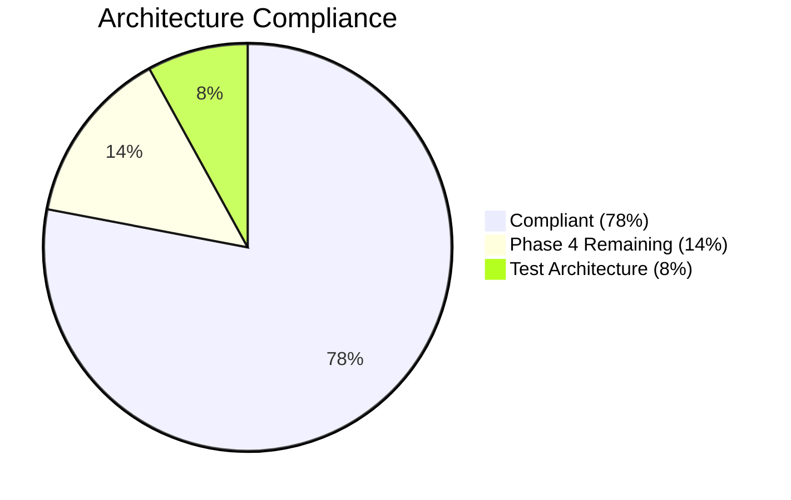

# Hexagonal Architecture Migration — Phases 1-3

## Summary

This PR migrates the Botero Trade Engine backend from a loosely-structured modular monolith to a **Hexagonal (Ports & Adapters) Architecture**, bringing Clean Architecture compliance from **62% → 78%**.

## Architecture Diagram

```mermaid
graph TB
    subgraph "API Layer (Driving Side)"
        R1["api/routers/portfolio.py"]
        R2["api/routers/strategy.py"]
        R3["api/routers/orders.py"]
        R4["api/routers/market_data.py"]
    end

    subgraph "Domain Layer (Core)"
        subgraph "Entities"
            E1["execution/entities/order_models.py"]
            E2["portfolio_mgmt/entities/portfolio_models.py"]
            E3["shared/entities/market_data.py"]
            E4["entry_decision/entities/signal.py"]
        end
        subgraph "Ports (ABCs)"
            P1["BrokerPort"]
            P2["OptionsDataPort"]
            P3["EntryMarketDataPort"]
            P4["FlowDataPort"]
            P5["FundamentalDataPort"]
            P6["ScreenerPort"]
            P7["MacroDataPort"]
            P8["CalendarDataPort"]
            P9["WhaleFlowPort"]
            P10["MarketDataPort"]
            P11["ExecutionPort"]
        end
        subgraph "Use Cases"
            UC1["EntryIntelligenceHub"]
            UC2["OptionsAwareness"]
            UC3["AlphaScanner"]
            UC4["UniverseFilter"]
        end
    end

    subgraph "Infrastructure Layer (Driven Side)"
        A1["AlpacaAdapter"]
        A2["IBAdapter"]
        A3["YFinanceOptionsAdapter"]
        A4["MarketDataFetcher"]
        A5["FinnhubAdapter"]
        A6["FinvizIntelligence"]
        A7["GuruFocusIntelligence"]
        A8["UnusualWhalesIntelligence"]
    end

    R1 --> UC1
    R2 --> UC2
    UC1 -.->|depends on| P3
    UC1 -.->|depends on| P4
    UC2 -.->|depends on| P2
    UC3 -.->|depends on| P5
    UC3 -.->|depends on| P6
    UC4 -.->|depends on| P5
    A1 -->|implements| P1
    A2 -->|implements| P1
    A3 -->|implements| P2
    A4 -->|implements| P3
    A5 -->|implements| P8
    A6 -->|implements| P6
    A7 -->|implements| P5
    A8 -->|implements| P9

    style P1 fill:#4CAF50,color:white
    style P2 fill:#4CAF50,color:white
    style P3 fill:#4CAF50,color:white
    style P4 fill:#4CAF50,color:white
    style P5 fill:#4CAF50,color:white
    style P6 fill:#4CAF50,color:white
    style P7 fill:#4CAF50,color:white
    style P8 fill:#4CAF50,color:white
    style P9 fill:#4CAF50,color:white
    style P10 fill:#4CAF50,color:white
    style P11 fill:#4CAF50,color:white
```



## Module Structure (Screaming Architecture)



## Compliance Progress



---

## Changelog

### Phase 1: Import Hygiene & Module Init
- **FIX**: 6 legacy `from modules.` imports → `from backend.modules.` across `shared/use_cases.py`, `alpaca_adapter.py`, `ib_adapter.py`, `evaluate_entry.py`, `qualify_ticker.py`
- **FIX**: Dead import path in `qualify_ticker.py` pointing to non-existent `modules.simulation.domain.feature_engineering`
- **ADD**: `__init__.py` public API exports for 6 modules: `execution`, `flow_intelligence`, `options_gamma`, `pattern_recognition`, `portfolio_management`, `shared`
- **RESTRUCTURE**: `shared/` module migrated to standard 5-folder domain layout (`domain/dtos`, `domain/entities`, `domain/ports`, `domain/rules`, `domain/use_cases`)

### Phase 2: Rules Layer Purity
- **EXTRACT**: `import yfinance` and FRED infrastructure import removed from `portfolio_management/domain/rules/macro_regime.py` → data fetching moved to new `infrastructure/macro_data_adapter.py`
- **EXTRACT**: Finnhub adapter import removed from `flow_intelligence/domain/rules/macro_calendar.py` → now accepts injectable `external_events_fetcher` parameter
- **ADD**: `portfolio_management/infrastructure/macro_data_adapter.py` — `YFinanceMacroAdapter` and `FREDMacroAdapter`

### Phase 3: Port Definitions (Hexagonal Backbone)
- **ADD**: 9 new Port ABCs across 5 modules:
  - `options_gamma/domain/ports/options_data_port.py` — `OptionsDataPort`
  - `entry_decision/domain/ports/market_data_port.py` — `EntryMarketDataPort`
  - `entry_decision/domain/ports/flow_data_port.py` — `FlowDataPort`
  - `execution/domain/ports/broker_port.py` — `BrokerPort`
  - `portfolio_management/domain/ports/screener_port.py` — `ScreenerPort`
  - `portfolio_management/domain/ports/fundamental_data_port.py` — `FundamentalDataPort`
  - `portfolio_management/domain/ports/macro_data_port.py` — `MacroDataPort`
  - `flow_intelligence/domain/ports/calendar_data_port.py` — `CalendarDataPort`
  - `flow_intelligence/domain/ports/whale_flow_port.py` — `WhaleFlowPort`
- **MOVE**: `BrokerAdapter` ABC relocated from `infrastructure/brokers/base.py` → `domain/ports/broker_port.py` (old location kept as re-export alias)

### Global Entity Distribution (prior session)
- **DELETE**: `backend/domain/entities.py` (monolithic entity file)
- **DISTRIBUTE**: Entities into their owning modules:
  - `Order`, `Trade`, `Broker` → `execution/domain/entities/order_models.py`
  - `Position`, `Portfolio` → `portfolio_management/domain/entities/portfolio_models.py`
  - `Bar` → `shared/domain/entities/market_data.py`
  - `Signal` → `entry_decision/domain/entities/signal.py`
  - `BacktestResult` → `simulation/domain/entities/simulation_models.py`

### Documentation & Agent Skills
- **ADD**: `.agent/clean_architecture_skill.md` — Comprehensive Hexagonal Architecture skill with import matrix, Port/Adapter patterns, and known violations registry
- **ADD**: `docs/phase4_dependency_injection_plan.md` — Detailed handoff document for Phase 4 completion
- **UPDATE**: `CLAUDE.md` — Reflects new modular architecture, updated layer rules and project structure

---

## Files Changed

| Category | Count |
|---|---|
| Modified | 15 |
| New files | ~35 |
| Deleted | ~20 |
| **Total** | ~70 |

## Testing

```bash
# Compilation verification (all pass)
PYTHONPATH=backend python3 -m compileall backend/

# Import hygiene (0 legacy imports)
grep -rn "^from modules\." backend/modules/ --include="*.py" | grep -v __pycache__
# Result: 0

# Rules purity (0 violations)
grep -rn "^import yfinance\|^from.*infrastructure" backend/modules/*/domain/rules/ --include="*.py"
# Result: 0

# Port ABCs defined
grep -rn "class.*ABC" backend/modules/*/domain/ports/ --include="*.py"
# Result: 11 ABCs
```

## Breaking Changes

> ⚠️ **`backend/domain/entities.py` has been deleted.** All imports referencing this file must use the new module-specific locations. See entity distribution table above.

> ⚠️ **`MacroRegimeDetector.detect_from_market()` removed.** This method (which fetched live yfinance data) was moved to `infrastructure/macro_data_adapter.py`. Callers should now use `detect_from_data(vix, yield_spread)` and fetch the data separately via `YFinanceMacroAdapter`.

## Next Steps

See `docs/phase4_dependency_injection_plan.md` for the remaining 17 domain→infrastructure violations that need dependency injection wiring (estimated ~3 hours of work).
