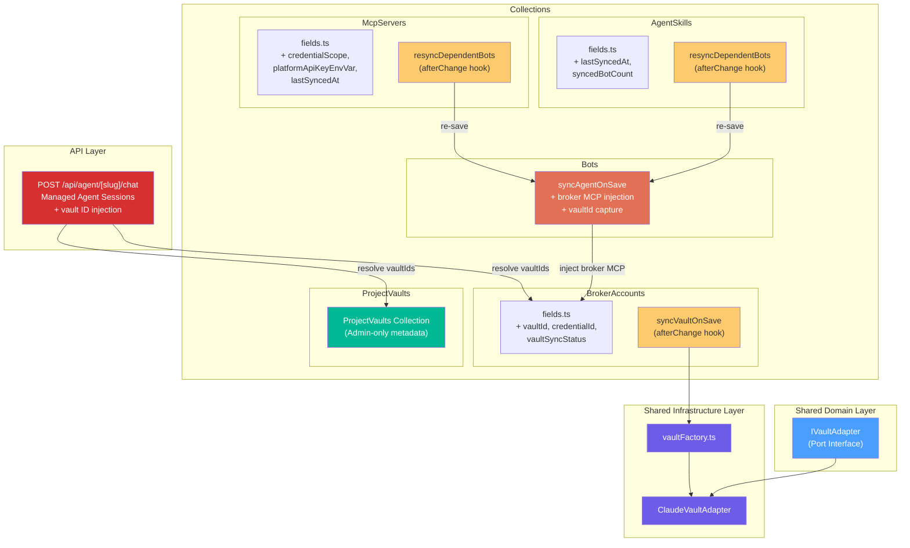
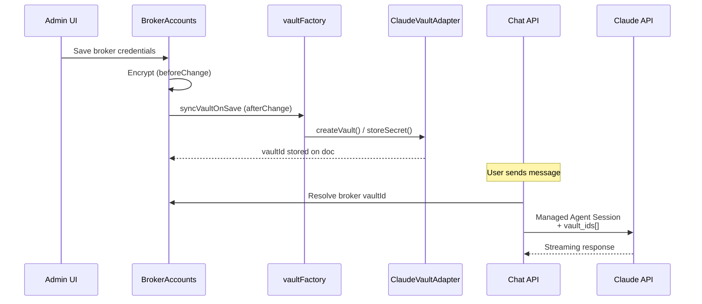

# Vault Sync Architecture & Cascade Hooks

## Summary

Implements a generic, provider-agnostic credential vault infrastructure and cascade synchronization hooks for the Botero Trade Engine. This PR establishes the secure credential management layer that enables Managed Agent Sessions to access broker credentials at runtime without persisting secrets in plaintext.

## Architecture Changes

## Credential Flow

## Files Changed

### New Files
| File | Purpose |
|------|---------|
| `src/shared/domain/ports/vaultPort.ts` | `IVaultAdapter` interface — provider-agnostic vault contract |
| `src/shared/infrastructure/vault/claudeVaultAdapter.ts` | Claude Vault HTTP API adapter |
| `src/shared/infrastructure/vaultFactory.ts` | Factory returning adapter based on `VAULT_PROVIDER` env var |
| `src/collections/ProjectVaults/fields.ts` | Field definitions for project-wide vault metadata |
| `src/collections/ProjectVaults/index.ts` | Admin-only collection config |
| `src/collections/BrokerAccounts/infrastructure/hooks/syncVaultOnSave.ts` | Vault sync hook for broker credentials |
| `src/collections/AgentSkills/infrastructure/hooks/resyncDependentBotsOnSkillChange.ts` | Cascade resync: skill change → re-save dependent bots |
| `src/collections/McpServers/infrastructure/hooks/resyncDependentBotsOnMcpChange.ts` | Cascade resync: MCP change → re-save dependent bots |

### Modified Files
| File | Change |
|------|--------|
| `src/payload.config.ts` | Registered `ProjectVaults` collection |
| `src/collections/BrokerAccounts/fields.ts` | Added generic vault fields (`vaultId`, `credentialId`, `vaultSyncStatus`); removed Claude-specific fields |
| `src/collections/BrokerAccounts/lifecycle.ts` | Wired `syncVaultOnSave` into `afterChange` |
| `src/collections/AgentSkills/fields.ts` | Added `lastSyncedAt`, `syncedBotCount` for sync tracking |
| `src/collections/AgentSkills/index.ts` | Wired cascade resync hook into `afterChange` |
| `src/collections/McpServers/fields.ts` | Added `credentialScope`, `platformApiKeyEnvVar`, `linkedBrokerType`, `lastSyncedAt`, `syncedBotCount` |
| `src/collections/McpServers/index.ts` | Wired cascade resync hook into `afterChange` |
| `src/collections/McpServers/domain/rules/mcpRules.ts` | Updated MCP categories (platform/portfolio credential scopes) |
| `src/collections/BrokerAccounts/domain/rules/portfolioRules.ts` | Added `BROKER_MCP_ENDPOINTS` mapping and `hasBrokerMcp` helper |
| `src/collections/Bots/infrastructure/hooks/syncAgentOnSave.ts` | Injects broker-specific MCP endpoint + captures `vaultId` from active BotAssignment |
| `src/app/api/agent/[slug]/chat/route.ts` | Refactored to support Managed Agent Sessions with vault ID injection (fallback to Messages API) |

### Bug Fixes (Pre-existing)
| File | Fix |
|------|-----|
| `src/providers/Auth/index.tsx` | Removed `isOperator` role (doesn't exist in this project) |
| `src/providers/Auth/server.ts` | Removed `isOperator` from server session |
| `src/app/(frontend)/(settings)/portafolio/[slug]/settings/actions.ts` | Added `draft: false` + `user` field to satisfy regenerated Payload types |
| `src/collections/Portfolios/infrastructure/PayloadPortfolioCreator.ts` | Added `draft: false`, `status: 'active'`, `Number(ownerId)` |
| `src/components/AgentChat/index.tsx` | Fixed HeroUI v3 props (`variant="soft"`, removed `color`/`radius`) |
| `src/scripts/seedAgentSkills.ts` | Added non-null assertions on regex match groups |

### Architecture Cleanup
| Action | Details |
|--------|---------|
| **Deleted** `src/collections/Domain/` | Shared vault port moved → `src/shared/domain/ports/` |
| **Deleted** `src/collections/Infrastructure/` | Shared vault adapter moved → `src/shared/infrastructure/vault/` |
| **Deleted** `src/collections/McpServers/lifecycle.ts` | Hooks now wired directly in collection `index.ts` |

## Design Decisions

1. **Generic vault fields** — All vault-related database fields use provider-agnostic names (`vaultId` instead of `claudeVaultId`) to support future migration to any vault service.
2. **Two-tier MCP credentials** — Platform MCPs read from env vars (no vault); Portfolio MCPs use per-account vaults.
3. **Cascade resync pattern** — AgentSkills and McpServers changes automatically re-save dependent Bots, triggering `syncAgentOnSave` to rebuild the Claude agent config.
4. **Managed Agent Sessions** — Chat API uses vault IDs at session creation time; Claude resolves the secrets internally. No plaintext secrets leave the vault.
5. **Clean Architecture compliance** — Shared domain/infrastructure code lives in `src/shared/`, not inside `src/collections/`.

## Testing

- ✅ Production build passes (`pnpm build` — exit code 0)
- ✅ TypeScript strict checking passes
- ✅ Zero stale imports referencing deleted folders
