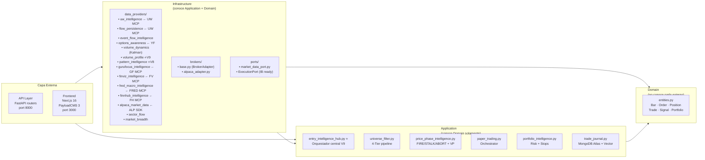
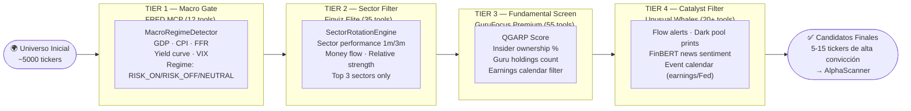
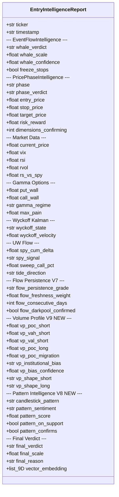
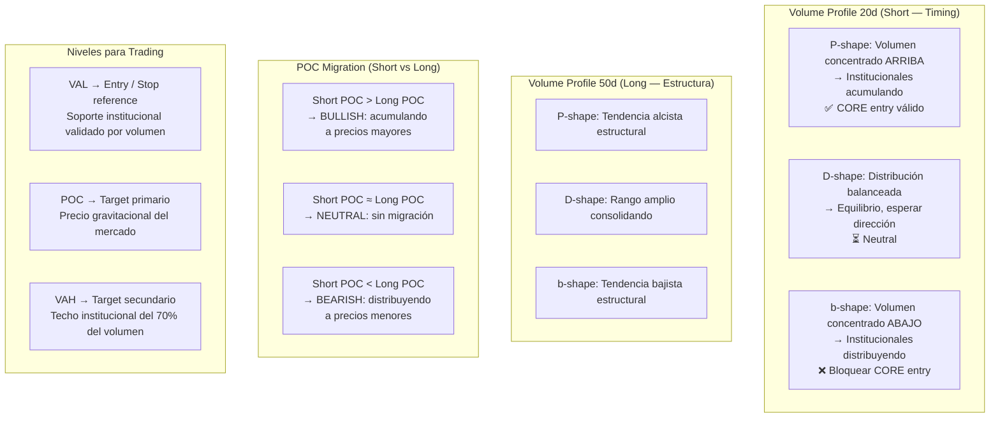
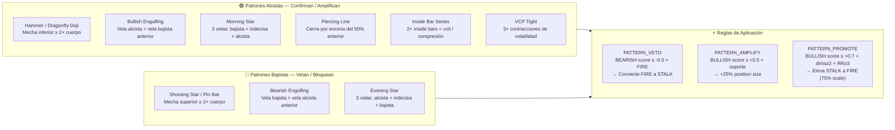
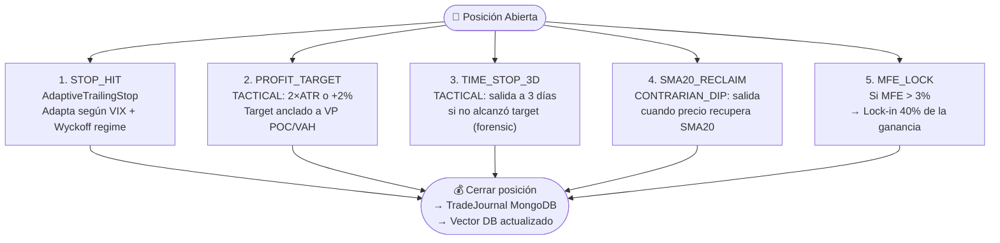

# Botero Trade Engine — Arquitectura Institucional v9

> Última actualización: 2026-04-24 | Versión V9 (Pattern Intelligence + Volume Profile)

---

## 1. Mapa General del Sistema

```mermaid
graph TB
    subgraph EXT["🌐 Fuentes Externas — MCP Servers (8 activos, ~241 tools)"]
        UW["🐋 Unusual Whales<br/>20+ tools<br/>Flow alerts · Market Tide<br/>SPY delta · Dark Pool"]
        FV["📊 Finviz Elite<br/>35 tools<br/>Screening · Sectores<br/>SEC filings"]
        GF["📈 GuruFocus Premium<br/>55 tools<br/>QGARP · Insiders<br/>Guru analysis"]
        FH["📅 Finnhub<br/>45 tools<br/>Earnings cal · Insiders<br/>News"]
        FR["🏛️ FRED<br/>12 tools<br/>GDP · CPI · FFR<br/>Yield curve"]
        ALP["🦙 Alpaca<br/>61 tools<br/>OHLCV · Quotes<br/>Execution (paper)"]
        YF["📉 Yahoo Finance<br/>9 tools<br/>VIX · Options<br/>Fallback data"]
        NS["📰 News Sentiment<br/>4 tools<br/>FinBERT scoring"]
    end

    subgraph SKILLS["🔧 Skills del Agente (CLAUDE.md)"]
        SK1["/start — Startup checklist"]
        SK2["/context — Architecture ref"]
        SK3["/dev — Dev cheatsheet"]
        SK4["/add-strategy — Nueva estrategia"]
        SK5["/add-broker — Nuevo broker"]
        SK6["/find-finance-skills — Descubrir APIs"]
        SK7["/proposito-practico — Anti-sesgo"]
    end

    subgraph INFRA["🔌 Infrastructure Layer — data_providers/"]
        UWI["uw_intelligence.py<br/>UnusualWhalesIntelligence<br/>parse_spy_macro_gate()<br/>parse_market_tide()<br/>parse_flow_alerts()"]
        FPI["flow_persistence.py<br/>FlowPersistenceAnalyzer<br/>evaluate_persistence()<br/>freshness_weight · grade"]
        EFI["event_flow_intelligence.py<br/>EventFlowIntelligence<br/>WhaleVerdict<br/>RIDE/LEAN/UNCERTAIN/CONTRA"]
        OA["options_awareness.py<br/>OptionsAwareness<br/>put_wall · call_wall<br/>gamma_regime · max_pain"]
        VD["volume_dynamics.py<br/>KalmanVolumeTracker<br/>wyckoff_state · velocity<br/>Kalman filter"]
        VP["volume_profile.py ⭐NEW V9<br/>VolumeProfileAnalyzer<br/>POC · VAH · VAL (20d/50d)<br/>P/D/b shapes · POC migration"]
        PI["pattern_intelligence.py ⭐NEW V8<br/>PatternRecognitionIntelligence<br/>Hammer · Engulfing · Morning Star<br/>Inside Bar · VCP · NumPy puro"]
        GFI["gurufocus_intelligence.py<br/>QGARP score · Insider tracking<br/>Guru holdings"]
        FVI["finviz_intelligence.py<br/>Sector performance<br/>Stock screening"]
        FRI["fred_macro_intelligence.py<br/>MacroRegimeDetector<br/>Macro dashboard"]
        FHI["finnhub_intelligence.py<br/>Earnings calendar<br/>Insider transactions"]
        AMI["alpaca_market_data.py<br/>OHLCV · Live quotes<br/>Execution adapter"]
        SF["sector_flow.py<br/>SectorRotationEngine<br/>Money flow analysis"]
        MB["market_breadth.py<br/>S5TH · S5TW · F&G<br/>Market breadth"]
        UDB["uw_data_bridge.py<br/>Data bridge adapter"]
        FC["fundamental_cache.py<br/>Cache layer<br/>Fundamentals"]
    end

    subgraph APP["🧠 Application Layer — El Cerebro"]
        UIH["entry_intelligence_hub.py ⭐CORE<br/>EntryIntelligenceHub<br/>Orquesta TODOS los módulos<br/>EntryIntelligenceReport (9D vector)"]
        UNF["universe_filter.py<br/>4-Tier Pipeline<br/>Macro→Sector→Fund→Catalyst"]
        ALS["alpha_scanner.py<br/>Alpha Score Ranking<br/>Multi-factor composite"]
        PPH["price_phase_intelligence.py<br/>PricePhaseIntelligence<br/>FIRE/STALK/ABORT<br/>VP-anchored entry/stop/target"]
        PT["paper_trading.py<br/>PaperTradingOrchestrator<br/>run_core_scan()<br/>run_tactical_scan()"]
        PI2["portfolio_intelligence.py<br/>RiskGuardian · AdaptiveTrailingStop<br/>GammaAwareStop · PortfolioOptimizer"]
        TJ["trade_journal.py<br/>TradeJournal (MongoDB Atlas)<br/>find_similar_trades()<br/>Atlas Vector Search 9D"]
        TQ["ticker_qualifier.py<br/>Walk-Forward fitness test"]
        TA["trade_autopsy.py<br/>Post-trade forensics"]
        PM["position_monitor.py<br/>Live position tracking<br/>5 exit signals"]
        LM["lstm_model.py<br/>QuantInstitutionalLSTM<br/>⚠️ planned → infra"]
    end

    subgraph DOM["📐 Domain Layer"]
        ENT["entities.py<br/>Bar · Order · Position<br/>Trade · Signal · Portfolio<br/>Broker enum"]
    end

    subgraph API["🔗 API Layer — FastAPI (port 8000)"]
        FAST["main.py<br/>FastAPI + CORS"]
        R1["market_data.py router"]
        R2["portfolio.py router"]
        R3["strategy.py router"]
    end

    subgraph STORE["🗄️ Storage"]
        MDB["MongoDB Atlas<br/>Trades collection<br/>Vector Search (9D)<br/>Journals"]
    end

    subgraph FE["🖥️ Frontend — Next.js 16 + PayloadCMS 3 (port 3000)"]
        UI2["Trading Dashboard<br/>src/app/frontend"]
        CMS2["Admin Panel<br/>src/app/payload"]
    end

    %% External → Infrastructure
    UW -->|"MCP tools"| UWI
    UW -->|"MCP tools"| FPI
    FV -->|"MCP tools"| FVI
    GF -->|"MCP tools"| GFI
    FH -->|"MCP tools"| FHI
    FR -->|"MCP tools"| FRI
    ALP -->|"SDK"| AMI
    YF -->|"yfinance"| UIH

    %% Infrastructure → Application
    UWI --> UIH
    FPI --> UIH
    EFI --> UIH
    OA --> UIH
    VD --> UIH
    VP --> UIH
    PI --> UIH
    PPH --> UIH
    GFI --> UNF
    FVI --> UNF
    FRI --> UNF
    FHI --> UNF
    SF --> UNF
    MB --> UIH

    %% Application → Application
    UIH --> PT
    UNF --> ALS
    ALS --> PT
    TJ --> UIH
    PI2 --> PT
    PM --> PT

    %% Application → Domain
    UIH --> ENT
    PT --> ENT

    %% Application → Storage
    TJ --> MDB

    %% API Layer
    FAST --> R1
    FAST --> R2
    FAST --> R3
    R1 --> UIH
    R3 --> PT

    %% Frontend
    FE -->|"HTTP fetch"| API
```

---

## 2. Pipeline de Decisión — EntryIntelligenceHub (V9)

```mermaid
flowchart TD
    START(["🎯 evaluate(ticker, strategy_bucket)"])

    S1["STEP 1: Precio<br/>yfinance 3mo OHLCV<br/>ATR · RVOL · RSI · RS vs SPY<br/>VIX (^VIX)"]

    S2["STEP 2: Opciones — Gamma<br/>OptionsAwareness<br/>put_wall · call_wall<br/>gamma_regime · max_pain"]

    S3["STEP 3: Volumen — Wyckoff<br/>KalmanVolumeTracker<br/>wyckoff_state · velocity<br/>Kalman Bayesian filter"]

    S4["STEP 4: Flujo de Ballenas<br/>UnusualWhalesIntelligence (UW MCP)<br/>spy_cum_delta · market_tide<br/>sweep_call_pct · am_pm_divergence"]

    S4B["STEP 4b: Flow Persistence V7<br/>FlowPersistenceAnalyzer<br/>FRESH_ISOLATED · CONFIRMED_STREAK<br/>DECAYING · DEAD_SIGNAL"]

    DEAD{"DEAD_SIGNAL?"}
    BLOCK1(["❌ BLOCK — Signal decayed"])

    S5["STEP 5: EventFlowIntelligence<br/>WhaleVerdict<br/>RIDE_THE_WHALES · LEAN_WITH_FLOW<br/>UNCERTAIN · CONTRA_FLOW"]

    CONTRA{"CONTRA_FLOW?"}
    BLOCK2(["❌ BLOCK (CORE)<br/>TACTICAL pasa al análisis de fase"])

    S55["STEP 5.5: Volume Profile V9 ⭐<br/>VolumeProfileAnalyzer (20d + 50d)<br/>POC · VAH · VAL<br/>Shape: P/D/b · POC Migration<br/>Institutional Bias ACCUMULATION/DISTRIBUTION"]

    DIST{"VP DISTRIBUTION<br/>≥75% confidence<br/>(CORE only)?"}
    BLOCK3(["⏳ STALK — VP Distribution Gate<br/>Institucionales distribuyendo"])

    S6["STEP 6: PricePhaseIntelligence<br/>Fases: CORRECTION · BREAKOUT<br/>CONTRARIAN_DIP · MOMENTUM_CONT<br/>EXHAUSTION_UP · STEALTH_DIST<br/>Verdict: FIRE / STALK / ABORT<br/>Entry/Stop/Target anclados a VP"]

    S6B["STEP 6b: PatternIntelligence V8 ⭐<br/>PatternRecognitionIntelligence<br/>Hammer · Bullish Engulfing · Morning Star<br/>Inside Bar · VCP · Shooting Star<br/>Bearish Engulfing · Evening Star<br/>confirmation_score -1.0 → +1.0"]

    S7{"STEP 7: Dictamen Final"}

    ABORT_F(["❌ BLOCK — Phase ABORT"])

    FIRE_F["Phase = FIRE"]
    RSI_GATE{"CORE RSI<br/>35-65 sweet spot?"}
    STALK3(["⏳ STALK — RSI Quality Gate<br/>Forensic WR=23% fuera del rango"])
    PAT_VETO{"Pattern BEARISH<br/>score ≤ -0.5?"}
    STALK4(["⏳ STALK — Pattern VETO<br/>Patrón bajista cancela FIRE"])
    VECTOR["Vector DB Query (9D)<br/>find_similar_trades()"]
    MEM{"80%+ históricos<br/>similares perdieron?"}
    BLOCK4(["❌ BLOCK — Memory Guard"])
    AMPLIFY{"Pattern BULLISH<br/>en soporte +score ≥0.5?"}
    EXECUTE(["✅ EXECUTE<br/>+25% scale si AMPLIFY"])

    STALK_F["Phase = STALK"]
    PROMOTE{"Pattern BULLISH<br/>score≥0.7 · dims≥2 · RR≥3?"}
    EXECUTE2(["✅ EXECUTE (75% scale)<br/>Pattern PROMOTE: STALK→FIRE"])
    STALK_FINAL(["⏳ STALK — Waiting better setup"])

    START --> S1 --> S2 --> S3 --> S4 --> S4B
    S4B --> DEAD
    DEAD -->|Sí| BLOCK1
    DEAD -->|No| S5
    S5 --> CONTRA
    CONTRA -->|Sí CORE| BLOCK2
    CONTRA -->|No| S55
    S55 --> DIST
    DIST -->|Sí| BLOCK3
    DIST -->|No| S6
    S6 --> S6B --> S7

    S7 -->|"ABORT"| ABORT_F
    S7 -->|"FIRE"| FIRE_F
    S7 -->|"STALK"| STALK_F

    FIRE_F --> RSI_GATE
    RSI_GATE -->|"Fuera rango"| STALK3
    RSI_GATE -->|"OK"| PAT_VETO
    PAT_VETO -->|"Sí"| STALK4
    PAT_VETO -->|"No"| VECTOR --> MEM
    MEM -->|"Sí"| BLOCK4
    MEM -->|"No"| AMPLIFY
    AMPLIFY -->|"Sí"| EXECUTE
    AMPLIFY -->|"No"| EXECUTE

    STALK_F --> PROMOTE
    PROMOTE -->|"Sí"| EXECUTE2
    PROMOTE -->|"No"| STALK_FINAL
```

---

## 3. Clean Architecture — Capas y Reglas

---

## 4. Universe Filter — 4-Tier Pipeline

---

## 5. EntryIntelligenceReport — Estructura del Dictamen (V9)

---

## 6. Volume Profile V9 — Lógica de Shapes

---

## 7. Pattern Intelligence V8 — Señales Detectadas

---

## 8. Exit System — 5 Señales Forenses

---

## 9. MCP Skills Map — Herramientas por Etapa

| Etapa del Pipeline | Módulo | MCP / Skill | Tools usados |
|---|---|---|---|
| **Universe — Macro** | `fred_macro_intelligence.py` | FRED | `get_series`, `search_series`, `get_releases` |
| **Universe — Sector** | `finviz_intelligence.py` | Finviz Elite | `get_sector_performance`, `get_market_overview`, `screen_stocks` |
| **Universe — Fundamental** | `gurufocus_intelligence.py` | GuruFocus Premium | `get_financials`, `get_insider_transactions`, `get_guru_holdings` |
| **Universe — Catalyst** | `finnhub_intelligence.py` | Finnhub | `get_earnings_calendar`, `get_insider_transactions` |
| **Gamma / Options** | `options_awareness.py` | Yahoo Finance | `get_options_chain`, `get_options_expiry` |
| **Wyckoff / Volume** | `volume_dynamics.py` | — (yfinance interno) | OHLCV via yfinance |
| **Volume Profile** ⭐V9 | `volume_profile.py` | — (NumPy puro) | OHLCV de yfinance, cálculo interno |
| **Pattern Intelligence** ⭐V8 | `pattern_intelligence.py` | — (NumPy + pandas-ta) | OHLCV de yfinance, detección interna |
| **Whale Flow** | `uw_intelligence.py` | Unusual Whales | `get_flow_alerts`, `get_market_tide`, `get_spy_ticks`, `get_darkpool_prints` |
| **Flow Persistence** | `flow_persistence.py` | Unusual Whales | `get_recent_flow`, `get_darkpool_prints` |
| **Event Flow** | `event_flow_intelligence.py` | Yahoo Finance + UW | VIX, earnings calendar, flow |
| **Alpha Score** | `alpha_scanner.py` | Finviz + GuruFocus | Screening compuesto |
| **Market Breadth** | `market_breadth.py` | Yahoo Finance + UW | S5TH, Fear & Greed |
| **News Sentiment** | — | News Sentiment MCP | `analyze_sentiment` (FinBERT) |
| **Execution** | `alpaca_market_data.py` | Alpaca | `place_order`, `get_positions`, `get_portfolio` |
| **Memory / Journal** | `trade_journal.py` | MongoDB Atlas | Vector Search 9D embedding |

---

## 10. Resultados Empíricos — V8→V9

| Métrica | V8 (pre-VP/Pattern) | V9 Final |
|---|---|---|
| **Trades / semana** | 19 | 17 |
| CORE trades | 2 | **0** (VP bloqueó todo) |
| TACTICAL trades | 17 | 17 |
| **Win Rate** | 57.9% | **67%** |
| **PnL semanal** | $849 | $721 (pure alpha) |
| Avg MFE | — | +5.14% |
| Pattern gate activo | ❌ No | ✅ Sí (V8) |
| VP protection | ❌ No | ✅ Sí (V9) |

> **Key finding**: El Volume Profile bloqueó **todos** los trades CORE en un mercado bajista estructural (b-shape / DISTRIBUTION bias). El sistema protegió el capital sin intervención manual.
