# Botero Trade Engine — Arquitectura Institucional v13

> Última actualización: 2026-05-01 | Versión V13 (Expert Committee + Module Internals + Graphyfi)
> Verificado con Graphyfi: 3387 nodos, 512 archivos, 12 módulos

### 📚 Documentación Expandida (V13)

| Documento | Contenido |
|---|---|
| **[architecture-diagram.md](./architecture-diagram.md)** | Este archivo — mapa general del sistema |
| **[architecture-expert-committee.md](./architecture-expert-committee.md)** | Expert Committee, 6-Gate Protocol, Skill→Module→Decision map |
| **[architecture-modules-internal.md](./architecture-modules-internal.md)** | Detalle interno de cada módulo: entities, ports, rules, use_cases |

---

## 1. Mapa General del Sistema

```mermaid
graph TB
    subgraph EXT["🌐 Fuentes Externas — MCP Servers (8 activos, ~241 tools)"]
        UW["🐋 Unusual Whales<br/>20+ tools<br/>Flow alerts · Market Tide<br/>SPY delta · Dark Pool"]
        FV["📊 Finviz<br/>35 tools<br/>Screening · Sectores<br/>SEC filings"]
        GF["📈 GuruFocus Premium<br/>55 tools<br/>QGARP · Insiders<br/>Guru analysis"]
        FH["📅 Finnhub<br/>45 tools<br/>Earnings cal · Insiders<br/>News"]
        FR["🏛️ FRED<br/>12 tools<br/>GDP · CPI · FFR<br/>Yield curve"]
        ALP["🦙 Alpaca<br/>61 tools<br/>OHLCV · Quotes<br/>Execution (paper)"]
        YF["📉 Yahoo Finance<br/>9 tools<br/>VIX · Options<br/>Fallback data"]
        NS["📰 News Sentiment<br/>4 tools<br/>FinBERT scoring"]
    end

    subgraph SKILLS["🔧 Agent Skills (.agents/skills/) — 17 skills"]
        SK_ALWAYS["🔒 ALWAYS ACTIVE<br/>operational-purpose (Zero-Bias)<br/>clean-architecture (Hexagonal Rules)"]
        SK_CIO["🏛️ cio-allocator — Ray Dalio<br/>Capital allocation · Regime · Meritocracy"]
        SK_ROT["🌍 rotation-analyst — Weinstein & Pring<br/>Stage Analysis · Intermarket cycles"]
        SK_RI["🔍 research-intelligence<br/>Dual-track: Quality watchlist + Speculative opps"]
        SK_FA["🎩 fundamental-analyst — Hohn & Munger<br/>Tollkeeper · Moat Stress Test · Valuation"]
        SK_TE["🎯 tactical-entries — Eifert, Karsan & PTJ<br/>GEX · Vanna/Charm · 5:1 R:R · tape"]
        SK_RM["📊 risk-manager — Druckenmiller & Seykota<br/>QUALITY: thesis exits · SPEC: mechanical stops"]
        SK_BT["🧪 backtesting — López de Prado<br/>Triple Barrier · Meta-Label · Purged CV"]
        SK_TA["📋 trading-analysis — Reports"]
        SK_TF["🔬 trade-forensics<br/>Detect→Learn→Retrain→Prevent"]
        SK_PL["⚙️ 4× Payload CMS skills<br/>Access · Hooks · Lifecycle · Routes"]
    end

    subgraph MODULES["🧩 Backend Modules (12 modules · Clean Architecture)"]

        subgraph MOD_ED["entry_decision"]
            ED_D["domain/ entities · ports · rules<br/>EntryMarketDataPort"]
            ED_A["application/ use_cases/<br/>EntryIntelligenceHub ⭐CORE<br/>9-step pipeline · Memory Guard"]
            ED_I["infrastructure/<br/>MarketDataFetcher (yfinance)"]
        end

        subgraph MOD_FI["flow_intelligence"]
            FI_D["domain/ entities · ports · rules<br/>CalendarDataPort · macro_calendar"]
            FI_A["application/ use_cases/<br/>analyze_whale_flow · analyze_persistence<br/>WhaleVerdict · FlowPersistence"]
            FI_I["infrastructure/<br/>uw_adapter · uw_mcp_bridge<br/>fred_adapter · finnhub_adapter<br/>market_breadth_adapter"]
        end

        subgraph MOD_EX["execution"]
            EX_D["domain/ entities · ports · rules<br/>BrokerPort · TradeJournalPort<br/>InstrumentBlacklistPort ⭐<br/>SpeculativeExitEngine (Seykota) ⭐<br/>QualityExitEngine (Druckenmiller) ⭐"]
            EX_A["application/ use_cases/<br/>orchestrate_paper_trading ⭐CORE<br/>execute_order · journal_trades<br/>monitor_positions · orchestrate_scans<br/>surveillance_loop ⭐"]
            EX_I["infrastructure/<br/>brokers/ (Alpaca · IB · base)<br/>BrokerRegistry {Q↔S} ⭐<br/>JournalRegistry {Q↔S} ⭐<br/>postgres_journal_adapter<br/>postgres_blacklist_adapter"]
        end

        subgraph MOD_OG["options_gamma"]
            OG_D["domain/ entities · ports · rules<br/>OptionsDataPort · black_scholes · opex_calendar"]
            OG_A["application/ use_cases/<br/>analyze_gamma<br/>GEX · put_wall · call_wall · max_pain"]
            OG_I["infrastructure/<br/>yfinance_adapter"]
        end

        subgraph MOD_PM["portfolio_management"]
            PM_D["domain/ entities · ports · rules<br/>5 Ports · 7 Rules<br/>MacroRegimeDetector · RiskGuardian"]
            PM_A["application/ use_cases/<br/>cio_orchestrator ⭐ · filter_universe<br/>scan_alpha · qualify_ticker<br/>optimize_portfolio · detect_regime_change"]
            PM_I["infrastructure/<br/>gurufocus · finviz · sector_flow<br/>macro_data · payload_instruments<br/>sec_filings · sec_nlp_analyzer"]
        end

        subgraph MOD_PA["price_analysis"]
            PA_D["domain/ entities · rules<br/>price_rules.py"]
            PA_A["application/ use_cases/<br/>detect_price_phase (FIRE/STALK/ABORT)<br/>analyze_rsi (Cardwell/Brown)"]
        end

        subgraph MOD_VI["volume_intelligence"]
            VI_D["domain/ entities · rules<br/>volume_rules.py"]
            VI_A["application/ use_cases/<br/>track_volume_dynamics (Kalman)<br/>analyze_volume_profile (POC/VAH/VAL)"]
        end

        subgraph MOD_PR["pattern_recognition"]
            PR_D["domain/ entities<br/>PatternVerdict"]
            PR_A["application/ use_cases/<br/>detect_patterns<br/>Hammer · Engulfing · VCP"]
        end

        subgraph MOD_RI["rotation_intelligence"]
            RI_D["domain/ entities · ports<br/>RotationDataPort · rotation_snapshot"]
            RI_A["application/ use_cases/<br/>rotation_scanner (Weinstein + Pring)"]
            RI_I["infrastructure/<br/>yahoo_rotation_adapter"]
        end

        subgraph MOD_SIM["simulation"]
            SIM_D["domain/ entities · ports (10)<br/>HistoricalData · TimeSeries · Signal<br/>BarrierLabeler · MarketStructure"]
            SIM_A["application/ use_cases/<br/>run_backtest · oracle_backtest<br/>calibrate_strategy · pre_trade_gate<br/>engineer_features · strategy_composer<br/>retrain_trigger · analyze_trades"]
            SIM_I["infrastructure/<br/>timescale_data_store · data_harmonizer<br/>signal_adapters · smc_adapter<br/>postgres_trading_state<br/>triple_barrier · vault_interceptor"]
        end

        subgraph MOD_SH["shared"]
            SH_D["domain/ entities<br/>Bar · market_data types"]
            SH_A["application/ use_cases/<br/>shared_use_cases (delegation)"]
            SH_I["infrastructure/<br/>cache_utils (TTL + retry)"]
        end
    end

    subgraph API["🔗 API Layer — FastAPI (port 8000)"]
        FAST["main.py<br/>FastAPI + CORS"]
        FAC["factories/<br/>execution_factory.py<br/>Composition Root ⭐<br/>build_journal_registry() ⭐V12<br/>build_blacklist() ⭐V12<br/>build_surveillance_loop() ⭐V12"]
        R1["market_data.py"]
        R2["portfolio.py"]
        R3["strategy.py"]
        R4["orders.py"]
        R5["simulation.py"]
    end

    subgraph STORE["🗄️ Storage — PostgreSQL Único"]
        PG_PAY["Neon PostgreSQL<br/>PayloadCMS tables<br/>12 collections"]
        PG_TS["TimescaleDB<br/>OHLCV · Macro · Features<br/>engine.* schema"]
        PG_TJ["Trade Journal<br/>engine.trade_journal<br/>engine.trade_snapshots<br/>pgvector (9D)"]
    end

    subgraph FE["🖥️ Frontend — Next.js 16 + PayloadCMS 3 (port 3000)"]
        UI2["Trading Dashboard<br/>src/app/(frontend)"]
        CMS2["Admin Panel<br/>src/app/(payload)<br/>12 Collections"]
        FE_SHARED["src/shared/<br/>domain/ · application/<br/>infrastructure/ · handlers/"]
    end

    %% External → Infrastructure
    UW -->|"MCP tools"| FI_I
    FV -->|"MCP tools"| PM_I
    GF -->|"MCP tools"| PM_I
    FH -->|"MCP tools"| FI_I
    FR -->|"MCP tools"| FI_I
    ALP -->|"SDK"| EX_I
    YF -->|"yfinance"| OG_I
    YF -->|"yfinance"| ED_I
    YF -->|"yfinance"| RI_I

    %% Infrastructure → Domain (via Ports)
    ED_I -.->|"implements<br/>EntryMarketDataPort"| ED_D
    FI_I -.->|"implements<br/>FlowDataPort · CalendarDataPort"| FI_D
    EX_I -.->|"implements<br/>BrokerPort · TradeJournalPort"| EX_D
    OG_I -.->|"implements<br/>OptionsDataPort"| OG_D
    PM_I -.->|"implements<br/>5 Ports"| PM_D
    RI_I -.->|"implements<br/>RotationDataPort"| RI_D
    SIM_I -.->|"implements<br/>10 Ports"| SIM_D

    %% Domain → Domain (allowed cross-module)
    ED_D --> EX_D
    FI_D --> ED_D
    OG_D --> ED_D
    PA_D --> ED_D
    VI_D --> ED_D
    PR_D --> ED_D
    PM_D --> EX_D

    %% API → Factory → Modules
    FAST --> R1 & R2 & R3 & R4 & R5
    FAC -->|"builds"| EX_I
    R1 --> ED_D
    R3 --> EX_D
    R4 --> EX_D
    R5 --> SIM_D

    %% Storage
    EX_I --> PG_TJ
    SIM_I --> PG_TS
    PM_I --> PG_PAY

    %% Frontend
    FE -->|"HTTP /api"| API
    CMS2 --> PG_PAY
```

---

## 2. Módulos Backend — Hexagonal Architecture (post-refactoring)

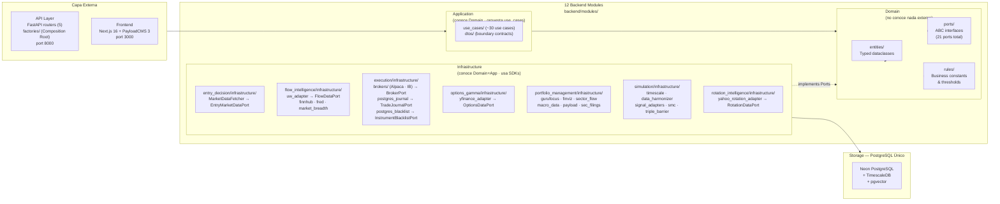

---

## 3. Composition Root — Factory Pattern

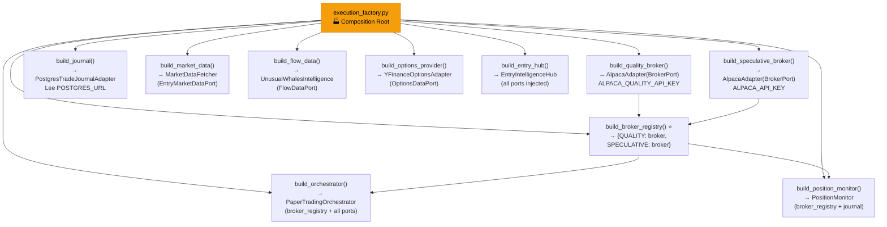

---

## 4. Pipeline de Decisión — EntryIntelligenceHub (V9)

```mermaid
flowchart TD
    START(["🎯 evaluate(ticker, strategy_bucket)"])

    S1["STEP 1: Precio<br/>EntryMarketDataPort.fetch_prices()<br/>ATR · RVOL · RSI · RS vs SPY<br/>VIX"]

    S2["STEP 2: Opciones — Gamma<br/>OptionsDataPort.get_options_chain()<br/>put_wall · call_wall<br/>gamma_regime · max_pain"]

    S3["STEP 3: Volumen — Wyckoff<br/>KalmanVolumeTracker<br/>wyckoff_state · velocity<br/>Kalman Bayesian filter"]

    S4["STEP 4: Flujo de Ballenas<br/>FlowDataPort (UW MCP)<br/>spy_cum_delta · market_tide<br/>sweep_call_pct · am_pm_divergence"]

    S4B["STEP 4b: Flow Persistence V7<br/>FlowPersistenceAnalyzer<br/>FRESH_ISOLATED · CONFIRMED_STREAK<br/>DECAYING · DEAD_SIGNAL"]

    DEAD{"DEAD_SIGNAL?"}
    BLOCK1(["❌ BLOCK — Signal decayed"])

    S5["STEP 5: EventFlowIntelligence<br/>WhaleVerdict<br/>RIDE_THE_WHALES · LEAN_WITH_FLOW<br/>UNCERTAIN · CONTRA_FLOW"]

    CONTRA{"CONTRA_FLOW?"}
    BLOCK2(["❌ BLOCK (CORE)<br/>TACTICAL pasa al análisis de fase"])

    S55["STEP 5.5: Volume Profile V9 ⭐<br/>VolumeProfileAnalyzer (20d + 50d)<br/>POC · VAH · VAL<br/>Shape: P/D/b · POC Migration<br/>Institutional Bias ACCUMULATION/DISTRIBUTION"]

    DIST{"VP DISTRIBUTION<br/>≥75% confidence<br/>(CORE only)?"}
    BLOCK3(["⏳ STALK — VP Distribution Gate<br/>Institucionales distribuyendo"])

    S6["STEP 6: PricePhaseIntelligence<br/>Fases: CORRECTION · BREAKOUT<br/>CONTRARIAN_DIP · MOMENTUM_CONT<br/>EXHAUSTION_UP · STEALTH_DIST<br/>Verdict: FIRE / STALK / ABORT<br/>Entry/Stop/Target anclados a VP"]

    S6B["STEP 6b: PatternIntelligence V8 ⭐<br/>PatternRecognitionIntelligence<br/>Hammer · Engulfing · Morning Star<br/>Inside Bar · VCP · Shooting Star<br/>confirmation_score -1.0 → +1.0"]

    S7{"STEP 7: Dictamen Final"}

    ABORT_F(["❌ BLOCK — Phase ABORT"])

    FIRE_F["Phase = FIRE"]
    RSI_GATE{"CORE RSI<br/>35-65 sweet spot?"}
    STALK3(["⏳ STALK — RSI Quality Gate"])
    PAT_VETO{"Pattern BEARISH<br/>score ≤ -0.5?"}
    STALK4(["⏳ STALK — Pattern VETO"])
    VECTOR["TradeJournalPort.find_similar()<br/>pgvector 9D query"]
    MEM{"80%+ históricos<br/>similares perdieron?"}
    BLOCK4(["❌ BLOCK — Memory Guard"])
    AMPLIFY{"Pattern BULLISH<br/>en soporte +score ≥0.5?"}
    EXECUTE(["✅ EXECUTE<br/>+25% scale si AMPLIFY"])

    STALK_F["Phase = STALK"]
    PROMOTE{"Pattern BULLISH<br/>score≥0.7 · dims≥2 · RR≥3?"}
    EXECUTE2(["✅ EXECUTE (75% scale)<br/>Pattern PROMOTE: STALK→FIRE"])
    STALK_FINAL(["⏳ STALK — Waiting better setup"])

    START --> S1 --> S2 --> S3 --> S4 --> S4B
    S4B --> DEAD
    DEAD -->|Sí| BLOCK1
    DEAD -->|No| S5
    S5 --> CONTRA
    CONTRA -->|Sí CORE| BLOCK2
    CONTRA -->|No| S55
    S55 --> DIST
    DIST -->|Sí| BLOCK3
    DIST -->|No| S6
    S6 --> S6B --> S7

    S7 -->|"ABORT"| ABORT_F
    S7 -->|"FIRE"| FIRE_F
    S7 -->|"STALK"| STALK_F

    FIRE_F --> RSI_GATE
    RSI_GATE -->|"Fuera rango"| STALK3
    RSI_GATE -->|"OK"| PAT_VETO
    PAT_VETO -->|"Sí"| STALK4
    PAT_VETO -->|"No"| VECTOR --> MEM
    MEM -->|"Sí"| BLOCK4
    MEM -->|"No"| AMPLIFY
    AMPLIFY -->|"Sí"| EXECUTE
    AMPLIFY -->|"No"| EXECUTE

    STALK_F --> PROMOTE
    PROMOTE -->|"Sí"| EXECUTE2
    PROMOTE -->|"No"| STALK_FINAL
```

---

## 5. Universe Filter — 4-Tier Pipeline

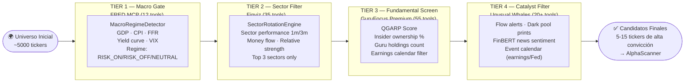

---

## 6. Port / Adapter Map — Módulo por Módulo

| Módulo | Port (domain) | Adapter (infrastructure) | External Source |
|---|---|---|---|
| **entry_decision** | `EntryMarketDataPort` | `MarketDataFetcher` | yfinance |
| **entry_decision** | `FlowDataPort` | `UnusualWhalesIntelligence` | UW MCP |
| **execution** | `BrokerPort` | `AlpacaAdapter` · `IBAdapter` | Alpaca SDK · IBKR |
| **execution** | `TradeJournalPort` | `PostgresTradeJournalAdapter` | PostgreSQL |
| **options_gamma** | `OptionsDataPort` | `YFinanceOptionsAdapter` | yfinance |
| **flow_intelligence** | `CalendarDataPort` | `FinnhubAdapter` | Finnhub MCP |
| **portfolio_management** | `FundamentalDataPort` | `GuruFocusAdapter` | GuruFocus MCP |
| **portfolio_management** | `ScreenerPort` | `FinvizAdapter` | Finviz MCP |
| **portfolio_management** | `SectorDataPort` | `SectorFlowAdapter` | Finviz + UW MCP |
| **portfolio_management** | `MacroDataPort` | `MacroDataAdapter` | FRED MCP |
| **portfolio_management** | `InstrumentRepoPort` | `PayloadInstrumentsAdapter` | PayloadCMS (PG) |
| **rotation_intelligence** | `RotationDataPort` | `YahooRotationAdapter` | yfinance |
| **simulation** | `HistoricalDataPort` | (TimescaleDB) | PostgreSQL |
| **simulation** | `TimeSeriesPort` | `TimescaleDataStore` | PostgreSQL |
| **simulation** | `DataHarmonizerPort` | `DataHarmonizer` | Internal |
| **simulation** | `SignalPort` | `SignalAdapters` | Internal |
| **simulation** | `TradingStatePort` | `PostgresTradingState` | PostgreSQL |
| **simulation** | `MarketStructurePort` | `SMCAdapter` | Internal |
| **simulation** | `BarrierLabelerPort` | `TripleBarrierAdapter` | Internal |
| **simulation** | `MLConfidencePort` | (planned) | — |
| **simulation** | `DashboardSyncPort` | (planned) | — |
| **simulation** | `VolumeAnalysisPort` | (planned) | — |

---

## 7. Storage — PostgreSQL Consolidado

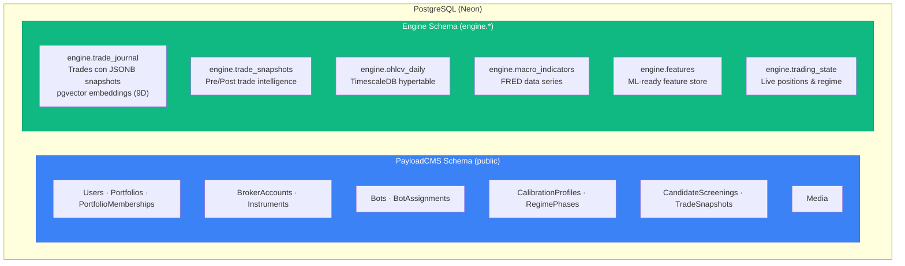

---

## 8. Frontend — Next.js 16 + PayloadCMS 3

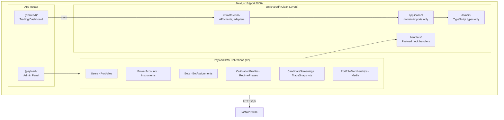

---

## 9. Exit System — Dual Engine Architecture ⭐V11

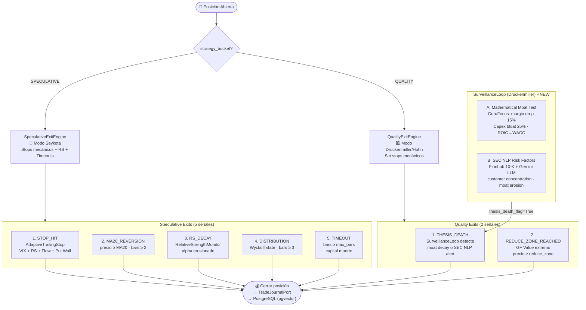

---

## 10. MCP Skills Map — Herramientas por Módulo

| Módulo Backend | MCP / Skill | Tools usados |
|---|---|---|
| **flow_intelligence** (UW) | Unusual Whales | `get_flow_alerts`, `get_market_tide`, `get_spy_ticks`, `get_darkpool_prints` |
| **flow_intelligence** (FRED) | FRED | `get_series`, `search_series`, `get_releases` |
| **flow_intelligence** (Finnhub) | Finnhub | `get_earnings_calendar`, `get_insider_transactions` |
| **flow_intelligence** (Breadth) | Yahoo Finance + UW | S5TH, Fear & Greed |
| **portfolio_management** (GuruFocus) | GuruFocus Premium | `get_financials`, `get_insider_transactions`, `get_guru_holdings` |
| **portfolio_management** (Finviz) | Finviz | `get_sector_performance`, `get_market_overview`, `screen_stocks` |
| **portfolio_management** (Instruments) | PayloadCMS (PG) | Direct DB read via adapter |
| **options_gamma** | Yahoo Finance | `get_options_chain`, `get_options_expiry` |
| **entry_decision** (Market Data) | yfinance (internal) | OHLCV, VIX |
| **rotation_intelligence** | Yahoo Finance (yfinance) | ETF price/volume for 26 ETFs (sector/intl/asset) |
| **volume_intelligence** | — (NumPy puro) | OHLCV de yfinance, Kalman filter |
| **pattern_recognition** | — (NumPy puro) | OHLCV, candlestick detection |
| **execution** (Broker) | Alpaca SDK ×2 | QUALITY account + SPECULATIVE account |
| **execution** (Journal) | PostgreSQL | pgvector similarity search |
| **execution** (Surveillance) | GuruFocus + Finnhub | Moat decay audit + SEC 10-K NLP |
| **simulation** | TimescaleDB | OHLCV, features, trading state |
| **shared** | News Sentiment MCP | `analyze_sentiment` (FinBERT) |

---

## 11. Inward Dependency Rule — Verificado ✅ (Graphyfi-verified)

```
┌─────────────────────────────────────────────────────┐
│  API Layer (routers, factories)                      │
│  ┌───────────────────────────────────────────────┐  │
│  │  Infrastructure (adapters, SDKs, PostgreSQL)   │  │
│  │  ┌─────────────────────────────────────────┐  │  │
│  │  │  Application (use_cases, dtos)           │  │  │
│  │  │  ┌───────────────────────────────────┐  │  │  │
│  │  │  │  Domain (entities, ports, rules)   │  │  │  │
│  │  │  │  • ZERO SDK imports               │  │  │  │
│  │  │  │  • ZERO os.getenv / os.environ    │  │  │  │
│  │  │  │  • ZERO infrastructure imports    │  │  │  │
│  │  │  │  • Dependencies via Ports (ABC)   │  │  │  │
│  │  │  └───────────────────────────────────┘  │  │  │
│  │  └─────────────────────────────────────────┘  │  │
│  └───────────────────────────────────────────────┘  │
└─────────────────────────────────────────────────────┘
```

| Check | Count | Status |
|---|---|---|
| Infrastructure imports in domain | **0** | ✅ |
| SDK imports in domain | **0** | ✅ |
| `os.getenv` in domain | **0** | ✅ |
| MongoDB references | **0** | ✅ Purged |
| Ports defined | **21** | ✅ |
| Adapters implementing ports | **~16** | ✅ |
| Composition Root | `execution_factory.py` | ✅ |
| Clean modules (12/12) | **12** | ✅ |
| Application layer separated | **12/12** | ✅ V13 |
| Use cases in application/ | **~30** | ✅ V13 |
| Dual Exit Engines | Quality + Speculative | ✅ |
| Dual Broker Accounts | QUALITY + SPECULATIVE | ✅ |
| Graphyfi nodes indexed | **3387** | ✅ V13 |
| Agent skills active | **17** | ✅ V13 |

---

## 12. Diagramas de Estado

### 12a. Trade Lifecycle — `TradeJournalEntry.status`

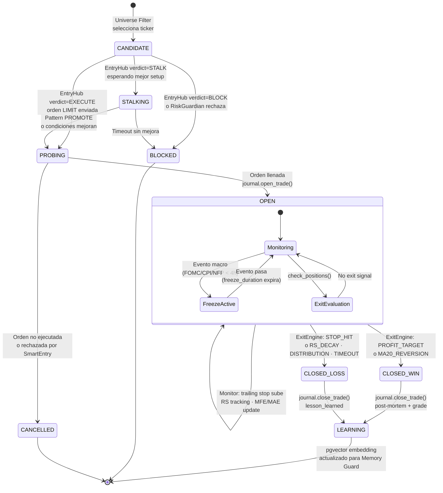

### 12b. Entry Verdict — `EntryIntelligenceReport.final_verdict`

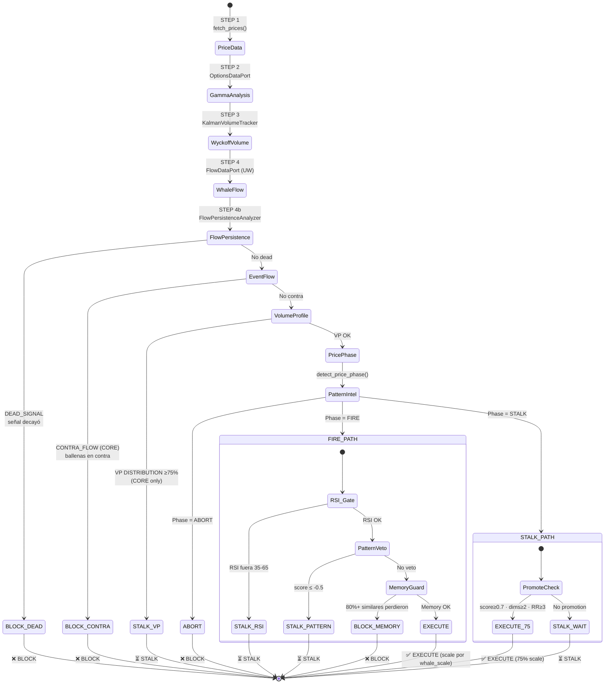

### 12c. Market Regime — `MarketRegime` enum

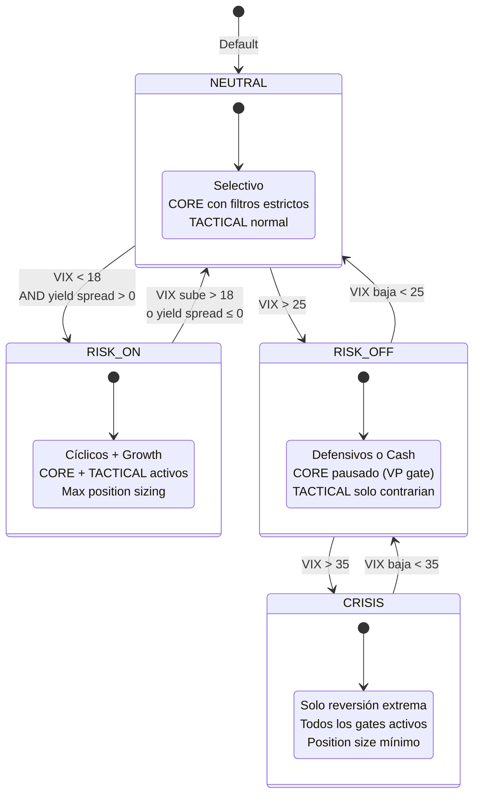

### 12d. Exit Engine — `ExitDecision.reason`

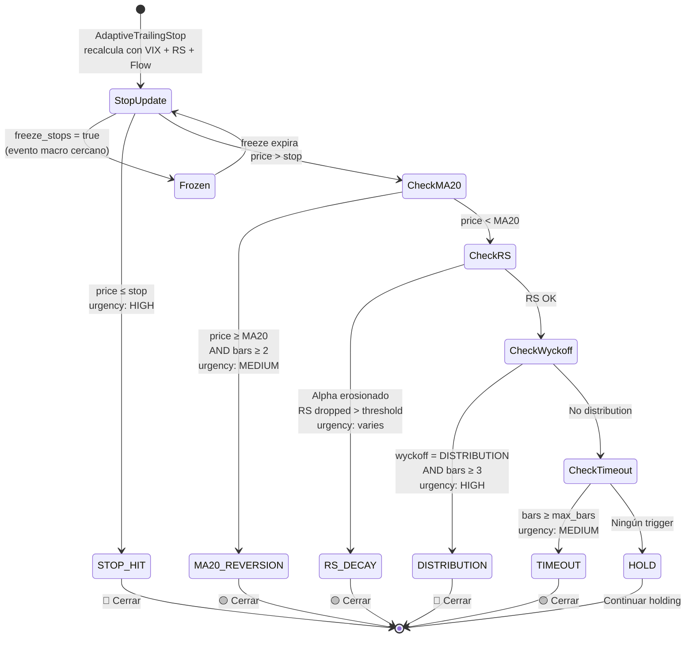
