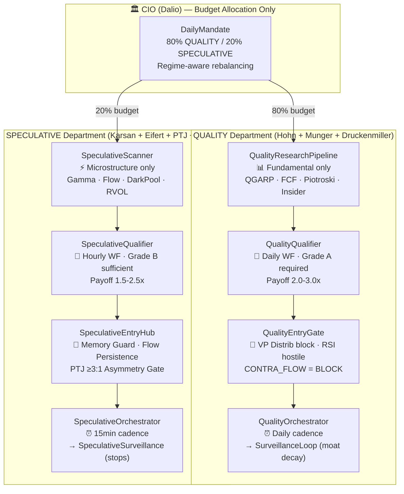
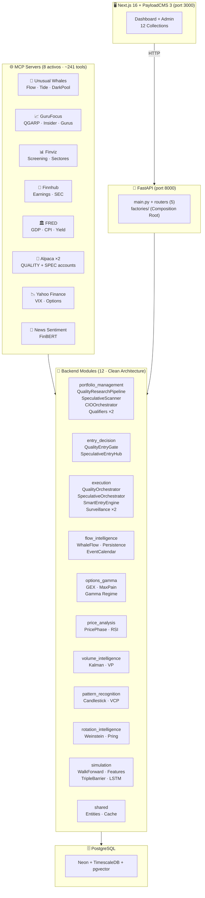
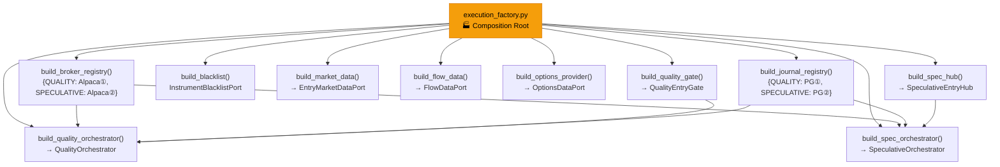
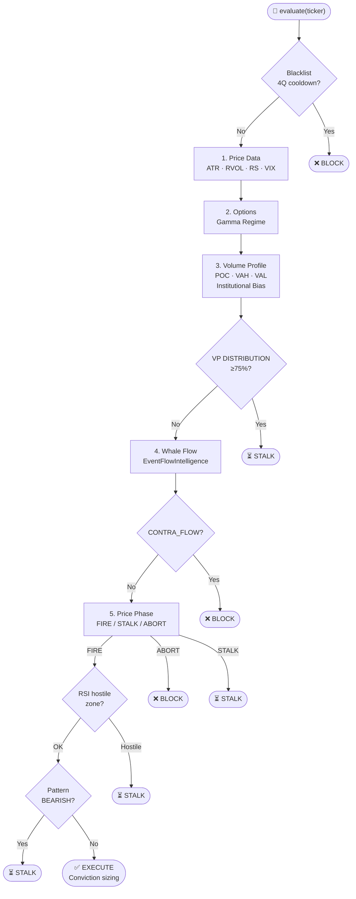
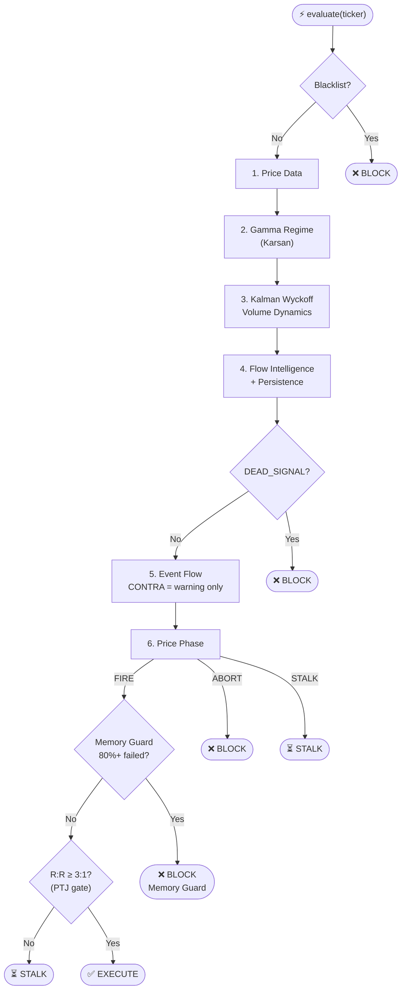
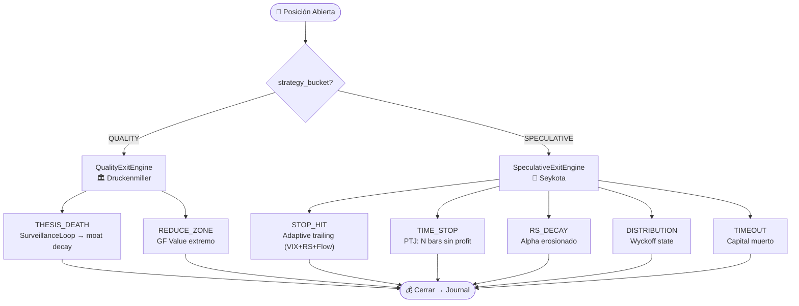
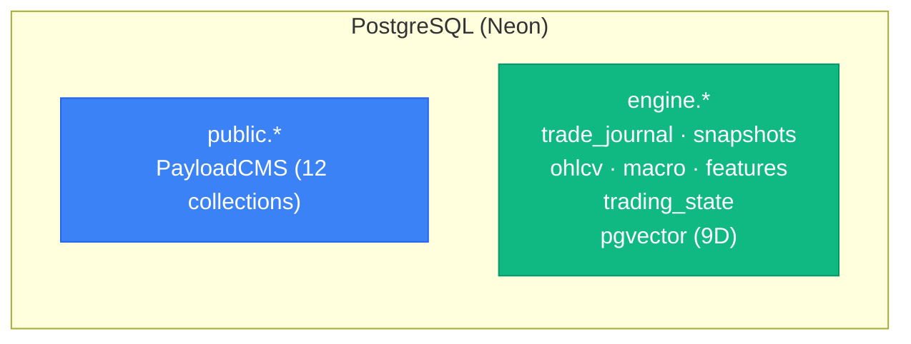

# Botero Trade Engine — Arquitectura Institucional v14

> Última actualización: 2026-05-01 | Versión V14 (Dual-Mandate Architecture)
> Verificado con Graphify: 2821 nodos, 6074 edges, 187 comunidades, 524 archivos

> [!NOTE]
> Skills y perfiles de expertos documentados en `AGENTS.md` / `GEMINI.md`.
> Detalle interno de módulos en [`architecture-modules-internal.md`](./architecture-modules-internal.md).
> Expert Committee en [`architecture-expert-committee.md`](./architecture-expert-committee.md).

---

## 1. Dual-Mandate — Separación QUALITY / SPECULATIVE



---

## 2. System Overview



---

## 3. Hexagonal Architecture — Dependency Rule

```
┌─────────────────────────────────────────────────┐
│  API Layer (routers, factories)                  │
│  ┌───────────────────────────────────────────┐  │
│  │  Infrastructure (adapters, SDKs, PG)       │  │
│  │  ┌─────────────────────────────────────┐  │  │
│  │  │  Application (use_cases, dtos)       │  │  │
│  │  │  ┌───────────────────────────────┐  │  │  │
│  │  │  │  Domain (entities, ports, rules)│  │  │  │
│  │  │  │  • ZERO SDK imports            │  │  │  │
│  │  │  │  • ZERO infrastructure imports │  │  │  │
│  │  │  │  • Dependencies via Ports (ABC)│  │  │  │
│  │  │  └───────────────────────────────┘  │  │  │
│  │  └─────────────────────────────────────┘  │  │
│  └───────────────────────────────────────────┘  │
└─────────────────────────────────────────────────┘
```

---

## 4. Composition Root



---

## 5. Entry Pipelines — Side by Side

### 5a. QualityEntryGate (Deep, Daily)



### 5b. SpeculativeEntryHub (Fast, Intraday)



---

## 6. Exit System — Dual Engine



---

## 7. Port / Adapter Map

| Módulo | Port (domain) | Adapter (infrastructure) | Source |
|---|---|---|---|
| **entry_decision** | `EntryMarketDataPort` | `MarketDataFetcher` | yfinance |
| **entry_decision** | `FlowDataPort` | `UnusualWhalesIntelligence` | UW MCP |
| **execution** | `BrokerPort` | `AlpacaAdapter` × 2 | Alpaca SDK |
| **execution** | `TradeJournalPort` | `PostgresTradeJournalAdapter` | PostgreSQL |
| **execution** | `InstrumentBlacklistPort` | `PostgresBlacklistAdapter` | PostgreSQL |
| **options_gamma** | `OptionsDataPort` | `YFinanceOptionsAdapter` | yfinance |
| **flow_intelligence** | `CalendarDataPort` | `FinnhubAdapter` | Finnhub MCP |
| **portfolio_management** | `FundamentalDataPort` | `GuruFocusAdapter` | GuruFocus MCP |
| **portfolio_management** | `ScreenerPort` | `FinvizAdapter` | Finviz MCP |
| **portfolio_management** | `SectorDataPort` | `SectorFlowAdapter` | Finviz + UW |
| **portfolio_management** | `MacroDataPort` | `MacroDataAdapter` | FRED MCP |
| **portfolio_management** | `InstrumentRepoPort` | `PayloadInstrumentsAdapter` | PayloadCMS |
| **rotation_intelligence** | `RotationDataPort` | `YahooRotationAdapter` | yfinance |
| **simulation** | `HistoricalDataPort` + 9 more | TimescaleDB adapters | PostgreSQL |

---

## 8. Storage — PostgreSQL Consolidado



---

## 9. Graphify Integrity Check

| Check | Value | Status |
|---|---|---|
| Graphify nodes | **2821** | ✅ V14 |
| Graphify edges | **6074** | ✅ V14 |
| Communities | **187** | ✅ V14 |
| Files indexed | **524** | ✅ V14 |
| Infrastructure imports in domain | **0** | ✅ |
| SDK imports in domain | **0** | ✅ |
| `_legacy/` imports in modules/ | **0** | ✅ V14 |
| Clean modules | **12/12** | ✅ |
| Ports defined | **~21** | ✅ |
| Dual Entry Pipelines | Quality + Speculative | ✅ V14 |
| Dual Exit Engines | Quality + Speculative | ✅ |
| Dual Orchestrators | Quality + Speculative | ✅ V14 |
| Dual Surveillance | Quality + Speculative | ✅ V14 |
| Dual Qualifiers | Quality + Speculative | ✅ V14 |
| Dual Broker Accounts | QUALITY + SPECULATIVE | ✅ |
