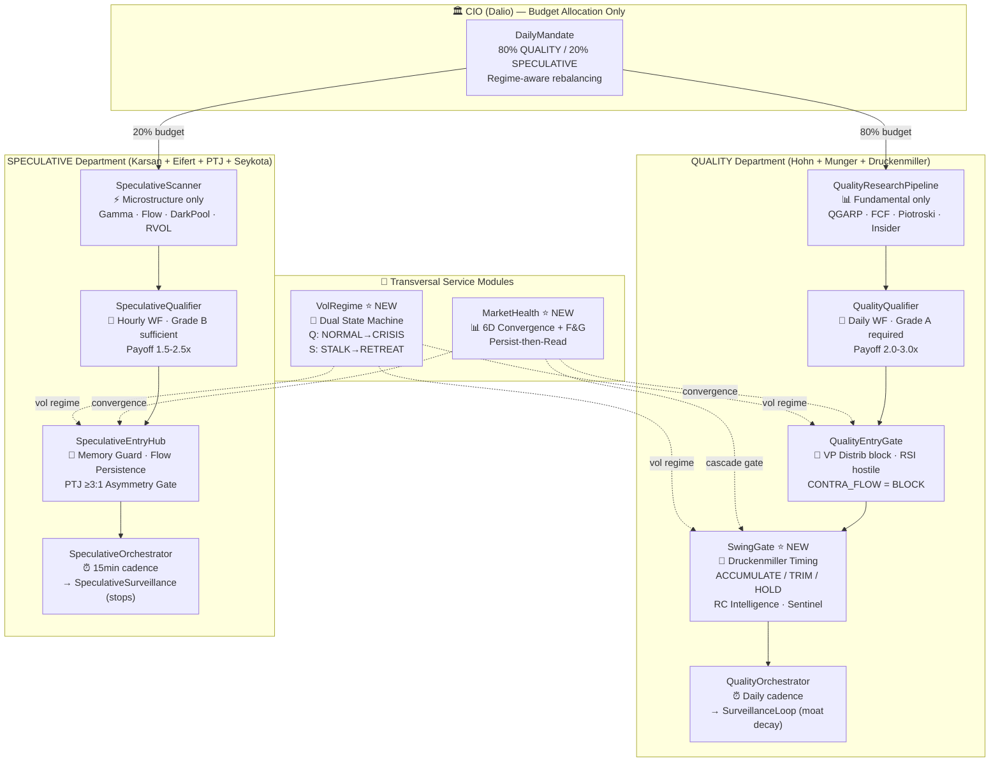
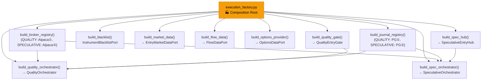
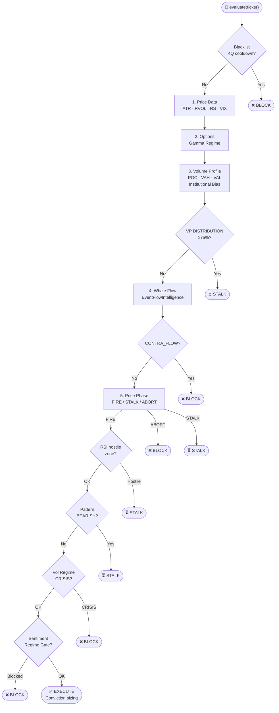
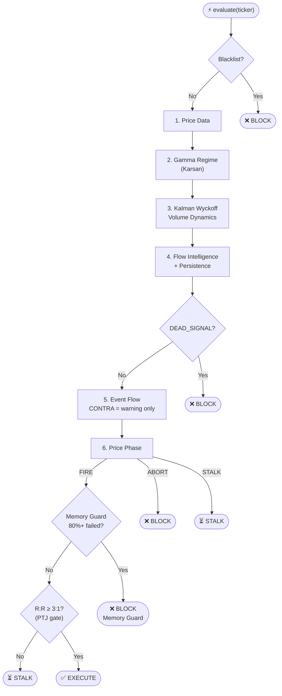
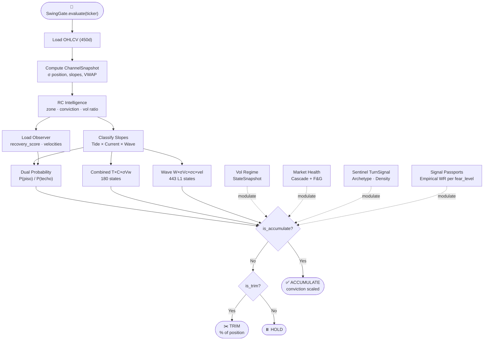
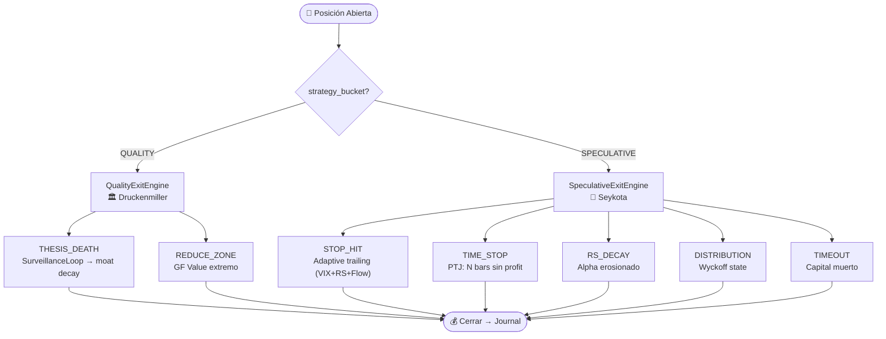
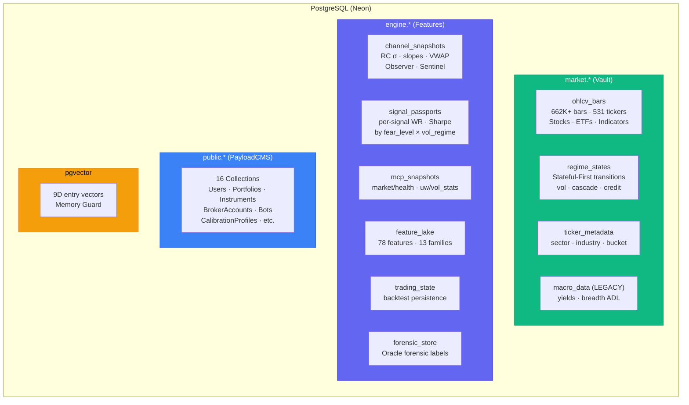

# Botero Trade Engine — Arquitectura Institucional v15

> Última actualización: 2026-07-09 | Versión V15 (Stateful-First + Vault Architecture)
> Basado en auditoría de código: 15 módulos, 4 daemons, 7 routers, 16 collections

> [!NOTE]
> Skills y perfiles de expertos documentados en `AGENTS.md` / `GEMINI.md`.
> Detalle interno de módulos en [`architecture-modules-internal.md`](./architecture-modules-internal.md).
> Expert Committee en [`architecture-expert-committee.md`](./architecture-expert-committee.md).

---

## 1. Dual-Mandate — Separación QUALITY / SPECULATIVE


```mermaid
graph TB
    subgraph CIO["🏛️ CIO (Dalio) — Budget Allocation Only"]
        MANDATE["DailyMandate<br/>80% QUALITY / 20% SPECULATIVE<br/>Regime-aware rebalancing"]
    end

    subgraph QUALITY["QUALITY Department (Hohn + Munger + Druckenmiller)"]
        QR["QualityResearchPipeline<br/>📊 Fundamental only<br/>QGARP · FCF · Piotroski · Insider"]
        QQ["QualityQualifier<br/>📐 Daily WF · Grade A required<br/>Payoff 2.0-3.0x"]
        QE["QualityEntryGate<br/>🚪 VP Distrib block · RSI hostile<br/>CONTRA_FLOW = BLOCK"]
        QS["SwingGate ⭐ NEW<br/>🔄 Druckenmiller Timing<br/>ACCUMULATE / TRIM / HOLD<br/>RC Intelligence · Sentinel"]
        QO["QualityOrchestrator<br/>⏰ Daily cadence<br/>→ SurveillanceLoop (moat decay)"]
    end

    subgraph SPECULATIVE["SPECULATIVE Department (Karsan + Eifert + PTJ + Seykota)"]
        SS["SpeculativeScanner<br/>⚡ Microstructure only<br/>Gamma · Flow · DarkPool · RVOL"]
        SQ["SpeculativeQualifier<br/>📐 Hourly WF · Grade B sufficient<br/>Payoff 1.5-2.5x"]
        SE["SpeculativeEntryHub<br/>🎯 Memory Guard · Flow Persistence<br/>PTJ ≥3:1 Asymmetry Gate"]
        SO["SpeculativeOrchestrator<br/>⏰ 15min cadence<br/>→ SpeculativeSurveillance (stops)"]
    end

    subgraph SERVICES["🔧 Transversal Service Modules"]
        MH["MarketHealth ⭐ NEW<br/>📊 6D Convergence + F&G<br/>Persist-then-Read"]
        VR["VolRegime ⭐ NEW<br/>🌊 Dual State Machine<br/>Q: NORMAL→CRISIS<br/>S: STALK→RETREAT"]
    end

    MANDATE -->|"80% budget"| QR
    MANDATE -->|"20% budget"| SS
    QR --> QQ --> QE --> QS --> QO
    SS --> SQ --> SE --> SO

    MH -.->|"cascade gate"| QS
    MH -.->|"convergence"| QE & SE
    VR -.->|"vol regime"| QS & QE & SE
```

---

## 2. System Overview


```mermaid
graph TB
    subgraph EXT["🌐 MCP Servers (8 activos · ~241 tools)"]
        UW["🐋 Unusual Whales<br/>Flow · Tide · DarkPool · GEX"]
        GF["📈 GuruFocus<br/>QGARP · Insider · Gurus"]
        FV["📊 Finviz<br/>Screening · Sectores"]
        FH["📅 Finnhub<br/>Earnings · SEC"]
        FR["🏛️ FRED<br/>GDP · CPI · Yield"]
        ALP["🦙 Alpaca ×2<br/>QUALITY + SPEC accounts"]
        YF["📉 Yahoo Finance<br/>VIX · Options"]
        NS["📰 News Sentiment<br/>FinBERT"]
    end

    subgraph DAEMONS["⚙️ Daemons (4 · Vault Writers)"]
        DVD["DataVaultDaemon<br/>vault_providers/ (8)<br/>OHLCV · Breadth · Health<br/>Gamma · Observer · Channels"]
        QD["QualityDaemon<br/>Daily orchestration"]
        SD["SpeculativeDaemon<br/>15min orchestration"]
        WAD["WatchlistAlertDaemon<br/>Alert notifications"]
    end

    subgraph MODULES["🧩 Backend Modules (15 · Clean Architecture)"]
        PM["portfolio_management<br/>QualityResearch · SpecScanner<br/>CIOOrchestrator · Qualifiers ×2<br/>WatchlistEngine · ThesisValidator"]
        ED["entry_decision<br/>QualityEntryGate<br/>SpeculativeEntryHub<br/>VolRegimeGate · SentimentGate"]
        QSM["quality_swing ⭐<br/>SwingGate (Druckenmiller)<br/>RC Intelligence · Sentinel<br/>Signal Passports"]
        EX["execution<br/>QualityOrchestrator<br/>SpeculativeOrchestrator<br/>SmartEntryEngine<br/>Surveillance ×2"]
        FI["flow_intelligence<br/>WhaleFlow · Persistence<br/>EventCalendar"]
        OG["options_gamma<br/>GEX · MaxPain<br/>Gamma Regime<br/>UW Gamma Adapter"]
        MHM["market_health ⭐<br/>6D Convergence<br/>F&G Contrarian Layer"]
        VRM["volatility_regime ⭐<br/>Dual State Machine<br/>Q + S classifiers"]
        PA["price_analysis<br/>PricePhase · RSI<br/>RegressionChannel"]
        VI["volume_intelligence<br/>Kalman · VP"]
        PR["pattern_recognition<br/>Candlestick · VCP"]
        RI["rotation_intelligence<br/>Weinstein · Pring"]
        SIM["simulation<br/>WalkForward · Features<br/>TripleBarrier · Oracle<br/>SignalPassports · Forensics"]
        SH["shared<br/>StateSnapshot · ChannelSnapshot<br/>RegimeStatePort · TurnDetector<br/>UnifiedObserver · Kalman5Ch"]
    end

    subgraph API["🔗 FastAPI (port 8000)"]
        FAST["main.py + routers (7)<br/>factories/ (Composition Root)<br/>market_data · orders · portfolio<br/>research · strategy · simulation<br/>vault_refresh"]
    end

    subgraph FE["🖥️ Next.js 16 + PayloadCMS 3 (port 3000)"]
        UI["Dashboard + Admin<br/>16 Collections"]
    end

    subgraph STORE["🗄️ PostgreSQL (Neon)"]
        PG["TimescaleDB + pgvector<br/>market.ohlcv_bars · regime_states<br/>engine.channel_snapshots<br/>engine.signal_passports<br/>engine.mcp_snapshots"]
    end

    EXT --> DAEMONS -->|"Vault Write"| STORE
    MODULES -->|"Vault Read"| STORE
    FE -->|"HTTP"| API --> MODULES
```

---

## 3. Hexagonal Architecture — Dependency Rule

```
┌─────────────────────────────────────────────────┐
│  API Layer (routers, factories)                  │
│  Daemons (vault_providers, orchestrators)        │
│  ┌───────────────────────────────────────────┐  │
│  │  Infrastructure (adapters, SDKs, PG)       │  │
│  │  ┌─────────────────────────────────────┐  │  │
│  │  │  Application (use_cases, dtos)       │  │  │
│  │  │  ┌───────────────────────────────┐  │  │  │
│  │  │  │  Domain (entities, ports, rules)│  │  │  │
│  │  │  │  • ZERO SDK imports            │  │  │  │
│  │  │  │  • ZERO infrastructure imports │  │  │  │
│  │  │  │  • Dependencies via Ports (ABC)│  │  │  │
│  │  │  └───────────────────────────────┘  │  │  │
│  │  └─────────────────────────────────────┘  │  │
│  └───────────────────────────────────────────┘  │
└─────────────────────────────────────────────────┘

Key architectural patterns (V15):
  • Vault-First (Rule 13): Modules read from Vault only
  • Stateful-First (Rule 15): Regime → RegimeStatePort → StateSnapshot
  • Persist-then-Read (Rule 16): Daemon writes → Module reads
  • Decision Context Logging (Rule 17): Every gate logs StateSnapshot
```

---

## 4. Composition Root


```mermaid
flowchart TD
    FAC["execution_factory.py<br/>🏭 Composition Root"]

    FAC --> BR["build_broker_registry()<br/>{QUALITY: Alpaca①, SPECULATIVE: Alpaca②}"]
    FAC --> JR["build_journal_registry()<br/>{QUALITY: PG①, SPECULATIVE: PG②}"]
    FAC --> BL["build_blacklist()<br/>InstrumentBlacklistPort"]
    FAC --> MD["build_market_data()<br/>→ EntryMarketDataPort"]
    FAC --> FD["build_flow_data()<br/>→ FlowDataPort"]
    FAC --> OP["build_options_provider()<br/>→ OptionsDataPort"]
    FAC --> QG["build_quality_gate()<br/>→ QualityEntryGate"]
    FAC --> SH["build_spec_hub()<br/>→ SpeculativeEntryHub"]
    FAC --> QO["build_quality_orchestrator()<br/>→ QualityOrchestrator"]
    FAC --> SO["build_spec_orchestrator()<br/>→ SpeculativeOrchestrator"]

    BR --> QO & SO
    JR --> QO & SO
    QG --> QO
    SH --> SO

    style FAC fill:#f59e0b,stroke:#d97706,color:#000
```

---

## 5. Entry Pipelines — Side by Side

### 5a. QualityEntryGate (Deep, Daily)


```mermaid
flowchart TD
    START(["🎩 evaluate(ticker)"])
    BL{"Blacklist<br/>4Q cooldown?"}
    PRICE["1. Price Data<br/>ATR · RVOL · RS · VIX"]
    OPT["2. Options<br/>Gamma Regime"]
    VP["3. Volume Profile<br/>POC · VAH · VAL<br/>Institutional Bias"]
    VP_GATE{"VP DISTRIBUTION<br/>≥75%?"}
    WHALE["4. Whale Flow<br/>EventFlowIntelligence"]
    CONTRA{"CONTRA_FLOW?"}
    PHASE["5. Price Phase<br/>FIRE / STALK / ABORT"]
    RSI{"RSI hostile<br/>zone?"}
    PAT{"Pattern<br/>BEARISH?"}
    VOL_GATE{"Vol Regime<br/>CRISIS?"}
    SENT{"Sentiment<br/>Regime Gate?"}
    EXEC(["✅ EXECUTE<br/>Conviction sizing"])

    START --> BL
    BL -->|"Yes"| BLOCK1(["❌ BLOCK"])
    BL -->|"No"| PRICE --> OPT --> VP
    VP --> VP_GATE
    VP_GATE -->|"Yes"| STALK1(["⏳ STALK"])
    VP_GATE -->|"No"| WHALE --> CONTRA
    CONTRA -->|"Yes"| BLOCK2(["❌ BLOCK"])
    CONTRA -->|"No"| PHASE
    PHASE -->|"ABORT"| BLOCK3(["❌ BLOCK"])
    PHASE -->|"FIRE"| RSI
    RSI -->|"Hostile"| STALK2(["⏳ STALK"])
    RSI -->|"OK"| PAT
    PAT -->|"Yes"| STALK3(["⏳ STALK"])
    PAT -->|"No"| VOL_GATE
    VOL_GATE -->|"CRISIS"| BLOCK4(["❌ BLOCK"])
    VOL_GATE -->|"OK"| SENT
    SENT -->|"Blocked"| BLOCK5(["❌ BLOCK"])
    SENT -->|"OK"| EXEC
    PHASE -->|"STALK"| STALK4(["⏳ STALK"])
```

### 5b. SpeculativeEntryHub (Fast, Intraday)


```mermaid
flowchart TD
    START(["⚡ evaluate(ticker)"])
    BL{"Blacklist?"}
    PRICE["1. Price Data"]
    GAMMA["2. Gamma Regime<br/>(Karsan)"]
    KALMAN["3. Kalman Wyckoff<br/>Volume Dynamics"]
    FLOW["4. Flow Intelligence<br/>+ Persistence"]
    DEAD{"DEAD_SIGNAL?"}
    WHALE["5. Event Flow<br/>CONTRA = warning only"]
    PHASE["6. Price Phase"]
    MEM{"Memory Guard<br/>80%+ failed?"}
    ASYM{"R:R ≥ 3:1?<br/>(PTJ gate)"}
    EXEC(["✅ EXECUTE"])

    START --> BL
    BL -->|"Yes"| BLOCK1(["❌ BLOCK"])
    BL -->|"No"| PRICE --> GAMMA --> KALMAN --> FLOW
    FLOW --> DEAD
    DEAD -->|"Yes"| BLOCK2(["❌ BLOCK"])
    DEAD -->|"No"| WHALE --> PHASE
    PHASE -->|"ABORT"| BLOCK3(["❌ BLOCK"])
    PHASE -->|"FIRE"| MEM
    MEM -->|"Yes"| BLOCK4(["❌ BLOCK<br/>Memory Guard"])
    MEM -->|"No"| ASYM
    ASYM -->|"No"| STALK1(["⏳ STALK"])
    ASYM -->|"Yes"| EXEC
    PHASE -->|"STALK"| STALK2(["⏳ STALK"])
```

### 5c. SwingGate (Quality Swing Timing) ⭐ NEW


```mermaid
flowchart TD
    START(["🔄 SwingGate.evaluate(ticker)"])
    DATA["Load OHLCV (450d)"]
    CH["Compute ChannelSnapshot<br/>σ position, slopes, VWAP"]
    RC["RC Intelligence<br/>zone · conviction · vol ratio"]
    SLOPE["Classify Slopes<br/>Tide × Current × Wave"]
    OBS["Load Observer<br/>recovery_score · velocities"]
    DUAL["Dual Probability<br/>P(piso) / P(techo)"]
    COMBINED["Combined T×C×σVw<br/>180 states"]
    WAVE["Wave W×σVc×σc×vel<br/>443 L1 states"]
    VOL["Vol Regime<br/>StateSnapshot"]
    MH["Market Health<br/>Cascade + F&G"]
    SENTINEL["Sentinel TurnSignal<br/>Archetype · Density"]
    PP["Signal Passports<br/>Empirical WR per fear_level"]

    ACCUM{"is_accumulate?"}
    TRIM{"is_trim?"}

    START --> DATA --> CH --> RC
    RC --> SLOPE & OBS
    SLOPE --> DUAL & COMBINED & WAVE
    OBS --> DUAL

    DUAL & COMBINED & WAVE --> ACCUM
    VOL & MH & SENTINEL & PP -.->|"modulate"| ACCUM

    ACCUM -->|"Yes"| ACC_OUT(["✅ ACCUMULATE<br/>conviction scaled"])
    ACCUM -->|"No"| TRIM
    TRIM -->|"Yes"| TRIM_OUT(["✂️ TRIM<br/>% of position"])
    TRIM -->|"No"| HOLD(["⏸️ HOLD"])
```

---

## 6. Exit System — Dual Engine


```mermaid
flowchart TD
    POS(["📍 Posición Abierta"])
    DEPT{"strategy_bucket?"}

    POS --> DEPT

    DEPT -->|"QUALITY"| QUAL["QualityExitEngine<br/>🏛️ Druckenmiller"]
    DEPT -->|"SPECULATIVE"| SPEC["SpeculativeExitEngine<br/>🎯 Seykota"]

    QUAL --> QE1["THESIS_DEATH<br/>SurveillanceLoop → moat decay"]
    QUAL --> QE2["REDUCE_ZONE<br/>GF Value extremo"]

    SPEC --> SE1["STOP_HIT<br/>Adaptive trailing (VIX+RS+Flow)"]
    SPEC --> SE2["TIME_STOP<br/>PTJ: N bars sin profit"]
    SPEC --> SE3["RS_DECAY<br/>Alpha erosionado"]
    SPEC --> SE4["DISTRIBUTION<br/>Wyckoff state"]
    SPEC --> SE5["TIMEOUT<br/>Capital muerto"]

    QE1 & QE2 --> CLOSE(["💰 Cerrar → Journal"])
    SE1 & SE2 & SE3 & SE4 & SE5 --> CLOSE
```

---

## 7. Port / Adapter Map

| Módulo | Port (domain) | Adapter (infrastructure) | Source |
|---|---|---|---|
| **entry_decision** | `EntryMarketDataPort` | `MarketDataFetcher` | Vault (OHLCV) |
| **entry_decision** | `FlowDataPort` | `UnusualWhalesIntelligence` | UW MCP |
| **execution** | `BrokerPort` | `AlpacaAdapter` × 2 | Alpaca SDK |
| **execution** | `TradeJournalPort` | `PostgresTradeJournalAdapter` | PostgreSQL |
| **execution** | `InstrumentBlacklistPort` | `PostgresBlacklistAdapter` | PostgreSQL |
| **options_gamma** | `OptionsDataPort` | `YFinanceOptionsAdapter` + `UWGammaAdapter` | yfinance + UW MCP |
| **flow_intelligence** | `CalendarDataPort` | `FinnhubAdapter` | Finnhub MCP |
| **portfolio_management** | `FundamentalDataPort` | `GuruFocusAdapter` + `GuruFocusFundamentalAdapter` | GuruFocus MCP |
| **portfolio_management** | `ScreenerPort` | `FinvizAdapter` | Finviz MCP |
| **portfolio_management** | `SectorDataPort` | `SectorFlowAdapter` | Finviz + UW |
| **portfolio_management** | `MacroDataPort` | `MacroDataAdapter` | FRED MCP |
| **portfolio_management** | `InstrumentRepoPort` | `PayloadInstrumentsAdapter` | PayloadCMS |
| **quality_swing** ⭐ | `SwingDataPort` | TimescaleDataStore | Vault (PG) |
| **rotation_intelligence** | `RotationDataPort` | `YahooRotationAdapter` | yfinance |
| **simulation** | `HistoricalDataPort` + 12 more | TimescaleDB adapters | PostgreSQL |
| **simulation** ⭐ | `ForensicStorePort` | `NeonForensicStore` | PostgreSQL |
| **simulation** ⭐ | `PassportStorePort` | `NeonPassportStore` | PostgreSQL |
| **shared** ⭐ | `RegimeStatePort` | `PostgresRegimeState` | `market.regime_states` |
| **shared** ⭐ | `ChannelSnapshotPort` | TimescaleDataStore | `engine.channel_snapshots` |
| **shared** ⭐ | `TickerProfilePort` | `TickerProfileStore` | PostgreSQL |
| **shared** ⭐ | `AlertPort` | `PostgresAlertAdapter` | PostgreSQL |
| **shared** ⭐ | `HeadScorerPort` | `HeadScorer` | ML model |
| **shared** ⭐ | `VaultRefreshPort` | `VaultRefreshAdapter` | PostgreSQL |
| **shared** ⭐ | `TimeSeriesPort` | `TimescaleDataStore` | `market.ohlcv_bars` |

---

## 8. Vault Architecture — Daemon → Module Data Flow ⭐ NEW


```mermaid
flowchart LR
    subgraph EXTERNAL["🌐 External APIs"]
        YF["yfinance"]
        MCP["MCP Servers"]
    end

    subgraph DAEMONS["⚙️ Daemons (Writers)"]
        DVD["DataVaultDaemon"]
        subgraph PROVIDERS["vault_providers/"]
            OHLCV_P["ohlcv_provider"]
            BREADTH_P["breadth_provider<br/>sector_breadth_provider"]
            MH_P["market_health_provider"]
            OBS_P["observer_provider<br/>channel_snapshot_provider"]
            GAMMA_P["uw_gamma_provider"]
            REM_P["remaining_providers"]
        end
    end

    subgraph VAULT["🗄️ Neon PostgreSQL"]
        BARS["market.ohlcv_bars<br/>(662K+ bars, 531 tickers)"]
        REGIME["market.regime_states<br/>Stateful-First transitions"]
        META["market.ticker_metadata<br/>531 classified tickers"]
        CHAN["engine.channel_snapshots<br/>RC · Observer · Sentinel"]
        MCP_SNAP["engine.mcp_snapshots<br/>market/health · uw/vol_stats"]
        PASS["engine.signal_passports<br/>Empirical WR per signal"]
    end

    subgraph MODULES["🧩 Modules (Readers)"]
        SW["quality_swing<br/>SwingGate"]
        ED2["entry_decision<br/>Gates"]
        SIM2["simulation<br/>Oracle · Forensics"]
    end

    EXTERNAL --> DAEMONS
    DVD --> PROVIDERS
    PROVIDERS --> VAULT
    VAULT --> MODULES
```

---

## 9. Storage — PostgreSQL Consolidado


```mermaid
graph LR
    subgraph PG["PostgreSQL (Neon)"]
        subgraph MARKET["market.* (Vault)"]
            OHLCV["ohlcv_bars<br/>662K+ bars · 531 tickers<br/>Stocks · ETFs · Indicators"]
            REGIME["regime_states<br/>Stateful-First transitions<br/>vol · cascade · credit"]
            META["ticker_metadata<br/>sector · industry · bucket"]
            MACRO["macro_data (LEGACY)<br/>yields · breadth ADL"]
        end

        subgraph ENGINE["engine.* (Features)"]
            CHAN2["channel_snapshots<br/>RC σ · slopes · VWAP<br/>Observer · Sentinel"]
            PASS2["signal_passports<br/>per-signal WR · Sharpe<br/>by fear_level × vol_regime"]
            MCP2["mcp_snapshots<br/>market/health · uw/vol_stats"]
            FEAT["feature_lake<br/>78 features · 13 families"]
            STATE["trading_state<br/>backtest persistence"]
            FOREN["forensic_store<br/>Oracle forensic labels"]
        end

        subgraph PUBLIC["public.* (PayloadCMS)"]
            PAY["16 Collections<br/>Users · Portfolios · Instruments<br/>BrokerAccounts · Bots<br/>CalibrationProfiles · etc."]
        end

        subgraph PGVEC["pgvector"]
            VEC["9D entry vectors<br/>Memory Guard"]
        end
    end

    style MARKET fill:#10b981,stroke:#059669,color:#fff
    style ENGINE fill:#6366f1,stroke:#4f46e5,color:#fff
    style PUBLIC fill:#3b82f6,stroke:#2563eb,color:#fff
    style PGVEC fill:#f59e0b,stroke:#d97706,color:#000
```

---

## 10. Architecture Integrity Check

| Check | Value | Status |
|---|---|---|
| Backend modules | **15** | ✅ V15 |
| Infrastructure imports in domain | **0** | ✅ |
| SDK imports in domain | **0** | ✅ |
| `_legacy/` imports in modules/ | **0** | ✅ |
| Clean modules | **15/15** | ✅ V15 |
| Ports defined | **~28** | ✅ V15 |
| Dual Entry Pipelines | Quality + Speculative | ✅ |
| Dual Exit Engines | Quality + Speculative | ✅ |
| Dual Orchestrators | Quality + Speculative | ✅ |
| Dual Surveillance | Quality + Speculative | ✅ |
| Dual Qualifiers | Quality + Speculative | ✅ |
| Dual Broker Accounts | QUALITY + SPECULATIVE | ✅ |
| SwingGate (Quality Swing) | ACCUMULATE / TRIM / HOLD | ✅ V15 |
| MarketHealth (6D + F&G) | Convergence scoring | ✅ V15 |
| VolRegime (Dual State Machine) | Q: 4 states, S: 4 states | ✅ V15 |
| Stateful-First (RegimeStatePort) | StateSnapshot transitions | ✅ V15 |
| Persist-then-Read | Daemon→Vault→Module | ✅ V15 |
| Vault Providers | 8 providers | ✅ V15 |
| Daemons | 4 (DataVault + Q + S + Alert) | ✅ V15 |
| API Routers | 7 + health | ✅ V15 |
| PayloadCMS Collections | 16 | ✅ V15 |
