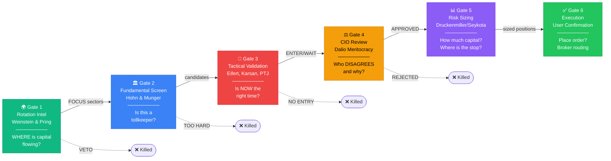
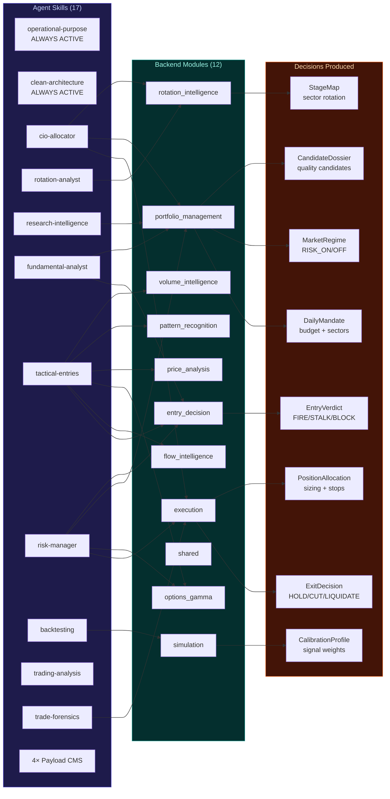

# Botero Trade — Expert Committee & Decision Architecture

> Generado con Graphyfi (3387 nodos, 512 archivos) | 2026-05-01

---

## 1. Investment Committee — Expert Personas & Decision Chain

```mermaid
graph TB
    subgraph CIO["🏛️ CIO — Ray Dalio<br/>cio-allocator skill"]
        DALIO["DailyMandate<br/>Capital: 80Q/20S default<br/>Sector vetoes & focus<br/>Regime: RISK_ON/OFF/NEUTRAL/CRISIS<br/>Idea Meritocracy: believability-weighted"]
    end

    subgraph RESEARCH["🔍 Research & Intelligence<br/>research-intelligence skill"]
        RQ["Track 1: QUALITY<br/>Guru Accumulation · Insider Clusters<br/>→ Quantitative Gate<br/>→ Moat Stress Test<br/>→ Valuation Zones<br/>→ CandidateDossier"]
        RS["Track 2: SPECULATIVE<br/>UW Sweeps · Dark Pool<br/>→ Flow Anomaly Detection<br/>→ Structure Analysis<br/>→ OpportunityBrief"]
    end

    subgraph QUALITY_DEPT["🏦 QUALITY Department"]
        HOHN["Fundamental Analyst<br/>🎩 Hohn & Munger<br/>fundamental-analyst skill<br/>─────────────<br/>Inversion Gate<br/>Tollkeeper Test<br/>Barrier Stack (≥2 moats)<br/>Moat Stress Test (5 checks)<br/>Pricing Power<br/>Valuation Zones (GF Value)"]
        DRUCK["Risk Manager QUALITY<br/>📊 Druckenmiller<br/>risk-manager skill<br/>─────────────<br/>Thesis-based exits only<br/>Go for Jugular sizing<br/>18-24mo forward<br/>Swing around core<br/>No mechanical stops"]
    end

    subgraph SPEC_DEPT["⚡ SPECULATIVE Department"]
        EIFERT["Tactical Entries<br/>🎯 Eifert, Karsan & PTJ<br/>tactical-entries skill<br/>─────────────<br/>Eifert: WHO & WHY (skeptic)<br/>Karsan: GEX/Vanna/Charm map<br/>PTJ: 5:1 R:R · 200-DMA · tape<br/>Three-voice veto chain"]
        SEYKOTA["Risk Manager SPECULATIVE<br/>🔥 Seykota<br/>risk-manager skill<br/>─────────────<br/>Mechanical stops (2-3 ATR)<br/>Time stops (2-5 sessions)<br/>Risk of Ruin < 5%<br/>Anti-Martingale<br/>Psychology Gate (3 losses)"]
    end

    subgraph ROTATION["🌍 Rotation Intelligence<br/>rotation-analyst skill"]
        WEIN["Weinstein Stage Analysis<br/>30-week MA · RS · Volume<br/>Stage 1-4 classification<br/>26 ETFs tracked"]
        PRING["Pring Intermarket Cycle<br/>Bonds→Stocks→Commodities<br/>Economic phase detection"]
    end

    subgraph FORENSICS["🔬 Trade Forensics<br/>trade-forensics skill"]
        FSPEC["Seykota Loop<br/>Detect→Learn→Retrain→Prevent<br/>Stop calibration · Pattern decay<br/>Memory Guard effectiveness"]
        FQUAL["Druckenmiller Loop<br/>Thesis accuracy scoring<br/>Surveillance lag measurement<br/>4Q blacklist enforcement"]
    end

    subgraph BACKTEST["🧪 Quantitative Lab<br/>backtesting skill"]
        LOPRADO["López de Prado<br/>Triple Barrier · Meta-Labeling<br/>Purged CV · Deflated Sharpe<br/>Feature importance (MDA/SFI)"]
    end

    %% Decision flow
    CIO -->|"DailyMandate<br/>budget + sectors"| QUALITY_DEPT
    CIO -->|"DailyMandate<br/>budget + sectors"| SPEC_DEPT
    CIO -->|"regime query"| ROTATION

    RESEARCH -->|"CandidateDossier"| QUALITY_DEPT
    RESEARCH -->|"OpportunityBrief"| SPEC_DEPT

    ROTATION -->|"sector_flows<br/>stage_transitions"| CIO
    ROTATION -->|"Stage 2 sectors"| RESEARCH

    HOHN -->|"HOHN QUALITY<br/>CONDITIONAL<br/>TOO HARD"| DRUCK
    EIFERT -->|"FIRE/WAIT<br/>entry params"| SEYKOTA

    DRUCK -->|"HOLD/SCALE/LIQUIDATE"| FORENSICS
    SEYKOTA -->|"CUT MECHANICAL"| FORENSICS

    FORENSICS -->|"calibrated params"| EIFERT
    FORENSICS -->|"adjusted thresholds"| DRUCK
    FORENSICS -->|"recalibration data"| BACKTEST

    BACKTEST -->|"VIABLE/OVERFIT"| CIO

    style CIO fill:#f59e0b,stroke:#d97706,color:#000
    style QUALITY_DEPT fill:#3b82f6,stroke:#2563eb,color:#fff
    style SPEC_DEPT fill:#ef4444,stroke:#dc2626,color:#fff
    style RESEARCH fill:#8b5cf6,stroke:#7c3aed,color:#fff
    style ROTATION fill:#10b981,stroke:#059669,color:#fff
    style FORENSICS fill:#f97316,stroke:#ea580c,color:#fff
    style BACKTEST fill:#6366f1,stroke:#4f46e5,color:#fff
```

---

## 2. 6-Gate Investment Committee Protocol

---

## 3. Skill → Module → Decision Map

