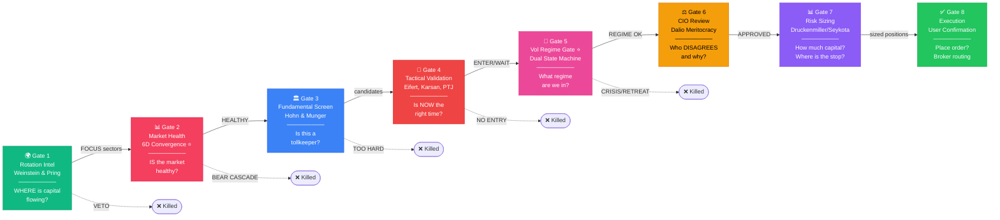
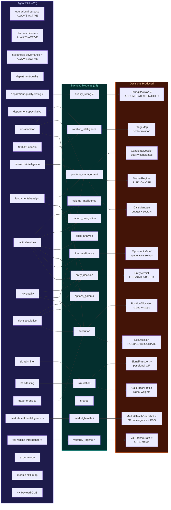
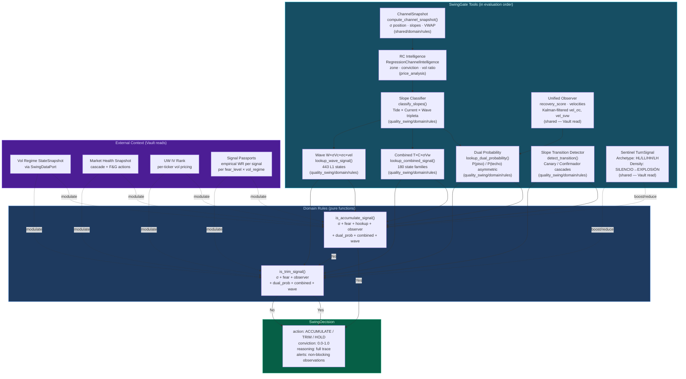
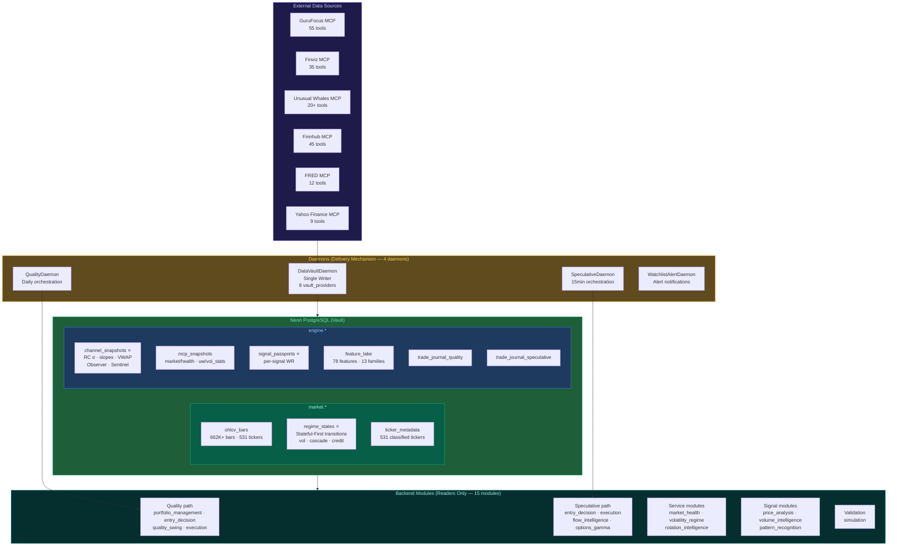

# Botero Trade — Expert Committee & Decision Architecture

> Actualizado 2026-07-10 | 25 Skills · 15 Modules · 8 MCP Servers · 4 Daemons

---

## 1. Investment Committee — Expert Personas & Decision Chain

```mermaid
graph TB
    subgraph CIO["🏛️ CIO — Ray Dalio<br/>cio-allocator skill"]
        DALIO["DailyMandate<br/>Capital: 80Q/20S default<br/>Sector vetoes & focus<br/>Regime: RISK_ON/OFF/NEUTRAL/CRISIS<br/>Idea Meritocracy: believability-weighted<br/>5-Step Self-Correcting Machine"]
    end

    subgraph RESEARCH["🔍 Research & Intelligence<br/>research-intelligence skill"]
        RQ["Track 1: QUALITY<br/>Guru Accumulation · Insider Clusters<br/>→ Quantitative Gate (Z/Piotroski/Beneish)<br/>→ Moat Stress Test (5 checks)<br/>→ Helmer Expectations Engine<br/>→ Valuation Zones (GF Value)<br/>→ Thesis Validation ⭐<br/>→ CandidateDossier"]
        RS["Track 2: SPECULATIVE<br/>UW Sweeps · Dark Pool<br/>→ Flow Anomaly Detection<br/>→ Structure Analysis (Eifert/Karsan/PTJ)<br/>→ OpportunityBrief"]
    end

    subgraph QUALITY_DEPT["🏦 QUALITY Department<br/>department-quality + department-quality-swing skills"]
        subgraph Q_CORE["Quality Core"]
            HOHN["Fundamental Analyst<br/>🎩 Hohn & Munger<br/>fundamental-analyst skill<br/>─────────────<br/>Inversion Gate<br/>Tollkeeper Test<br/>Barrier Stack (≥2 moats)<br/>Moat Stress Test (5 checks)<br/>Pricing Power<br/>Helmer Reverse DCF<br/>Valuation Zones (GF Value)"]
        end
        subgraph Q_SWING["Quality Swing ⭐ NEW"]
            DRUCK_SW["Swing Timing<br/>🔄 Druckenmiller<br/>department-quality-swing skill<br/>─────────────<br/>ACCUMULATE / TRIM / HOLD<br/>RC Intelligence (σ, slopes)<br/>Dual Probability P(piso)/P(techo)<br/>Combined T×C×σVw (180 states)<br/>Wave W×σVc×σc×vel (443 states)<br/>Sentinel TurnSignal<br/>Signal Passports (empirical WR)"]
        end
        DRUCK["Risk Manager QUALITY<br/>📊 Druckenmiller<br/>risk-quality skill<br/>─────────────<br/>Thesis-based exits only<br/>Go for Jugular sizing<br/>18-24mo forward<br/>No mechanical stops<br/>Liquidity > Earnings"]
    end

    subgraph SPEC_DEPT["⚡ SPECULATIVE Department<br/>department-speculative skill"]
        EIFERT["Tactical Entries<br/>🎯 Eifert, Karsan & PTJ<br/>tactical-entries skill<br/>─────────────<br/>Eifert: WHO & WHY (skeptic)<br/>Karsan: GEX/Vanna/Charm map<br/>PTJ: 5:1 R:R · 200-DMA · tape<br/>Three-voice veto chain"]
        SEYKOTA["Risk Manager SPECULATIVE<br/>🔥 Seykota<br/>risk-speculative skill<br/>─────────────<br/>Mechanical stops (2-3 ATR)<br/>Time stops (2-5 sessions)<br/>Risk of Ruin < 5%<br/>Anti-Martingale<br/>Psychology Gate (3 losses)<br/>PTJ Rhythm Sizing"]
    end

    subgraph SERVICES["🔧 Transversal Services ⭐ NEW"]
        MH_SVC["Market Health Intelligence<br/>📊 market-health-intelligence skill<br/>─────────────<br/>6D Convergence Score<br/>G1:Breadth G2:Vol G3:Flow<br/>G4:Credit G5:Rotation G6:Macro<br/>F&G Contrarian Signal Layer<br/>Persist-then-Read via daemon"]
        VOL_SVC["Volatility Regime<br/>🌊 vol-regime-intelligence skill<br/>─────────────<br/>Quality: NORMAL/COMPLACENT/ELEVATED/CRISIS<br/>Speculative: STALK/STRIKE/HARVEST/RETREAT<br/>Dual state machine<br/>Stateful-First via RegimeStatePort"]
        HYP_SVC["Hypothesis Governance<br/>🔬 hypothesis-governance skill<br/>─────────────<br/>Evidence Status Tags<br/>HYPOTHESIS/CANDIDATE/VALIDATED<br/>No unvalidated hypothesis<br/>may act as Hard Gate"]
    end

    subgraph ROTATION["🌍 Rotation Intelligence<br/>rotation-analyst skill"]
        WEIN["Weinstein Stage Analysis<br/>30-week MA · RS · Volume<br/>Stage 1-4 classification<br/>26 ETFs tracked"]
        PRING["Pring Intermarket Cycle<br/>Bonds→Stocks→Commodities<br/>Economic phase detection"]
    end

    subgraph FORENSICS["🔬 Trade Forensics<br/>trade-forensics skill"]
        FSPEC["Seykota Loop (SPECULATIVE)<br/>Detect→Learn→Retrain→Prevent<br/>Stop calibration · Pattern decay<br/>Memory Guard effectiveness<br/>engine.trade_journal_speculative"]
        FQUAL["Druckenmiller Loop (QUALITY)<br/>Thesis accuracy scoring<br/>Surveillance lag measurement<br/>4Q blacklist enforcement<br/>engine.trade_journal_quality"]
    end

    subgraph BACKTEST["🧪 Quantitative Lab<br/>backtesting skill"]
        LOPRADO["López de Prado<br/>Triple Barrier · Meta-Labeling<br/>Purged CV · Deflated Sharpe<br/>Feature importance (MDA/SFI)<br/>Information-Driven Bars<br/>Oracle Training System ⭐<br/>Signal Passport Generator ⭐"]
        SIMONS["Signal Miner (Simons)<br/>signal-miner skill<br/>Non-intuitive anomaly detection<br/>Cross-asset correlations<br/>Signal decay monitoring<br/>Feeds → López de Prado"]
    end

    %% Decision flow
    CIO -->|"DailyMandate<br/>budget + sectors"| QUALITY_DEPT
    CIO -->|"DailyMandate<br/>budget + sectors"| SPEC_DEPT
    CIO -->|"regime query"| ROTATION

    RESEARCH -->|"CandidateDossier"| QUALITY_DEPT
    RESEARCH -->|"OpportunityBrief"| SPEC_DEPT

    ROTATION -->|"sector_flows<br/>stage_transitions"| CIO
    ROTATION -->|"Stage 2 sectors"| RESEARCH

    HOHN -->|"HOHN QUALITY<br/>CONDITIONAL<br/>TOO HARD"| DRUCK_SW
    DRUCK_SW -->|"ACCUMULATE<br/>TRIM<br/>HOLD"| DRUCK
    EIFERT -->|"FIRE/WAIT<br/>entry params"| SEYKOTA

    DRUCK -->|"HOLD/SCALE/LIQUIDATE"| FORENSICS
    SEYKOTA -->|"CUT MECHANICAL"| FORENSICS

    FORENSICS -->|"calibrated params"| EIFERT
    FORENSICS -->|"adjusted thresholds"| DRUCK
    FORENSICS -->|"recalibration data"| BACKTEST

    SIMONS -->|"signal candidates"| LOPRADO
    BACKTEST -->|"VIABLE/OVERFIT"| CIO

    %% Services feed into departments
    SERVICES -.->|"MarketHealthSnapshot<br/>convergence + F&G"| QUALITY_DEPT
    SERVICES -.->|"VolRegimeState<br/>StateSnapshot"| QUALITY_DEPT
    SERVICES -.->|"VolRegimeState<br/>StateSnapshot"| SPEC_DEPT
    SERVICES -.->|"convergence<br/>regime gates"| CIO

    style CIO fill:#f59e0b,stroke:#d97706,color:#000
    style QUALITY_DEPT fill:#3b82f6,stroke:#2563eb,color:#fff
    style Q_CORE fill:#1e40af,stroke:#3b82f6,color:#dbeafe
    style Q_SWING fill:#0e7490,stroke:#22d3ee,color:#cffafe
    style SPEC_DEPT fill:#ef4444,stroke:#dc2626,color:#fff
    style SERVICES fill:#4c1d95,stroke:#8b5cf6,color:#ddd6fe
    style RESEARCH fill:#8b5cf6,stroke:#7c3aed,color:#fff
    style ROTATION fill:#10b981,stroke:#059669,color:#fff
    style FORENSICS fill:#f97316,stroke:#ea580c,color:#fff
    style BACKTEST fill:#6366f1,stroke:#4f46e5,color:#fff
```

---

## 2. 8-Gate Investment Committee Protocol

```mermaid
flowchart LR
    G1["🌍 Gate 1<br/>Rotation Intel<br/>Weinstein & Pring<br/>─────────<br/>WHERE is capital<br/>flowing?"]
    G2["📊 Gate 2<br/>Market Health<br/>6D Convergence ⭐<br/>─────────<br/>IS the market<br/>healthy?"]
    G3["🏛️ Gate 3<br/>Fundamental Screen<br/>Hohn & Munger<br/>─────────<br/>Is this a<br/>tollkeeper?"]
    G4["🎯 Gate 4<br/>Tactical Validation<br/>Eifert, Karsan, PTJ<br/>─────────<br/>Is NOW the<br/>right time?"]
    G5["🌊 Gate 5<br/>Vol Regime Gate ⭐<br/>Dual State Machine<br/>─────────<br/>What regime<br/>are we in?"]
    G6["⚖️ Gate 6<br/>CIO Review<br/>Dalio Meritocracy<br/>─────────<br/>Who DISAGREES<br/>and why?"]
    G7["📊 Gate 7<br/>Risk Sizing<br/>Druckenmiller/Seykota<br/>─────────<br/>How much capital?<br/>Where is the stop?"]
    G8["✅ Gate 8<br/>Execution<br/>User Confirmation<br/>─────────<br/>Place order?<br/>Broker routing"]

    G1 -->|"FOCUS sectors"| G2
    G2 -->|"HEALTHY"| G3
    G3 -->|"candidates"| G4
    G4 -->|"ENTER/WAIT"| G5
    G5 -->|"REGIME OK"| G6
    G6 -->|"APPROVED"| G7
    G7 -->|"sized positions"| G8

    G1 -.->|"VETO"| KILL1([❌ Killed])
    G2 -.->|"BEAR CASCADE"| KILL2([❌ Killed])
    G3 -.->|"TOO HARD"| KILL3([❌ Killed])
    G4 -.->|"NO ENTRY"| KILL4([❌ Killed])
    G5 -.->|"CRISIS/RETREAT"| KILL5([❌ Killed])

    style G1 fill:#10b981,stroke:#059669,color:#fff
    style G2 fill:#f43f5e,stroke:#e11d48,color:#fff
    style G3 fill:#3b82f6,stroke:#2563eb,color:#fff
    style G4 fill:#ef4444,stroke:#dc2626,color:#fff
    style G5 fill:#ec4899,stroke:#db2777,color:#fff
    style G6 fill:#f59e0b,stroke:#d97706,color:#000
    style G7 fill:#8b5cf6,stroke:#7c3aed,color:#fff
    style G8 fill:#22c55e,stroke:#16a34a,color:#fff
```

---

## 3. Skill Dependency Graph — Layers & Conflicts

```mermaid
graph TB
    subgraph ROUTER["Router Layer"]
        EM["expert-mode<br/>Skill Router"]
        MSM["module-skill-map<br/>Module → Skill Lookup"]
    end

    subgraph TOOLS["Tool Layer (VALIDATION)"]
        BT["backtesting-trading-strategies<br/>López de Prado"]
        TF["trade-forensics<br/>Closed-Loop Learning"]
    end

    subgraph PERSONAS["Persona Layer"]
        subgraph P_QUALITY["QUALITY Personas"]
            FA["fundamental-analyst<br/>Hohn & Munger"]
            RQ["risk-quality<br/>Druckenmiller"]
            DQS["department-quality-swing ⭐<br/>Druckenmiller (Timing)"]
        end
        subgraph P_SPECULATIVE["SPECULATIVE Personas"]
            TE["tactical-entries<br/>Eifert/Karsan/PTJ"]
            RS_P["risk-speculative<br/>Seykota"]
            SM["signal-miner<br/>Simons"]
        end
        subgraph P_SERVICE["SERVICE Personas"]
            RA["rotation-analyst<br/>Weinstein & Pring"]
            RI["research-intelligence<br/>Research Director"]
            MHI["market-health-intelligence ⭐<br/>6D Convergence"]
            VRI["vol-regime-intelligence ⭐<br/>Dual State Machine"]
        end
        subgraph P_CROSS["CROSS Persona"]
            CIA["cio-allocator<br/>Dalio"]
        end
    end

    subgraph DEPTS["Department Layer"]
        DQ["department-quality<br/>80% Tollkeeper Capital"]
        DS["department-speculative<br/>20% Tactical Alpha"]
    end

    subgraph GOVERNANCE["Governance Layer ⭐ NEW"]
        HG["hypothesis-governance<br/>Evidence Status Tags<br/>No unvalidated hard gates"]
    end

    subgraph BASELINE["Baseline Layer (ALWAYS ACTIVE)"]
        OP["operational-purpose<br/>Zero-Bias Alignment"]
        CA["clean-architecture<br/>Hexagonal Enforcement"]
    end

    subgraph PAYLOAD["Payload CMS Layer"]
        PL1["payload-access-policy-audit"]
        PL2["payload-hook-first-use-case"]
        PL3["payload-lifecycle-manifest"]
        PL4["payload-route-boundary-standardizer"]
    end

    %% Router → everything
    EM --> TOOLS & PERSONAS & DEPTS
    MSM --> PERSONAS

    %% Personas → departments
    FA --> DQ
    RQ --> DQ
    DQS --> DQ
    TE --> DS
    RS_P --> DS
    SM --> DS

    %% Departments → governance → baseline
    DQ --> HG
    DS --> HG
    HG --> OP & CA

    %% Service/Cross → governance → baseline
    RA --> HG
    RI --> HG
    MHI --> HG
    VRI --> HG
    CIA --> HG
    BT --> HG
    TF --> HG

    %% Payload → baseline directly
    PL1 & PL2 & PL3 & PL4 --> CA

    %% Conflict lines (red dashed)
    FA -.-x SM
    RQ -.-x RS_P
    DQ -.-x DS

    linkStyle 25 stroke:#ef4444,stroke-dasharray:5
    linkStyle 26 stroke:#ef4444,stroke-dasharray:5
    linkStyle 27 stroke:#ef4444,stroke-dasharray:5

    style ROUTER fill:#1e1b4b,stroke:#4338ca,color:#c7d2fe
    style TOOLS fill:#431407,stroke:#ea580c,color:#fed7aa
    style P_QUALITY fill:#1e3a5f,stroke:#3b82f6,color:#93c5fd
    style P_SPECULATIVE fill:#5f1e1e,stroke:#ef4444,color:#fca5a5
    style P_SERVICE fill:#1e5f3a,stroke:#10b981,color:#6ee7b7
    style P_CROSS fill:#5f4b1e,stroke:#f59e0b,color:#fcd34d
    style DEPTS fill:#2d1b4e,stroke:#8b5cf6,color:#c4b5fd
    style GOVERNANCE fill:#4c1d95,stroke:#a78bfa,color:#ddd6fe
    style BASELINE fill:#1e1e1e,stroke:#6b7280,color:#d1d5db
    style PAYLOAD fill:#134e4a,stroke:#2dd4bf,color:#ccfbf1
```

---

## 4. Skill → Module → Decision Map

```mermaid
graph LR
    subgraph SKILLS["Agent Skills (25)"]
        direction TB
        S_OP["operational-purpose<br/>ALWAYS ACTIVE"]
        S_CA["clean-architecture<br/>ALWAYS ACTIVE"]
        S_HG["hypothesis-governance ⭐<br/>ALWAYS ACTIVE"]
        S_DQ["department-quality"]
        S_DQS["department-quality-swing ⭐"]
        S_DS["department-speculative"]
        S_CIO["cio-allocator"]
        S_ROT["rotation-analyst"]
        S_RI["research-intelligence"]
        S_FA["fundamental-analyst"]
        S_TE["tactical-entries"]
        S_RQ["risk-quality"]
        S_RS["risk-speculative"]
        S_SM["signal-miner"]
        S_BT["backtesting"]
        S_TF["trade-forensics"]
        S_MHI["market-health-intelligence ⭐"]
        S_VRI["vol-regime-intelligence ⭐"]
        S_EM["expert-mode"]
        S_MSM["module-skill-map"]
        S_PL["4× Payload CMS"]
    end

    subgraph MODULES["Backend Modules (15)"]
        direction TB
        M_ED["entry_decision"]
        M_EX["execution"]
        M_QS["quality_swing ⭐"]
        M_FI["flow_intelligence"]
        M_OG["options_gamma"]
        M_PR["pattern_recognition"]
        M_PM["portfolio_management"]
        M_PA["price_analysis"]
        M_RI["rotation_intelligence"]
        M_MH["market_health ⭐"]
        M_VR["volatility_regime ⭐"]
        M_SH["shared"]
        M_SIM["simulation"]
        M_VI["volume_intelligence"]
    end

    subgraph DECISIONS["Decisions Produced"]
        direction TB
        D_MANDATE["DailyMandate<br/>budget + sectors"]
        D_STAGE["StageMap<br/>sector rotation"]
        D_DOSSIER["CandidateDossier<br/>quality candidates"]
        D_BRIEF["OpportunityBrief<br/>speculative setups"]
        D_ENTRY["EntryVerdict<br/>FIRE/STALK/BLOCK"]
        D_SWING["SwingDecision ⭐<br/>ACCUMULATE/TRIM/HOLD"]
        D_EXIT["ExitDecision<br/>HOLD/CUT/LIQUIDATE"]
        D_SIZE["PositionAllocation<br/>sizing + stops"]
        D_CALIB["CalibrationProfile<br/>signal weights"]
        D_REGIME["MarketRegime<br/>RISK_ON/OFF"]
        D_HEALTH["MarketHealthSnapshot ⭐<br/>6D convergence + F&G"]
        D_VOL["VolRegimeState ⭐<br/>Q + S states"]
        D_PASSPORT["SignalPassport ⭐<br/>per-signal WR"]
    end

    %% Skills → Modules (QUALITY path)
    S_FA --> M_ED & M_PM
    S_RQ --> M_EX & M_PM & M_ED
    S_DQS --> M_QS

    %% Skills → Modules (SPECULATIVE path)
    S_TE --> M_ED & M_FI & M_OG & M_PA & M_PR & M_VI
    S_RS --> M_EX & M_OG & M_ED
    S_SM --> M_SIM

    %% Skills → Modules (SERVICE)
    S_MHI --> M_MH
    S_VRI --> M_VR

    %% Skills → Modules (CROSS/VALIDATION)
    S_CIO --> M_EX & M_PM & M_RI
    S_ROT --> M_RI
    S_RI --> M_PM
    S_BT --> M_SIM
    S_TF --> M_EX

    %% Modules → Decisions
    M_PM --> D_MANDATE & D_REGIME & D_DOSSIER
    M_RI --> D_STAGE
    M_ED --> D_ENTRY
    M_QS --> D_SWING
    M_EX --> D_EXIT & D_SIZE
    M_SIM --> D_CALIB & D_PASSPORT
    M_FI --> D_BRIEF
    M_MH --> D_HEALTH
    M_VR --> D_VOL

    style SKILLS fill:#1e1b4b,stroke:#4338ca,color:#c7d2fe
    style MODULES fill:#042f2e,stroke:#0d9488,color:#99f6e4
    style DECISIONS fill:#431407,stroke:#ea580c,color:#fed7aa
```

---

## 5. Quality Swing Decision Pipeline ⭐ NEW

The Quality Swing sub-department introduces a multi-tool pipeline that didn't exist in V14. It sits between Quality Core (WHAT to own) and Quality Risk (WHEN to exit):

```mermaid
flowchart TD
    subgraph TOOLS["SwingGate Tools (in evaluation order)"]
        T1["ChannelSnapshot<br/>compute_channel_snapshot()<br/>σ position · slopes · VWAP<br/>(shared/domain/rules)"]
        T2["RC Intelligence<br/>RegressionChannelIntelligence<br/>zone · conviction · vol ratio<br/>(price_analysis)"]
        T3["Slope Classifier<br/>classify_slopes()<br/>Tide × Current × Wave tripleta<br/>(quality_swing/domain/rules)"]
        T4["Dual Probability<br/>lookup_dual_probability()<br/>P(piso) / P(techo) asymmetric<br/>(quality_swing/domain/rules)"]
        T5["Combined T×C×σVw<br/>lookup_combined_signal()<br/>180 state families<br/>(quality_swing/domain/rules)"]
        T6["Wave W×σVc×σc×vel<br/>lookup_wave_signal()<br/>443 L1 states<br/>(quality_swing/domain/rules)"]
        T7["Unified Observer<br/>recovery_score · velocities<br/>Kalman-filtered vel_σc, vel_svw<br/>(shared — Vault read)"]
        T8["Slope Transition Detector<br/>detect_transition()<br/>Canary / Confirmador cascades<br/>(quality_swing/domain/rules)"]
        T9["Sentinel TurnSignal<br/>Archetype: HL/LL/HH/LH<br/>Density: SILENCIO→EXPLOSIÓN<br/>(shared — Vault read)"]
    end

    subgraph CONTEXT["External Context (Vault reads)"]
        C1["Vol Regime StateSnapshot<br/>via SwingDataPort"]
        C2["Market Health Snapshot<br/>cascade + F&G actions"]
        C3["UW IV Rank<br/>per-ticker vol pricing"]
        C4["Signal Passports<br/>empirical WR per signal<br/>per fear_level × vol_regime"]
    end

    subgraph RULES["Domain Rules (pure functions)"]
        R1["is_accumulate_signal()<br/>σ + fear + hookup + observer<br/>+ dual_prob + combined + wave"]
        R2["is_trim_signal()<br/>σ + fear + observer<br/>+ dual_prob + combined + wave"]
    end

    subgraph OUTPUT["SwingDecision"]
        OUT["action: ACCUMULATE / TRIM / HOLD<br/>conviction: 0.0-1.0<br/>reasoning: full trace<br/>alerts: non-blocking observations"]
    end

    T1 --> T2 --> T3
    T3 --> T4 & T5 & T6
    T7 --> T4
    T8 --> R1 & R2

    T4 & T5 & T6 --> R1
    T4 & T5 & T6 --> R2
    C1 & C2 & C3 & C4 -.->|"modulate"| R1 & R2
    T9 -.->|"boost/reduce"| R1 & R2

    R1 -->|"Yes"| OUT
    R1 -->|"No"| R2
    R2 -->|"Yes"| OUT
    R2 -->|"No"| OUT

    style TOOLS fill:#164e63,stroke:#22d3ee,color:#cffafe
    style CONTEXT fill:#4c1d95,stroke:#8b5cf6,color:#ddd6fe
    style RULES fill:#1e3a5f,stroke:#60a5fa,color:#bfdbfe
    style OUTPUT fill:#065f46,stroke:#10b981,color:#d1fae5
```

---

## 6. Sentinel Turn Detection System ⭐ NEW

The Sentinel is a cross-cutting detection system that identifies turn-proximity signals:

| Archetype | Pattern | is_piso? | is_techo? | Quality Core | Quality Swing | Speculative |
|---|---|---|---|---|---|---|
| **HL** (Higher Low) | Pullback in uptrend | ✅ | ❌ | HOLD | ACCUMULATE | COVER |
| **LL** (Lower Low) | Capitulation | ✅ | ❌ | HOLD | ACCUMULATE | COVER |
| **HH** (Higher High) | Exhaustion | ❌ | ✅ | HOLD | TRIM | SHORT |
| **LH** (Lower High) | Failed rally | ❌ | ✅ | HOLD | TRIM | SHORT |

**Density Levels** (urgency escalation):

| Level | Meaning | Conviction Multiplier |
|---|---|---|
| SILENCIO | No signal detected | 0.0 |
| ALARMA | Early warning | 0.3 |
| PRESURIZACIÓN | Building pressure | 0.6 |
| EXPLOSIÓN | Imminent turn | 0.9 |

**EXPLOSIÓN at techo = hard block on accumulation** (SwingGate returns TRIM immediately).

---

## 7. CrewAI Agent Blueprint (Future Multi-Agent)

When CrewAI is implemented, each skill stack becomes an autonomous agent:

| Agent | System Prompt Skills | MCP Servers | Department |
|---|---|---|---|
| **Quality Core Agent** | operational-purpose, clean-architecture, hypothesis-governance, department-quality, fundamental-analyst, risk-quality | GuruFocus, Finnhub, FRED | QUALITY |
| **Quality Swing Agent** ⭐ | operational-purpose, clean-architecture, hypothesis-governance, department-quality-swing, risk-quality | *(reads from Vault only)* | QUALITY_SWING |
| **Speculative Agent** | operational-purpose, clean-architecture, hypothesis-governance, department-speculative, tactical-entries, risk-speculative | Unusual Whales, Yahoo Finance | SPECULATIVE |
| **Research Agent** | operational-purpose, clean-architecture, hypothesis-governance, research-intelligence | GuruFocus, Finnhub, Finviz, Unusual Whales | SERVICE |
| **CIO Agent** | operational-purpose, clean-architecture, hypothesis-governance, cio-allocator, rotation-analyst, market-health-intelligence | FRED, Yahoo Finance | CROSS |
| **Validation Agent** | operational-purpose, clean-architecture, hypothesis-governance, backtesting, trade-forensics, signal-miner | *(none)* | VALIDATION |
| **Market Health Agent** ⭐ | operational-purpose, clean-architecture, hypothesis-governance, market-health-intelligence, vol-regime-intelligence | *(reads from Vault only)* | SERVICE |

### Conflict Pairs (Never Co-Load)

| Pair | Reason | Exception |
|---|---|---|
| `fundamental-analyst` ↔ `signal-miner` | Quality vs Speculative cognitive conflict | CIO-level with explicit department scoping |
| `risk-quality` ↔ `risk-speculative` | Thesis exits vs mechanical stops | CIO-level audit only |
| `fundamental-analyst` ↔ `tactical-entries` | Long-term vs tactical framing | CIO-level with both departments |
| `department-quality` ↔ `department-speculative` | Contradictory mandates | CIO-level overview |
| `department-quality-swing` ↔ `department-speculative` | Swing timing vs speculative timing | Never — they operate on different instruments |

---

## 8. Data Flow — Vault-First Architecture

```mermaid
flowchart TB
    subgraph EXTERNAL["External Data Sources"]
        MCP_GF["GuruFocus MCP<br/>55 tools"]
        MCP_FV["Finviz MCP<br/>35 tools"]
        MCP_UW["Unusual Whales MCP<br/>20+ tools"]
        MCP_FH["Finnhub MCP<br/>45 tools"]
        MCP_FR["FRED MCP<br/>12 tools"]
        MCP_YF["Yahoo Finance MCP<br/>9 tools"]
    end

    subgraph DAEMONS["Daemons (Delivery Mechanism — 4 daemons)"]
        DVD["DataVaultDaemon<br/>Single Writer<br/>8 vault_providers"]
        QD["QualityDaemon<br/>Daily orchestration"]
        SD["SpeculativeDaemon<br/>15min orchestration"]
        WAD["WatchlistAlertDaemon<br/>Alert notifications"]
    end

    subgraph VAULT["Neon PostgreSQL (Vault)"]
        subgraph MARKET["market.*"]
            OHLCV["ohlcv_bars<br/>662K+ bars · 531 tickers"]
            REGIME["regime_states ⭐<br/>Stateful-First transitions<br/>vol · cascade · credit"]
            META["ticker_metadata<br/>531 classified tickers"]
        end
        subgraph ENGINE["engine.*"]
            CHAN["channel_snapshots ⭐<br/>RC σ · slopes · VWAP<br/>Observer · Sentinel"]
            SNAP["mcp_snapshots<br/>market/health · uw/vol_stats"]
            PASS["signal_passports ⭐<br/>per-signal WR"]
            FEAT["feature_lake<br/>78 features · 13 families"]
            JOURNAL_Q["trade_journal_quality"]
            JOURNAL_S["trade_journal_speculative"]
        end
    end

    subgraph MODULES["Backend Modules (Readers Only — 15 modules)"]
        MOD_Q["Quality path<br/>portfolio_management · entry_decision<br/>quality_swing · execution"]
        MOD_S["Speculative path<br/>entry_decision · execution<br/>flow_intelligence · options_gamma"]
        MOD_SVC["Service modules<br/>market_health · volatility_regime<br/>rotation_intelligence"]
        MOD_SIG["Signal modules<br/>price_analysis · volume_intelligence<br/>pattern_recognition"]
        MOD_VAL["Validation<br/>simulation"]
    end

    EXTERNAL --> DVD
    DVD --> VAULT
    QD --> MOD_Q
    SD --> MOD_S
    VAULT --> MODULES

    style EXTERNAL fill:#1e1b4b,stroke:#4338ca,color:#c7d2fe
    style DAEMONS fill:#5f4b1e,stroke:#f59e0b,color:#fcd34d
    style VAULT fill:#1e5f3a,stroke:#10b981,color:#6ee7b7
    style MARKET fill:#065f46,stroke:#10b981,color:#a7f3d0
    style ENGINE fill:#1e3a5f,stroke:#3b82f6,color:#93c5fd
    style MODULES fill:#042f2e,stroke:#0d9488,color:#99f6e4
```

**Rule 13**: Production modules read ONLY from the Vault. Direct calls to yfinance, requests, httpx, or any external API are **FORBIDDEN** in `backend/modules/`. Only `backend/daemons/` and `backend/scripts/` may call external APIs.

**Rule 15**: Every classifier emitting a discrete state MUST persist transitions via `RegimeStatePort`. Consumers receive `StateSnapshot` with temporal context (duration, previous state, trigger).

**Rule 16**: If a module produces state consumed by another module, that state MUST be persisted to the Vault before being read. Writers: daemons only. Readers: gates, entry hubs, risk managers.

---

## 9. Complete Skill Inventory (25 skills)

| # | Skill | Layer | Department | Module(s) |
|---|---|---|---|---|
| 1 | `operational-purpose` | Baseline | ALL | *(all)* |
| 2 | `clean-architecture` | Baseline | ALL | *(all)* |
| 3 | `hypothesis-governance` | Governance | ALL | simulation |
| 4 | `expert-mode` | Router | ALL | *(routing)* |
| 5 | `module-skill-map` | Router | ALL | *(routing)* |
| 6 | `department-quality` | Department | QUALITY | entry_decision, execution, portfolio_management |
| 7 | `department-quality-swing` ⭐ | Department | QUALITY_SWING | quality_swing |
| 8 | `department-speculative` | Department | SPECULATIVE | entry_decision, execution |
| 9 | `cio-allocator` | Cross | CIO | execution, portfolio_management, rotation_intelligence |
| 10 | `fundamental-analyst` | Persona | QUALITY | entry_decision, portfolio_management |
| 11 | `risk-quality` | Persona | QUALITY | execution, portfolio_management, entry_decision |
| 12 | `tactical-entries` | Persona | SPECULATIVE | entry_decision, flow_intelligence, options_gamma, price_analysis, pattern_recognition, volume_intelligence |
| 13 | `risk-speculative` | Persona | SPECULATIVE | execution, options_gamma, entry_decision |
| 14 | `signal-miner` | Persona | SPECULATIVE | simulation |
| 15 | `rotation-analyst` | Service | SERVICE | rotation_intelligence |
| 16 | `research-intelligence` | Service | SERVICE | portfolio_management |
| 17 | `market-health-intelligence` ⭐ | Service | SERVICE | market_health |
| 18 | `vol-regime-intelligence` ⭐ | Service | SERVICE | volatility_regime |
| 19 | `backtesting-trading-strategies` | Validation | VALIDATION | simulation |
| 20 | `trade-forensics` | Validation | VALIDATION | execution |
| 21 | `payload-access-policy-audit` | Payload | FRONTEND | *(PayloadCMS)* |
| 22 | `payload-hook-first-use-case` | Payload | FRONTEND | *(PayloadCMS)* |
| 23 | `payload-lifecycle-manifest` | Payload | FRONTEND | *(PayloadCMS)* |
| 24 | `payload-route-boundary-standardizer` | Payload | FRONTEND | *(PayloadCMS)* |
| 25 | `graphify-protocol` | Tool | ALL | *(code analysis)* |
