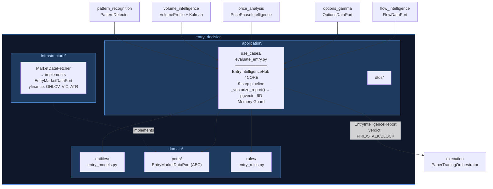
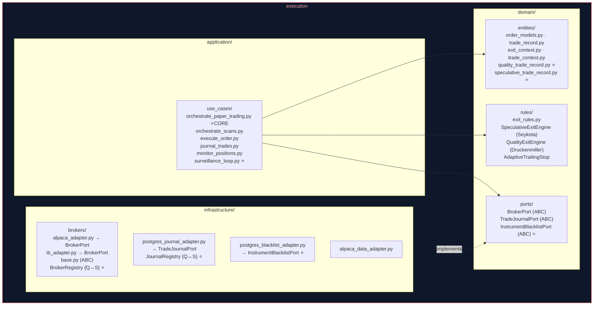
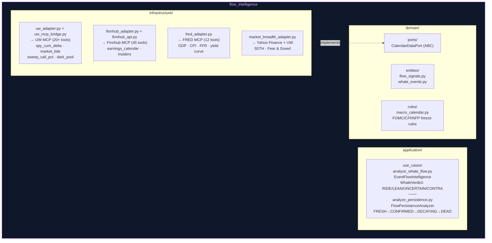
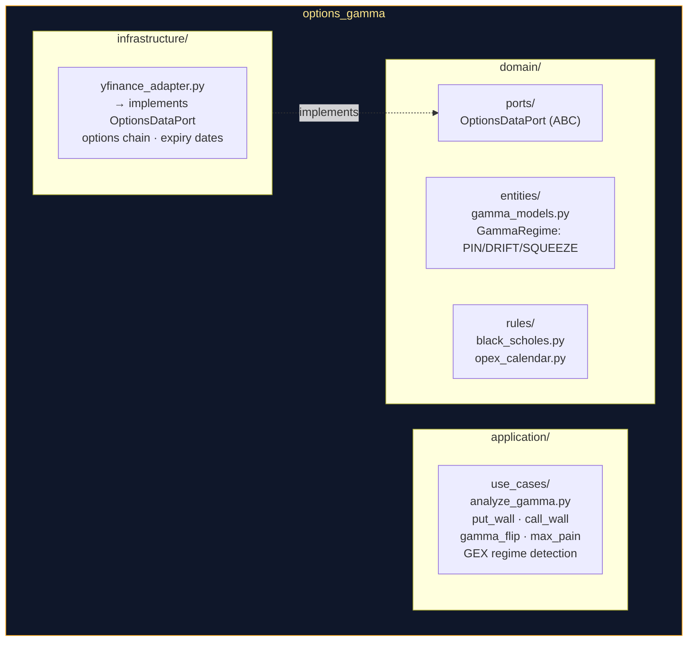
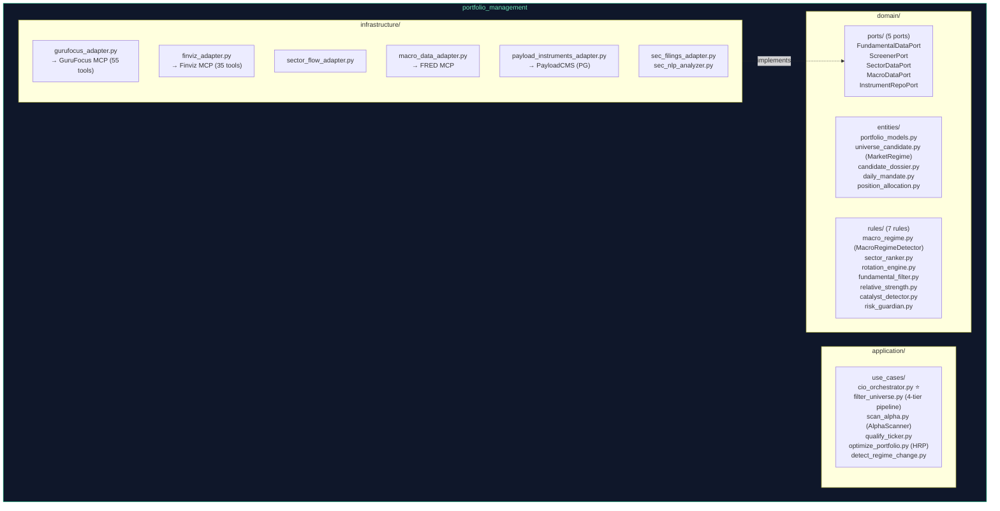
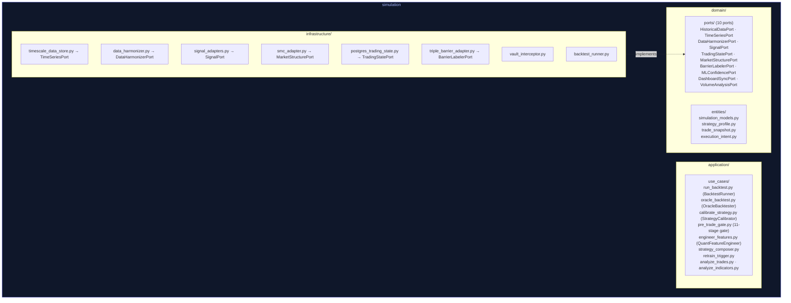
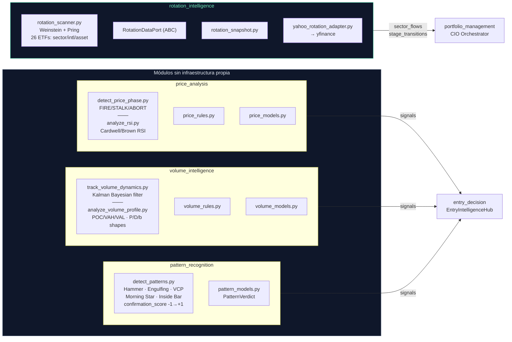

# Botero Trade — Module Internals (Graphyfi-verified)

> Extraído de Graphyfi graph.json (3387 nodos, 512 archivos) | 2026-05-01

---

## 1. entry_decision — Central Intelligence Hub

**Skills activados:** `fundamental-analyst`, `tactical-entries`, `risk-manager`
**Decisión:** `EntryVerdict` — FIRE (ejecutar) / STALK (esperar) / BLOCK (rechazar)

---

## 2. execution — Order Lifecycle & Dual Exit

**Skills activados:** `risk-manager`, `cio-allocator`, `trade-forensics`
**Decisiones:** `ExitDecision` (HOLD/CUT/LIQUIDATE), order execution, journal persistence

---

## 3. flow_intelligence — Whale Flow & Macro Events

**Skills activados:** `tactical-entries`
**Decisión:** `WhaleVerdict` + `FlowPersistence` → gates en EntryHub

---

## 4. options_gamma — Dealer Positioning

**Skills activados:** `tactical-entries`, `risk-manager`
**Decisión:** `GammaRegime` + structural levels → entry timing gates

---

## 5. portfolio_management — Universe Filter & CIO Orchestration

**Skills activados:** `research-intelligence`, `fundamental-analyst`, `risk-manager`, `cio-allocator`
**Decisiones:** `DailyMandate`, `MarketRegime`, `PositionAllocation`, universe candidates

---

## 6. simulation — Quantitative Validation Lab

**Skill activado:** `backtesting-trading-strategies` (López de Prado)
**Decisiones:** `CalibrationProfile`, signal weights, VIABLE/OVERFIT verdict

---

## 7. Módulos de Señal (Pure Domain)

**Skills:** `tactical-entries` (PA, VI, PR) · `rotation-analyst` + `cio-allocator` (RI)

---

## 8. shared — Cross-Module Foundation

| Component | Location | Purpose |
|---|---|---|
| `Bar`, market types | `domain/entities/market_data.py` | Typed dataclasses para OHLCV |
| `shared_use_cases.py` | `application/use_cases/` | Delegation hub |
| `cache_utils.py` | `infrastructure/` | TTL cache + retry with backoff |
| Skills | `operational-purpose` + `clean-architecture` only | Architecture baseline |
