# Botero Trade — Module Internals V15

> Actualizado: 2026-07-09 | 15 módulos, ~28 ports, 4 daemons
> Auditoría directa de código fuente

---

## 1. entry_decision — Central Intelligence Hub

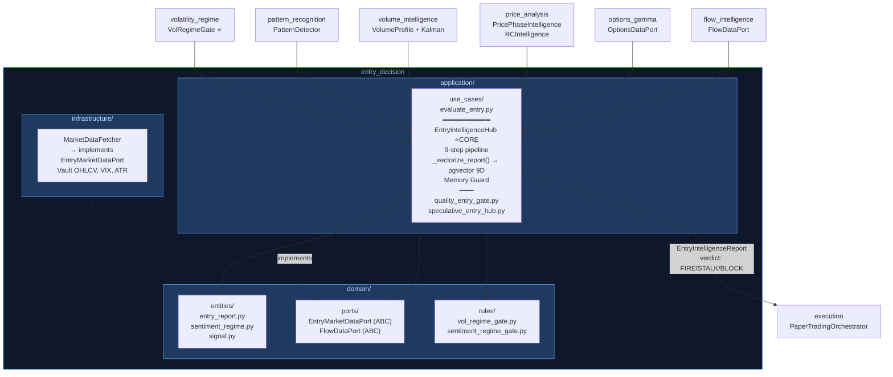
```mermaid
graph TB
    subgraph ED["entry_decision"]
        subgraph ED_DOM["domain/"]
            ED_E["entities/<br/>entry_report.py<br/>sentiment_regime.py<br/>signal.py"]
            ED_P["ports/<br/>EntryMarketDataPort (ABC)<br/>FlowDataPort (ABC)"]
            ED_R["rules/<br/>vol_regime_gate.py<br/>sentiment_regime_gate.py"]
        end
        subgraph ED_APP["application/"]
            ED_UC["use_cases/<br/>evaluate_entry.py<br/>══════════<br/>EntryIntelligenceHub ⭐CORE<br/>9-step pipeline<br/>_vectorize_report() → pgvector 9D<br/>Memory Guard<br/>───<br/>quality_entry_gate.py<br/>speculative_entry_hub.py"]
        end
        subgraph ED_INF["infrastructure/"]
            ED_MDF["MarketDataFetcher<br/>→ implements EntryMarketDataPort<br/>Vault OHLCV, VIX, ATR"]
        end
    end

    ED_INF -.->|"implements"| ED_P
    ED_UC --> ED_E & ED_R & ED_P

    %% Cross-module inputs
    FI_IN["flow_intelligence<br/>FlowDataPort"] --> ED_UC
    OG_IN["options_gamma<br/>OptionsDataPort"] --> ED_UC
    PA_IN["price_analysis<br/>PricePhaseIntelligence<br/>RCIntelligence"] --> ED_UC
    VI_IN["volume_intelligence<br/>VolumeProfile + Kalman"] --> ED_UC
    PR_IN["pattern_recognition<br/>PatternDetector"] --> ED_UC
    VR_IN["volatility_regime<br/>VolRegimeGate ⭐"] --> ED_UC

    ED_UC -->|"EntryIntelligenceReport<br/>verdict: FIRE/STALK/BLOCK"| EX_OUT["execution<br/>PaperTradingOrchestrator"]

    style ED fill:#0f172a,stroke:#3b82f6,color:#93c5fd
    style ED_DOM fill:#1e3a5f,stroke:#60a5fa,color:#bfdbfe
    style ED_APP fill:#1e3a5f,stroke:#60a5fa,color:#bfdbfe
    style ED_INF fill:#1e3a5f,stroke:#60a5fa,color:#bfdbfe
```

**Skills activados:** `fundamental-analyst`, `tactical-entries`, `risk-quality`, `risk-speculative`
**Decisión:** `EntryVerdict` — FIRE (ejecutar) / STALK (esperar) / BLOCK (rechazar)
**V15 Δ:** Separate `quality_entry_gate.py` + `speculative_entry_hub.py` use cases. New `vol_regime_gate`, `sentiment_regime_gate` domain rules.

---

## 2. execution — Order Lifecycle & Dual Exit

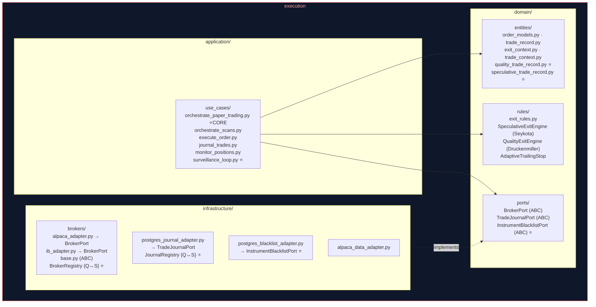
```mermaid
graph TB
    subgraph EX["execution"]
        subgraph EX_DOM["domain/"]
            EX_E["entities/<br/>order_models.py · trade_record.py<br/>exit_context.py · trade_context.py<br/>quality_trade_record.py ⭐<br/>speculative_trade_record.py ⭐"]
            EX_P["ports/<br/>BrokerPort (ABC)<br/>TradeJournalPort (ABC)<br/>InstrumentBlacklistPort (ABC) ⭐"]
            EX_R["rules/<br/>exit_rules.py<br/>SpeculativeExitEngine (Seykota)<br/>QualityExitEngine (Druckenmiller)<br/>AdaptiveTrailingStop"]
        end
        subgraph EX_APP["application/"]
            EX_UC["use_cases/<br/>orchestrate_paper_trading.py ⭐CORE<br/>orchestrate_scans.py<br/>execute_order.py<br/>journal_trades.py<br/>monitor_positions.py<br/>surveillance_loop.py ⭐"]
        end
        subgraph EX_INF["infrastructure/"]
            EX_BR["brokers/<br/>alpaca_adapter.py → BrokerPort<br/>ib_adapter.py → BrokerPort<br/>base.py (ABC)<br/>BrokerRegistry {Q↔S} ⭐"]
            EX_PG["postgres_journal_adapter.py<br/>→ TradeJournalPort<br/>JournalRegistry {Q↔S} ⭐"]
            EX_BL["postgres_blacklist_adapter.py<br/>→ InstrumentBlacklistPort ⭐"]
            EX_AD["alpaca_data_adapter.py"]
        end
    end

    EX_INF -.->|"implements"| EX_P
    EX_UC --> EX_E & EX_R & EX_P

    style EX fill:#0f172a,stroke:#ef4444,color:#fca5a5
```

**Skills activados:** `risk-quality`, `risk-speculative`, `cio-allocator`, `trade-forensics`
**Decisiones:** `ExitDecision` (HOLD/CUT/LIQUIDATE), order execution, journal persistence

---

## 3. quality_swing — Druckenmiller Tactical Timing ⭐ NEW

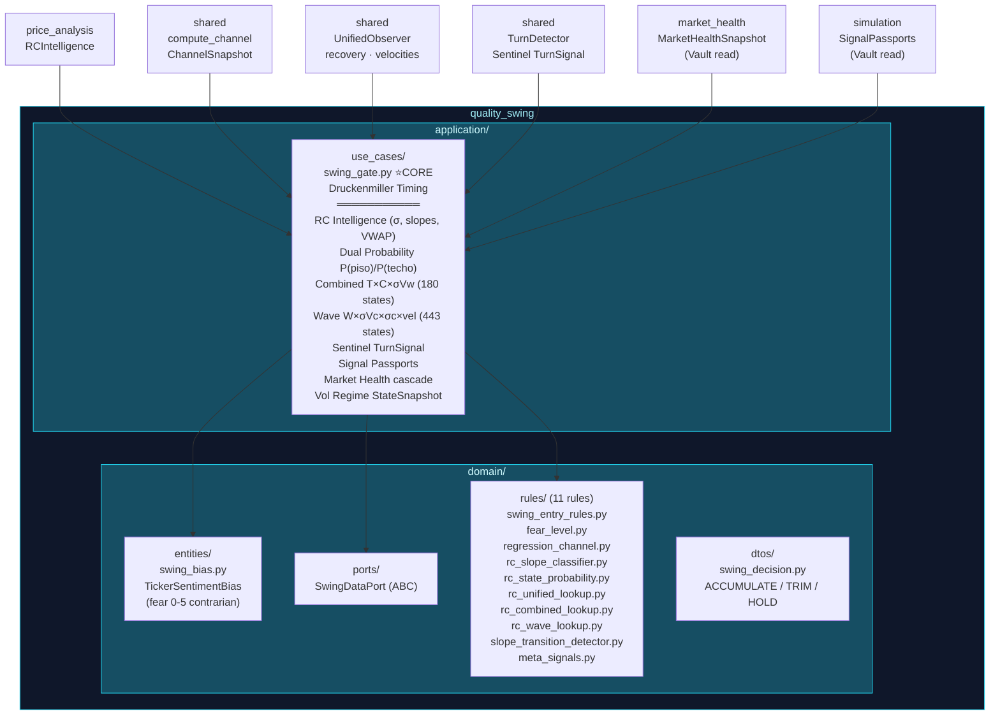
```mermaid
graph TB
    subgraph QS["quality_swing"]
        subgraph QS_DOM["domain/"]
            QS_E["entities/<br/>swing_bias.py<br/>TickerSentimentBias<br/>(fear 0-5 contrarian)"]
            QS_P["ports/<br/>SwingDataPort (ABC)"]
            QS_R["rules/ (11 rules)<br/>swing_entry_rules.py<br/>fear_level.py<br/>regression_channel.py<br/>rc_slope_classifier.py<br/>rc_state_probability.py<br/>rc_unified_lookup.py<br/>rc_combined_lookup.py<br/>rc_wave_lookup.py<br/>slope_transition_detector.py<br/>meta_signals.py"]
            QS_DTO["dtos/<br/>swing_decision.py<br/>ACCUMULATE / TRIM / HOLD"]
        end
        subgraph QS_APP["application/"]
            QS_UC["use_cases/<br/>swing_gate.py ⭐CORE<br/>Druckenmiller Timing<br/>═══════════<br/>RC Intelligence (σ, slopes, VWAP)<br/>Dual Probability P(piso)/P(techo)<br/>Combined T×C×σVw (180 states)<br/>Wave W×σVc×σc×vel (443 states)<br/>Sentinel TurnSignal<br/>Signal Passports<br/>Market Health cascade<br/>Vol Regime StateSnapshot"]
        end
    end

    QS_UC --> QS_E & QS_R & QS_P

    %% Cross-module reads
    PA_RC["price_analysis<br/>RCIntelligence"] --> QS_UC
    SH_CH["shared<br/>compute_channel<br/>ChannelSnapshot"] --> QS_UC
    SH_OB["shared<br/>UnifiedObserver<br/>recovery · velocities"] --> QS_UC
    SH_TN["shared<br/>TurnDetector<br/>Sentinel TurnSignal"] --> QS_UC
    MH_IN["market_health<br/>MarketHealthSnapshot<br/>(Vault read)"] --> QS_UC
    SIM_PP["simulation<br/>SignalPassports<br/>(Vault read)"] --> QS_UC

    style QS fill:#0f172a,stroke:#22d3ee,color:#a5f3fc
    style QS_DOM fill:#164e63,stroke:#22d3ee,color:#cffafe
    style QS_APP fill:#164e63,stroke:#22d3ee,color:#cffafe
```

**Skills activados:** `department-quality-swing`, `risk-quality`
**Decisión:** `SwingDecision` — ACCUMULATE (add to position) / TRIM (reduce) / HOLD (wait)
**Architecture:** Pure Domain — no infrastructure layer. Reads Vault via SwingDataPort.

---

## 4. flow_intelligence — Whale Flow & Macro Events

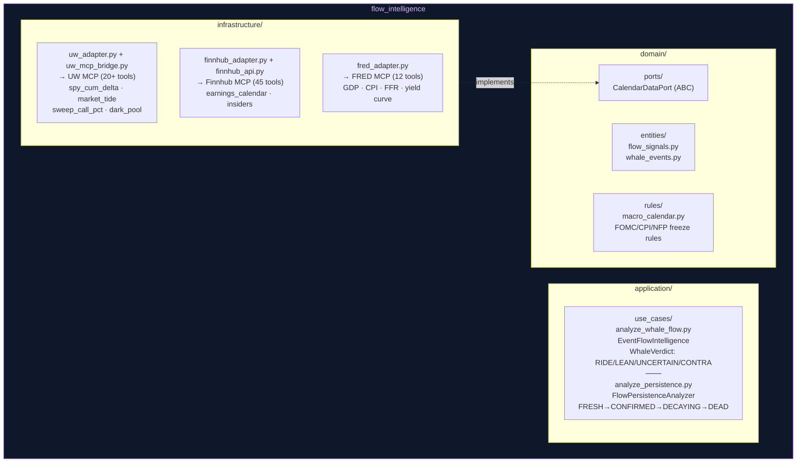
```mermaid
graph TB
    subgraph FI["flow_intelligence"]
        subgraph FI_DOM["domain/"]
            FI_E["entities/<br/>flow_signals.py<br/>whale_events.py"]
            FI_P["ports/<br/>CalendarDataPort (ABC)"]
            FI_R["rules/<br/>macro_calendar.py<br/>FOMC/CPI/NFP freeze rules"]
        end
        subgraph FI_APP["application/"]
            FI_UC["use_cases/<br/>analyze_whale_flow.py<br/>EventFlowIntelligence<br/>WhaleVerdict: RIDE/LEAN/UNCERTAIN/CONTRA<br/>───<br/>analyze_persistence.py<br/>FlowPersistenceAnalyzer<br/>FRESH→CONFIRMED→DECAYING→DEAD"]
        end
        subgraph FI_INF["infrastructure/"]
            FI_UW["uw_adapter.py + uw_mcp_bridge.py<br/>→ UW MCP (20+ tools)<br/>spy_cum_delta · market_tide<br/>sweep_call_pct · dark_pool"]
            FI_FH["finnhub_adapter.py + finnhub_api.py<br/>→ Finnhub MCP (45 tools)<br/>earnings_calendar · insiders"]
            FI_FR["fred_adapter.py<br/>→ FRED MCP (12 tools)<br/>GDP · CPI · FFR · yield curve"]
        end
    end

    FI_INF -.->|"implements"| FI_P

    style FI fill:#0f172a,stroke:#a855f7,color:#d8b4fe
```

**Skills activados:** `tactical-entries`
**Decisión:** `WhaleVerdict` + `FlowPersistence` → gates en EntryHub

---

## 5. options_gamma — Dealer Positioning

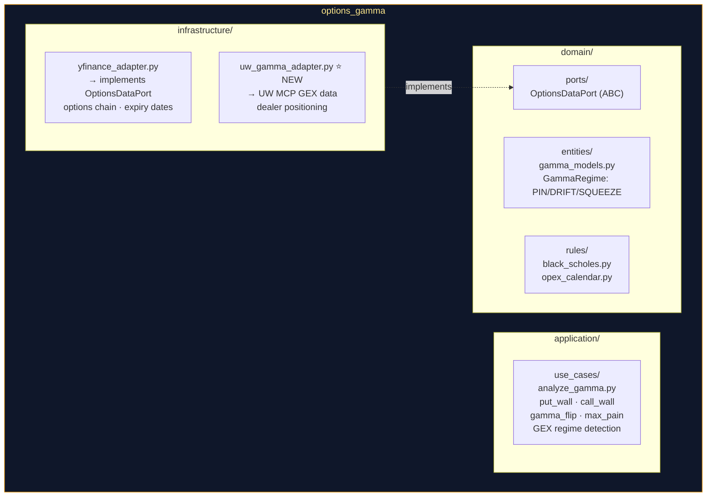
```mermaid
graph TB
    subgraph OG["options_gamma"]
        subgraph OG_DOM["domain/"]
            OG_E["entities/<br/>gamma_models.py<br/>GammaRegime: PIN/DRIFT/SQUEEZE"]
            OG_P["ports/<br/>OptionsDataPort (ABC)"]
            OG_R["rules/<br/>black_scholes.py<br/>opex_calendar.py"]
        end
        subgraph OG_APP["application/"]
            OG_UC["use_cases/<br/>analyze_gamma.py<br/>put_wall · call_wall<br/>gamma_flip · max_pain<br/>GEX regime detection"]
        end
        subgraph OG_INF["infrastructure/"]
            OG_YF["yfinance_adapter.py<br/>→ implements OptionsDataPort<br/>options chain · expiry dates"]
            OG_UW["uw_gamma_adapter.py ⭐ NEW<br/>→ UW MCP GEX data<br/>dealer positioning"]
        end
    end

    OG_INF -.->|"implements"| OG_P

    style OG fill:#0f172a,stroke:#f59e0b,color:#fde68a
```

**Skills activados:** `tactical-entries`, `risk-speculative`
**Decisión:** `GammaRegime` + structural levels → entry timing gates
**V15 Δ:** New `uw_gamma_adapter.py` for UW MCP GEX enrichment.

---

## 6. market_health — 6D Convergence Intelligence ⭐ NEW

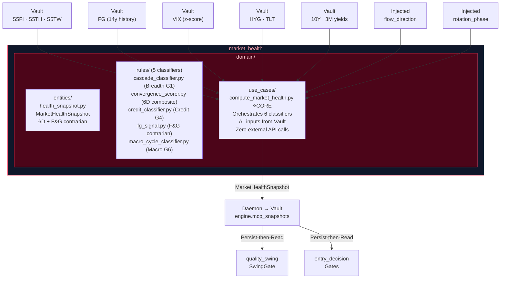
```mermaid
graph TB
    subgraph MH["market_health"]
        subgraph MH_DOM["domain/"]
            MH_E["entities/<br/>health_snapshot.py<br/>MarketHealthSnapshot<br/>6D + F&G contrarian"]
            MH_R["rules/ (5 classifiers)<br/>cascade_classifier.py (Breadth G1)<br/>convergence_scorer.py (6D composite)<br/>credit_classifier.py (Credit G4)<br/>fg_signal.py (F&G contrarian)<br/>macro_cycle_classifier.py (Macro G6)"]
            MH_UC["use_cases/<br/>compute_market_health.py ⭐CORE<br/>Orchestrates 6 classifiers<br/>All inputs from Vault<br/>Zero external API calls"]
        end
    end

    %% Inputs from Vault
    S5["Vault<br/>S5FI · S5TH · S5TW"] --> MH_UC
    FG["Vault<br/>FG (14y history)"] --> MH_UC
    VIX_IN["Vault<br/>VIX (z-score)"] --> MH_UC
    CREDIT["Vault<br/>HYG · TLT"] --> MH_UC
    YIELDS["Vault<br/>10Y · 3M yields"] --> MH_UC
    FLOW_IN["Injected<br/>flow_direction"] --> MH_UC
    ROT_IN["Injected<br/>rotation_phase"] --> MH_UC

    %% Consumers
    MH_UC -->|"MarketHealthSnapshot"| PERSIST["Daemon → Vault<br/>engine.mcp_snapshots"]
    PERSIST -->|"Persist-then-Read"| QS_READ["quality_swing<br/>SwingGate"]
    PERSIST -->|"Persist-then-Read"| ED_READ["entry_decision<br/>Gates"]

    style MH fill:#0f172a,stroke:#f43f5e,color:#fda4af
    style MH_DOM fill:#4c0519,stroke:#f43f5e,color:#fecdd3
```

**Skill activado:** `market-health-intelligence`
**Decisión:** `MarketHealthSnapshot` — 6D convergence + F&G contrarian actions
**6 Dimensions:** G1:Breadth Cascade, G2:Vol Regime, G3:Flow, G4:Credit, G5:Rotation, G6:Macro
**F&G Actions:** CAPITULATION_BUY / FEAR_BUY / GREED_CAUTION / GREED_TRAP / NONE
**Architecture:** Pure Domain module (domain only, no infrastructure layer). Daemon computes daily, modules read from Vault.

---

## 7. volatility_regime — Dual State Machine ⭐ NEW

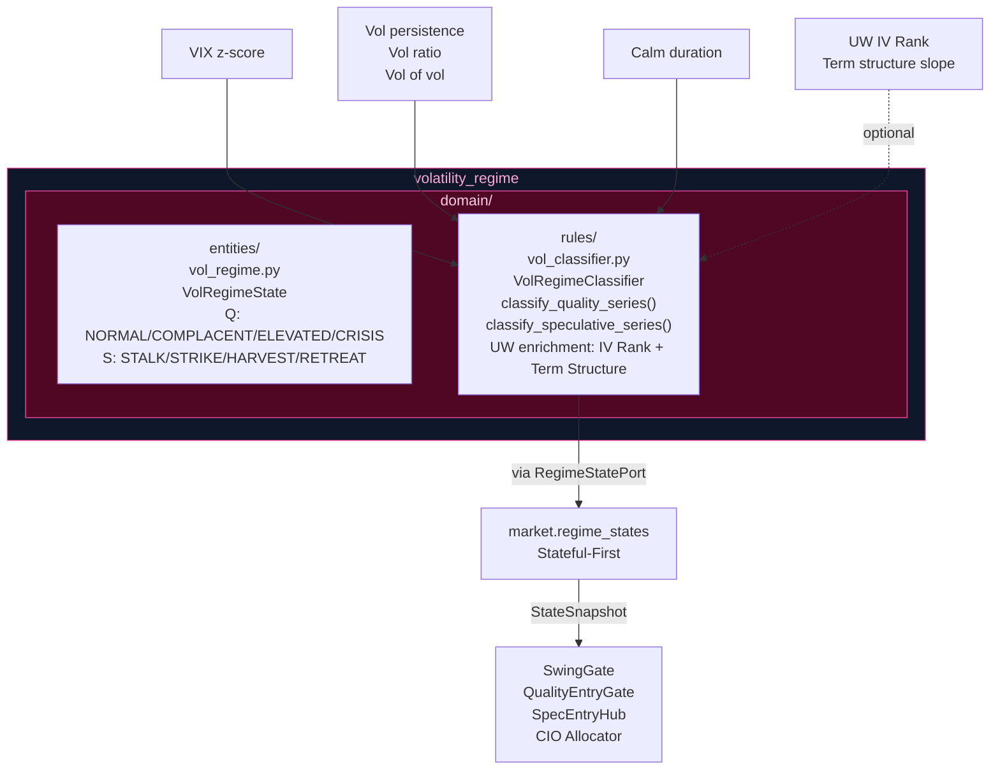
```mermaid
graph TB
    subgraph VR["volatility_regime"]
        subgraph VR_DOM["domain/"]
            VR_E["entities/<br/>vol_regime.py<br/>VolRegimeState<br/>Q: NORMAL/COMPLACENT/ELEVATED/CRISIS<br/>S: STALK/STRIKE/HARVEST/RETREAT"]
            VR_R["rules/<br/>vol_classifier.py<br/>VolRegimeClassifier<br/>classify_quality_series()<br/>classify_speculative_series()<br/>UW enrichment: IV Rank + Term Structure"]
        end
    end

    %% Inputs
    VIX_Z["VIX z-score"] --> VR_R
    VOL_P["Vol persistence<br/>Vol ratio<br/>Vol of vol"] --> VR_R
    CALM["Calm duration"] --> VR_R
    UW_IV["UW IV Rank<br/>Term structure slope"] -.->|"optional"| VR_R

    %% Outputs
    VR_R -->|"via RegimeStatePort"| RSP["market.regime_states<br/>Stateful-First"]
    RSP -->|"StateSnapshot"| CONSUMERS["SwingGate<br/>QualityEntryGate<br/>SpecEntryHub<br/>CIO Allocator"]

    style VR fill:#0f172a,stroke:#ec4899,color:#f9a8d4
    style VR_DOM fill:#500724,stroke:#ec4899,color:#fbcfe8
```

**Skill activado:** `vol-regime-intelligence`
**Architecture:** Pure Domain (entities + rules only). Persists via RegimeStatePort (Stateful-First).
**Quality States:** NORMAL→COMPLACENT→ELEVATED→CRISIS
**Speculative States:** STALK→STRIKE→HARVEST→RETREAT
**Simons fix:** STRIKE uses EMA(vol_ratio, 5) + ≥3 bar persistence (not single-bar)

---

## 8. portfolio_management — Universe Filter & CIO Orchestration

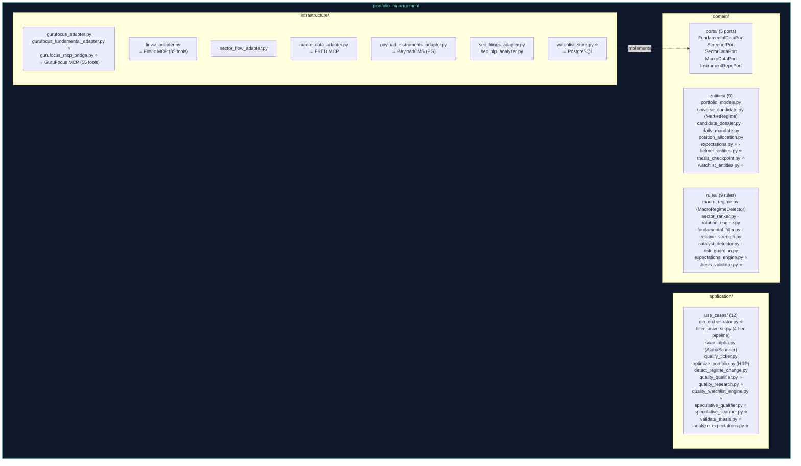
```mermaid
graph TB
    subgraph PM["portfolio_management"]
        subgraph PM_DOM["domain/"]
            PM_E["entities/ (9)<br/>portfolio_models.py<br/>universe_candidate.py (MarketRegime)<br/>candidate_dossier.py · daily_mandate.py<br/>position_allocation.py<br/>expectations.py ⭐ · helmer_entities.py ⭐<br/>thesis_checkpoint.py ⭐<br/>watchlist_entities.py ⭐"]
            PM_P["ports/ (5 ports)<br/>FundamentalDataPort<br/>ScreenerPort<br/>SectorDataPort<br/>MacroDataPort<br/>InstrumentRepoPort"]
            PM_R["rules/ (9 rules)<br/>macro_regime.py (MacroRegimeDetector)<br/>sector_ranker.py · rotation_engine.py<br/>fundamental_filter.py · relative_strength.py<br/>catalyst_detector.py · risk_guardian.py<br/>expectations_engine.py ⭐<br/>thesis_validator.py ⭐"]
        end
        subgraph PM_APP["application/"]
            PM_UC["use_cases/ (12)<br/>cio_orchestrator.py ⭐<br/>filter_universe.py (4-tier pipeline)<br/>scan_alpha.py (AlphaScanner)<br/>qualify_ticker.py<br/>optimize_portfolio.py (HRP)<br/>detect_regime_change.py<br/>quality_qualifier.py ⭐<br/>quality_research.py ⭐<br/>quality_watchlist_engine.py ⭐<br/>speculative_qualifier.py ⭐<br/>speculative_scanner.py ⭐<br/>validate_thesis.py ⭐<br/>analyze_expectations.py ⭐"]
        end
        subgraph PM_INF["infrastructure/"]
            PM_GF["gurufocus_adapter.py<br/>gurufocus_fundamental_adapter.py ⭐<br/>gurufocus_mcp_bridge.py ⭐<br/>→ GuruFocus MCP (55 tools)"]
            PM_FV["finviz_adapter.py<br/>→ Finviz MCP (35 tools)"]
            PM_SF["sector_flow_adapter.py"]
            PM_MD["macro_data_adapter.py<br/>→ FRED MCP"]
            PM_PI["payload_instruments_adapter.py<br/>→ PayloadCMS (PG)"]
            PM_SEC["sec_filings_adapter.py<br/>sec_nlp_analyzer.py"]
            PM_WL["watchlist_store.py ⭐<br/>→ PostgreSQL"]
        end
    end

    PM_INF -.->|"implements"| PM_P

    style PM fill:#0f172a,stroke:#10b981,color:#6ee7b7
```

**Skills activados:** `research-intelligence`, `fundamental-analyst`, `risk-quality`, `cio-allocator`
**Decisiones:** `DailyMandate`, `MarketRegime`, `PositionAllocation`, universe candidates
**V15 Δ:** Dual research pipelines (Quality + Speculative), thesis validation, expectations engine, watchlist management.

---

## 9. simulation — Quantitative Validation Lab

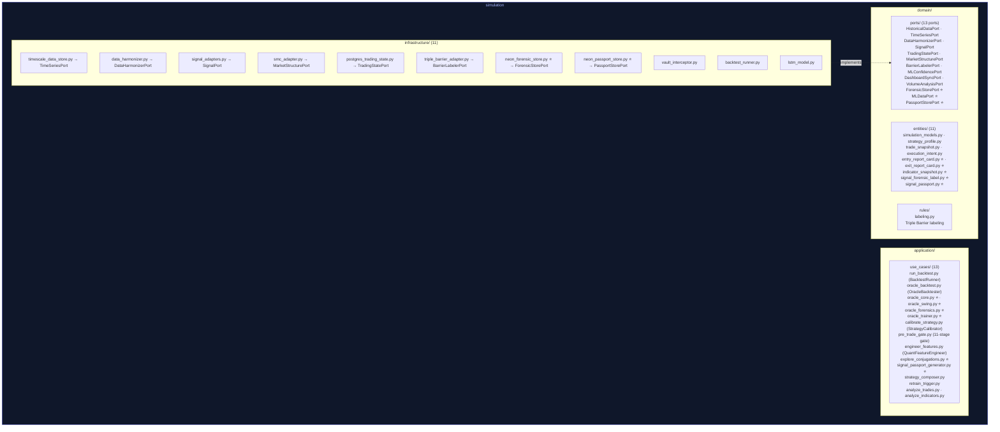
```mermaid
graph TB
    subgraph SIM["simulation"]
        subgraph SIM_DOM["domain/"]
            SIM_E["entities/ (11)<br/>simulation_models.py · strategy_profile.py<br/>trade_snapshot.py · execution_intent.py<br/>entry_report_card.py ⭐ · exit_report_card.py ⭐<br/>indicator_snapshot.py ⭐<br/>signal_forensic_label.py ⭐<br/>signal_passport.py ⭐"]
            SIM_P["ports/ (13 ports)<br/>HistoricalDataPort · TimeSeriesPort<br/>DataHarmonizerPort · SignalPort<br/>TradingStatePort · MarketStructurePort<br/>BarrierLabelerPort · MLConfidencePort<br/>DashboardSyncPort · VolumeAnalysisPort<br/>ForensicStorePort ⭐<br/>MLDataPort ⭐<br/>PassportStorePort ⭐"]
            SIM_R["rules/<br/>labeling.py<br/>Triple Barrier labeling"]
        end
        subgraph SIM_APP["application/"]
            SIM_UC["use_cases/ (13)<br/>run_backtest.py (BacktestRunner)<br/>oracle_backtest.py (OracleBacktester)<br/>oracle_core.py ⭐ · oracle_swing.py ⭐<br/>oracle_forensics.py ⭐<br/>oracle_trainer.py ⭐<br/>calibrate_strategy.py (StrategyCalibrator)<br/>pre_trade_gate.py (11-stage gate)<br/>engineer_features.py (QuantFeatureEngineer)<br/>explore_conjugations.py ⭐<br/>signal_passport_generator.py ⭐<br/>strategy_composer.py<br/>retrain_trigger.py<br/>analyze_trades.py · analyze_indicators.py"]
        end
        subgraph SIM_INF["infrastructure/ (11)"]
            SIM_TS["timescale_data_store.py → TimeSeriesPort"]
            SIM_DH["data_harmonizer.py → DataHarmonizerPort"]
            SIM_SA["signal_adapters.py → SignalPort"]
            SIM_SM["smc_adapter.py → MarketStructurePort"]
            SIM_PS["postgres_trading_state.py → TradingStatePort"]
            SIM_TB["triple_barrier_adapter.py → BarrierLabelerPort"]
            SIM_NF["neon_forensic_store.py ⭐ → ForensicStorePort"]
            SIM_NP["neon_passport_store.py ⭐ → PassportStorePort"]
            SIM_VI["vault_interceptor.py"]
            SIM_BR["backtest_runner.py"]
            SIM_ML["lstm_model.py"]
        end
    end

    SIM_INF -.->|"implements"| SIM_P

    style SIM fill:#0f172a,stroke:#6366f1,color:#a5b4fc
```

**Skill activado:** `backtesting-trading-strategies` (López de Prado)
**Decisiones:** `CalibrationProfile`, signal weights, VIABLE/OVERFIT verdict
**V15 Δ:** Oracle system (core/swing/forensics/trainer), Signal Passports, conjugation explorer, Neon-backed forensic + passport stores.

---

## 10. Módulos de Señal (Pure Domain)

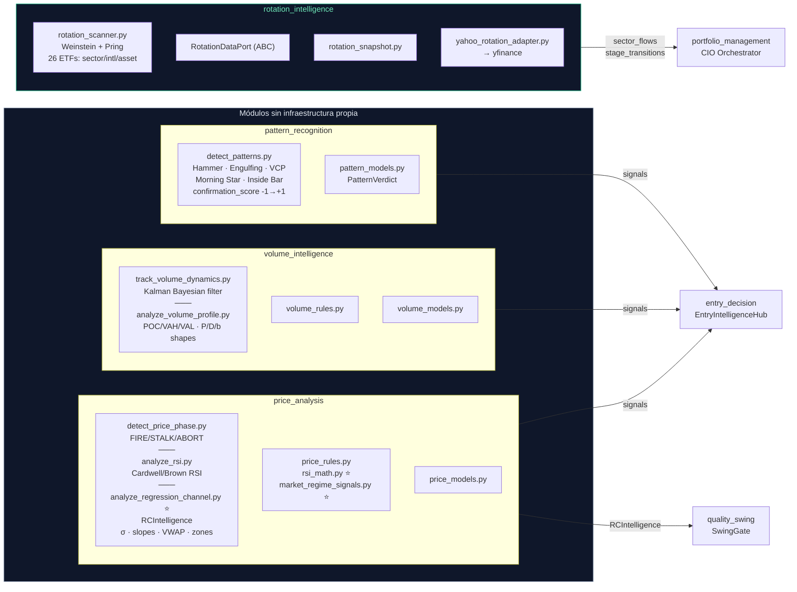
```mermaid
graph LR
    subgraph SIGNAL["Módulos sin infraestructura propia"]
        subgraph PA["price_analysis"]
            PA_UC["detect_price_phase.py<br/>FIRE/STALK/ABORT<br/>───<br/>analyze_rsi.py<br/>Cardwell/Brown RSI<br/>───<br/>analyze_regression_channel.py ⭐<br/>RCIntelligence<br/>σ · slopes · VWAP · zones"]
            PA_R["price_rules.py<br/>rsi_math.py ⭐<br/>market_regime_signals.py ⭐"]
            PA_E["price_models.py"]
        end

        subgraph VI["volume_intelligence"]
            VI_UC["track_volume_dynamics.py<br/>Kalman Bayesian filter<br/>───<br/>analyze_volume_profile.py<br/>POC/VAH/VAL · P/D/b shapes"]
            VI_R["volume_rules.py"]
            VI_E["volume_models.py"]
        end

        subgraph PR["pattern_recognition"]
            PR_UC["detect_patterns.py<br/>Hammer · Engulfing · VCP<br/>Morning Star · Inside Bar<br/>confirmation_score -1→+1"]
            PR_E["pattern_models.py<br/>PatternVerdict"]
        end
    end

    subgraph RI["rotation_intelligence"]
        RI_UC["rotation_scanner.py<br/>Weinstein + Pring<br/>26 ETFs: sector/intl/asset"]
        RI_P["RotationDataPort (ABC)"]
        RI_E["rotation_snapshot.py"]
        RI_INF["yahoo_rotation_adapter.py<br/>→ yfinance"]
    end

    PA & VI & PR -->|"signals"| HUB["entry_decision<br/>EntryIntelligenceHub"]
    PA -->|"RCIntelligence"| QS_HUB["quality_swing<br/>SwingGate"]
    RI -->|"sector_flows<br/>stage_transitions"| PM["portfolio_management<br/>CIO Orchestrator"]

    style SIGNAL fill:#0f172a,stroke:#94a3b8,color:#e2e8f0
    style RI fill:#0f172a,stroke:#10b981,color:#6ee7b7
```

**Skills:** `tactical-entries` (PA, VI, PR) · `rotation-analyst` + `cio-allocator` (RI)
**V15 Δ:** New `RegressionChannelIntelligence` in PA feeds SwingGate. RSI math extracted.

---

## 11. shared — Cross-Module Foundation

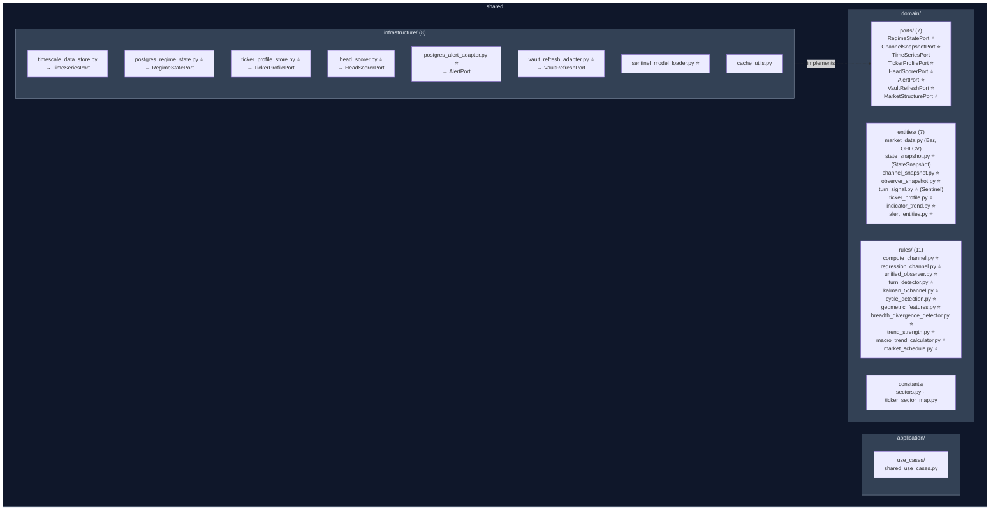
```mermaid
graph TB
    subgraph SH["shared"]
        subgraph SH_DOM["domain/"]
            SH_E["entities/ (7)<br/>market_data.py (Bar, OHLCV)<br/>state_snapshot.py ⭐ (StateSnapshot)<br/>channel_snapshot.py ⭐<br/>observer_snapshot.py ⭐<br/>turn_signal.py ⭐ (Sentinel)<br/>ticker_profile.py ⭐<br/>indicator_trend.py ⭐<br/>alert_entities.py ⭐"]
            SH_P["ports/ (7)<br/>RegimeStatePort ⭐<br/>ChannelSnapshotPort ⭐<br/>TimeSeriesPort<br/>TickerProfilePort ⭐<br/>HeadScorerPort ⭐<br/>AlertPort ⭐<br/>VaultRefreshPort ⭐<br/>MarketStructurePort ⭐"]
            SH_R["rules/ (11)<br/>compute_channel.py ⭐<br/>regression_channel.py ⭐<br/>unified_observer.py ⭐<br/>turn_detector.py ⭐<br/>kalman_5channel.py ⭐<br/>cycle_detection.py ⭐<br/>geometric_features.py ⭐<br/>breadth_divergence_detector.py ⭐<br/>trend_strength.py ⭐<br/>macro_trend_calculator.py ⭐<br/>market_schedule.py ⭐"]
            SH_C["constants/<br/>sectors.py · ticker_sector_map.py"]
        end
        subgraph SH_APP["application/"]
            SH_UC["use_cases/<br/>shared_use_cases.py"]
        end
        subgraph SH_INF["infrastructure/ (8)"]
            SH_TS["timescale_data_store.py<br/>→ TimeSeriesPort"]
            SH_RS["postgres_regime_state.py ⭐<br/>→ RegimeStatePort"]
            SH_TP["ticker_profile_store.py ⭐<br/>→ TickerProfilePort"]
            SH_HS["head_scorer.py ⭐<br/>→ HeadScorerPort"]
            SH_AL["postgres_alert_adapter.py ⭐<br/>→ AlertPort"]
            SH_VR["vault_refresh_adapter.py ⭐<br/>→ VaultRefreshPort"]
            SH_SM["sentinel_model_loader.py ⭐"]
            SH_CA["cache_utils.py"]
        end
    end

    SH_INF -.->|"implements"| SH_P

    style SH fill:#0f172a,stroke:#94a3b8,color:#e2e8f0
    style SH_DOM fill:#334155,stroke:#94a3b8,color:#e2e8f0
    style SH_APP fill:#334155,stroke:#94a3b8,color:#e2e8f0
    style SH_INF fill:#334155,stroke:#94a3b8,color:#e2e8f0
```

**Skills:** `operational-purpose` + `clean-architecture` only
**V15 Δ:** Massive expansion — StateSnapshot, RegimeStatePort (Stateful-First), ChannelSnapshot, UnifiedObserver, TurnDetector (Sentinel), Kalman 5-channel, geometric features, breadth divergence. This is the architectural spine of the system.

---

## 12. Daemons — Vault Writers ⭐ NEW SECTION

| Daemon | Cadence | Purpose |
|---|---|---|
| **DataVaultDaemon** | Daily | Orchestrates 8 vault_providers to populate Vault |
| **QualityDaemon** | Daily | Quality department orchestration |
| **SpeculativeDaemon** | 15min | Speculative department orchestration |
| **WatchlistAlertDaemon** | On-demand | Watchlist alert notifications |

### Vault Providers (DataVaultDaemon)

| Provider | Writes To | Data |
|---|---|---|
| `ohlcv_provider` | `market.ohlcv_bars` | OHLCV for all tracked tickers |
| `breadth_provider` | `market.ohlcv_bars` | S5FI, S5TH, S5TW breadth |
| `sector_breadth_provider` | `market.ohlcv_bars` | Sector-level breadth |
| `market_health_provider` | `engine.mcp_snapshots` | MarketHealthSnapshot (6D+F&G) |
| `observer_provider` | `engine.channel_snapshots` | UnifiedObserver output |
| `channel_snapshot_provider` | `engine.channel_snapshots` | RC σ, slopes, VWAP, Sentinel |
| `uw_gamma_provider` | `engine.mcp_snapshots` | UW GEX, IV Rank, vol stats |
| `remaining_providers` | Various | Other indicator data |
