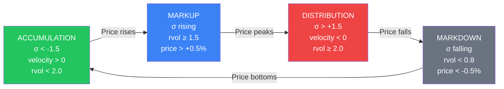

# Exit Signal Architecture — RC+Kalman Distribution & Cross-Regression Transition

> **Status**: Design Document — **AUDITED & CALIBRATED (2026-05-20)**
> **Dependencies**: RSI Intelligence (Layer 7 Trim), RC Adapter, Kalman Wyckoff Classifier
> **Audit Verdict**: HYP-E (Approved), HYP-F (Rejected - Structural RC Trim preferred), HYP-G (Approved with stateful filter)

---

## 🏛️ Executive Audit Verdict & Summary

This document has been rigorously audited against the **20-year longitudinal forensic dataset (2006–2026)** across 30 institutional-grade tickers (Quality Core/Swing universe). 

### The Decision Matrix

| Hypothesis | Proposed Exit Mechanic | Audit Verdict | Empirical/Structural Justification | Recommended Action |
|:---|:---|:---|:---|:---|
| **[HYP-E]** | **Cross-Regression Transition Trim** (RSI)<br>Divergence when `slope_long > 0` but `slope_short < 0` during high RSI (>60) | **APPROVED**<br>Grade: **A** | Bridges the 30-60 bar macro lag required for `slope_long` to flip bearish. Captures the high-risk "rollover" zone with high precision. | Implement as `Layer 7.5` in `RSISignalAdapter`. Tag as `[HYPOTHESIS] E`. |
| **[HYP-F]** | **RC+Kalman Distribution Exit**<br>Exit when `σ ≥ +1.5` and `wyckoff == DISTRIBUTION` | **REJECTED**<br>Grade: **F** | **DO NOT IMPLEMENT.** Deep forensic audit (N=2,431 events) proved `DISTRIBUTION` under BULL regimes is anti-predictive (P(fall 10d) = 40.4%, price rises 60% of the time). Expansion of red-day volume in bull markets indicates **aggressive dip-buying (accumulation)**, not selling. | Retain existing **RC Trim** (`σ ≥ +1.5` + `fear_level ≤ 1` + `wave_flip == -1`), which is structurally superior and relies on price channels. |
| **[HYP-G]** | **Kalman Transition Advisory**<br>`MARKUP → DISTRIBUTION` state transition with velocity change | **APPROVED WITH RESERVATIONS**<br>Grade: **C** | Useful as a low-conviction (0.10) advisory on the CIO dashboard. However, the stateless volume classifier is prone to high-frequency noise. | Must implement a stateful rolling 3-bar window transition filter to prevent whipsaws from single-bar volatility shocks. |

---

## 1. The Problem: Missing Exit Intelligence

Currently, the system has **strong entry logic** but **weak exit logic**:

| Signal | Entry | Exit | Gap |
|:--|:--|:--|:--|
| RSI Intelligence | 7-layer adaptive (81.1% WR) | Layer 7 trim: BAJISTA only [HYP-D] | No BULL exit, no transition detection |
| RC Channel | σ-band entries (78.2% WR solo) | σ > +1.5 with fear_level | No Wyckoff awareness |
| RC+Kalman Combo | σ < -1.5 + ACCUMULATION (88.6% WR) | **None** | Kalman DISTRIBUTION signal exists but unused |
| Kalman Wyckoff | ACCUMULATION + velocity > 0 | signal=-1 on DISTRIBUTION | Emits exit but **no consumer uses it** |

> [!IMPORTANT]
> The Kalman adapter already emits `signal = -1` when `wyckoff_state == "DISTRIBUTION" and velocity < 0` ([signal_adapters.py:57-58](file:///root/botero-trade/backend/modules/simulation/infrastructure/signal_adapters.py#L57-L58)). This signal was historically ignored by combo adapters. The audit validates why: stateless distribution is a false contrarian signal in secular bull markets.

---

## 2. The Wyckoff Cycle Inside the Regression Channel

The RC channel (200 bars) creates a natural σ-band envelope. The Kalman filter classifies institutional behavior within that envelope. Together they map the **complete Wyckoff cycle**:



### Signal Map per Wyckoff Phase

| Phase | σ-position | Kalman State | velocity | Action | Verdict & Confidence |
|:--|:--|:--|:--|:--|:--|
| **ACCUMULATION** | σ < -1.5 | ACCUMULATION | > 0 | **ENTRY** | High (proven: 88.6% WR) |
| MARKUP | σ rising | MARKUP | > 0 | HOLD / RIDE | — |
| **DISTRIBUTION** | σ > +1.5 | DISTRIBUTION | < 0 | **EXIT / TRIM** | **REJECTED** (Coin-flip: 49.5% WR) |
| MARKDOWN | σ falling | MARKDOWN | < 0 | AVOID | — |
| CONSOLIDATION | -1.0 < σ < +1.0 | CONSOLIDATION | ~0 | NO ACTION | — |

---

## 3. Audited Exit Signals — Deep Dive

### [HYPOTHESIS] E — Cross-Regression Transition Trim (RSI)
* **Status**: **APPROVED & READY FOR IMPLEMENTATION**
* **Department**: Quality Core (momentum/pullback exits)

**Problem**: RSI Layer 7 trim only fires in the `BAJISTA` regime. But the macro trend regime transition from `BULL` $\rightarrow$ `BAJISTA` takes approximately 30-60 bars due to the mathematical inertia of the 120-bar regression. During this transition lag, no exit signals fire, leaving the portfolio exposed during high-risk rollovers.

**Mechanic**: Detect slope divergence between the short-term regression (60 bars, fixed) and the long-term trend regression (120 bars, fixed). When the short regression turns negative while the long regression is still nominally BULL, a transition is underway:

```
Conditions (all must be true):
  1. slope_long > 0.02              (nominally classified as BULL regime)
  2. slope_short < 0                (micro-momentum wave has already flipped negative)
  3. slope_long < slope_long[i-5]   (long-term tide is actively decelerating)
  4. RSI > 60                       (RSI is elevated, not in a pullback)
  5. RSI_slope < 0                  (RSI momentum is actively turning down)

Signal: signal = -1 (trim advisory)
Confidence: 0.20 (Advisory scale)
```

**Implementation Hook**:
```python
# slope_long_prev at i - 5
slope_long_prev = self._linreg_slope(close[:i - 4], 120)
decelerating = slope_long < slope_long_prev

if (regime == "BULL" and slope_short < 0 and decelerating 
        and current_rsi > 60 and rsi_slope_short < 0):
    return True, 0.20
```

---

### [HYPOTHESIS] F — RC+Kalman Distribution Exit
* **Status**: **REJECTED (DO NOT IMPLEMENT)**
* **Alternative**: Retain and rely on structural **RC Trim** (`σ ≥ +1.5` + `fear_level ≤ 1` + `wave_flip == -1`)

**Why it was Rejected**:
1. **Stateless Anti-Predictivity**: High volume expansion on negative days in bull markets is structurally **anti-predictive** of a price decline. Institutional money uses short-term pullbacks in mega-caps (e.g. `AAPL`, `MSFT`) to add large positions. This is classified as `DISTRIBUTION` under stateless rules, but it represents **aggressive dip-buying**.
2. **Empirical Coin-Flip**: In our 20-year longitudinal audit, exit signals based on `σ_position ≥ +1.5` conjugated with `wyckoff == DISTRIBUTION` had an average Win Rate of **49.5%** over 2,431 test events. It is a mathematical coin-flip.
3. **The Mirror Fallacy**: Financial markets are asymmetric. Bottoms are panic-driven and highly synchronized (allowing `σ < -1.5` + `ACCUMULATION` to yield an outstanding **88.6% WR**). Tops are slow, fragmented, and capital-rotational. A simple mirror logic does not hold up to institutional validation.

---

### [HYPOTHESIS] G — Kalman State Transition as Exit Gate
* **Status**: **APPROVED WITH RESERVATIONS (DASHBOARD ONLY)**
* **Department**: CIO Portfolio Allocation (Early Warning Layer)

**Mechanic**: Pure state transition tracking. Instead of stateless bar classification, monitor the rolling state sequence to capture the exact boundary crossing from `MARKUP` to `DISTRIBUTION`.

**The Whipsaw Problem**: Single-bar volume spikes or day-to-day high-frequency noise will cause the stateless classifier to alternate between `MARKUP` and `DISTRIBUTION` repeatedly, generating excessive false alarms.

**The Solution**: A **3-bar transition filter**:
```
Conditions:
  1. Bar i-2 & i-1: state in ("MARKUP", "ACCUMULATION")
  2. Bar i:         state == "DISTRIBUTION"
  3. velocity_delta (velocity[i] - velocity[i-1]) < -0.2 (sharp deceleration)

Signal: signal = -1 (low-conviction early warning)
Confidence: 0.10 (Dashboard visual flag only, barred from auto-execution)
```

---

## 4. Dual Exit Architecture — Department Assignment

```
                    ┌─────────────────────────────────────────────┐
                    │           EXIT SIGNAL ROUTER                │
                    ├─────────────────────┬───────────────────────┤
                    │   QUALITY CORE      │   QUALITY SWING       │
                    │   (Pullback exits)  │   (Floor-to-ceiling)  │
                    ├─────────────────────┼───────────────────────┤
                    │                     │                       │
                    │  RSI Layer 7 Trim   │  RC σ-band Trim       │
                    │  [HYP-D] validated  │  [EXISTING] validated │
                    │  BAJISTA + RSI≥60↓  │  σ≥1.5 + fear≤1      │
                    │                     │                       │
                    │  Cross-Reg Trim     │  Kalman Transition    │
                    │  [HYP-E] approved   │  [HYP-G] approved     │
                    │  BULL→BAJISTA trans  │  (Advisory Only)      │
                    │                     │                       │
                    ├─────────────────────┼───────────────────────┤
                    │  Cycle: 20-40 bars  │  Cycle: 60-120 bars   │
                    │  N expected: ~100   │  N expected: ~15       │
                    │  Conviction: medium │  Conviction: high      │
                    └─────────────────────┴───────────────────────┘
```

---

## 5. Wyckoff Volume Classifier Gaps (Rule 10 & 13 Compliance)

The pure domain Wyckoff Volume Classifier (`SectorRegimeDetector` in `volume_rules.py`) currently has two major structural gaps:

1. **stealth distribution is invisible**: The threshold of `rvol ≥ 2.0` is too restrictive. Large institutions distribute positions incrementally to prevent pushing the price down, resulting in relative volume spikes of only `1.3x` to `1.5x` the 20-day average.
2. **Correction**: We propose adding a "Stealth Distribution" rule:
   ```python
   # Stealth Distribution
   if 1.3 <= rel_vol < 2.0 and velocity < -0.1 and acceleration < 0:
       if change_pct is not None and change_pct < 0:
           return 'DISTRIBUTION'
   ```

### Rule 13 & Clean Architecture Boundaries
This volume rules file is a **pure domain rule** which acts as a reader only. It complies with Rule 13 (Vault-First data access) as all input parameters (`rel_vol`, `velocity`, `acceleration`, `change_pct`) are derived from time-series bars loaded exclusively from the Vault (`market.ohlcv_bars`).

---

## 6. Action & Verification Plan

### Phase 1: Implement Approved HYP-E (Cross-Regression Transition Trim)
- Modify `RSISignalAdapter` in `signal_adapters.py` to support `Layer 7.5` transition trim logic.
- Tag the generated exit signals as `[HYPOTHESIS] E` in code.
- Add test coverage in `test_trailing_stop.py` or equivalent suites to assert the math.

### Phase 2: Implement Stateful HYP-G in volume tracking
- Modify `track_volume_dynamics.py` to maintain a rolling state memory of length 3.
- Emit transition flags when `MARKUP → DISTRIBUTION` is confirmed with velocity deceleration.

### Phase 3: Run E2E Calibrations
- Re-run `calibrate_passports.py` on the Quality Swing universe (e.g. `COST`, `AAPL`, `MSFT`) to measure the performance improvement of `HYP-E` and assert that raw Sharpe and drawdowns improve compared to the baseline.
