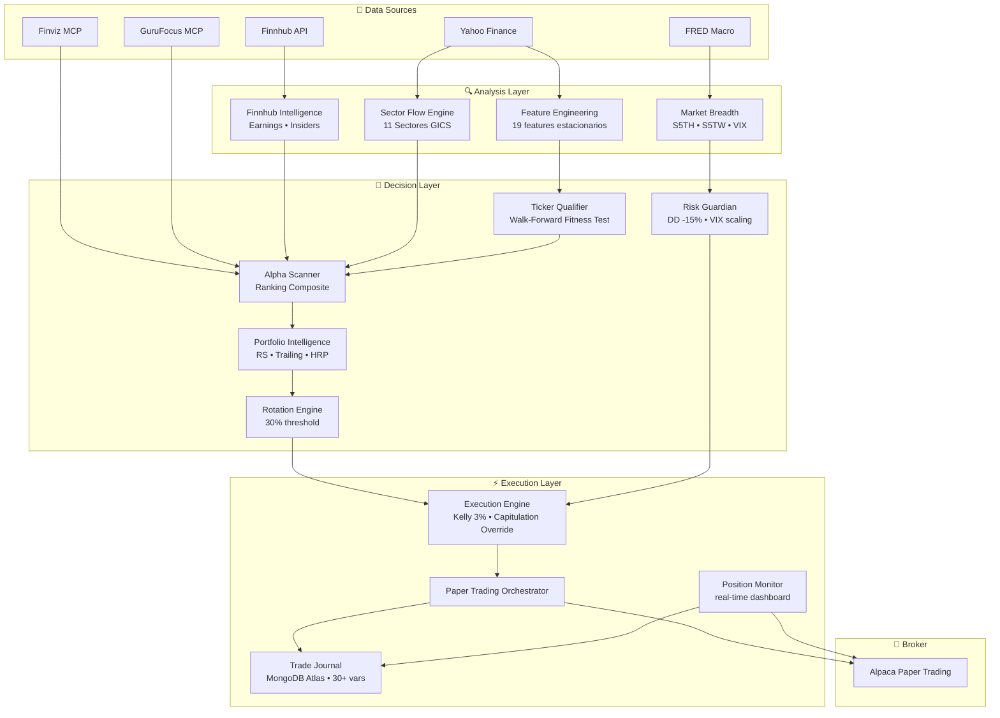
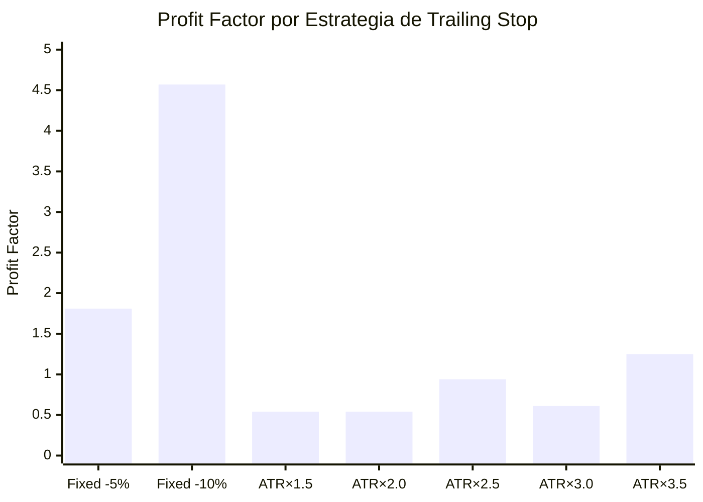
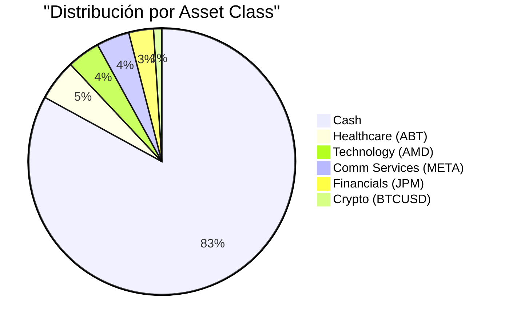
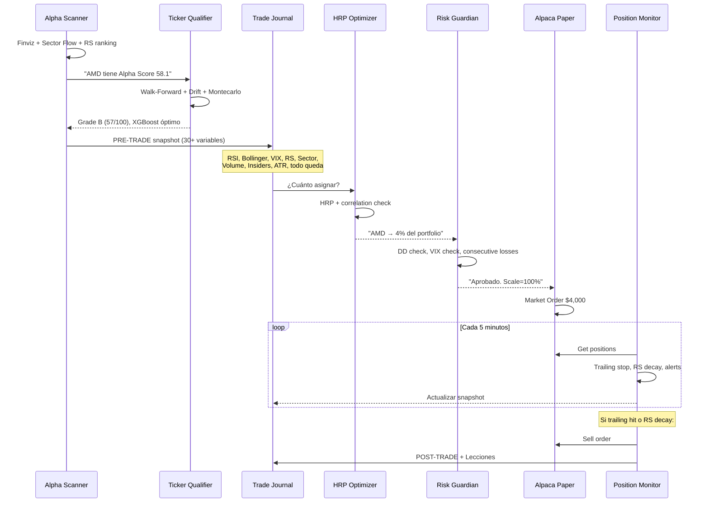

# Sesión: Portfolio Intelligence System + Paper Trading

> **Fecha:** 16-17 Abril 2026  
> **Branch:** `v4-omnidimensional`  
> **Commit clave:** `e93563c` → Portfolio Intelligence + Paper Trading + Trade Journal  
> **Conversación ID:** `5e23716c-aada-423a-afde-709cafc2593a`

---

## 1. Objetivo de la Sesión

Implementar el sistema de gestión de portafolio institucional que faltaba: calificación pre-trade (Ticker Qualifier), gestión de salidas (Adaptive Trailing Stop), rotación por costo de oportunidad (Relative Strength), ponderación (HRP), y arrancar Paper Trading con Alpaca documentando cada trade para aprendizaje continuo.

---

## 2. Arquitectura Resultante



---

## 3. Módulos Creados

| Archivo | Líneas | Función |
|---|---|---|
| [ticker_qualifier.py](file:///root/botero-trade/backend/application/ticker_qualifier.py) | 600 | Fitness test pre-trade: Walk-Forward mini + Drift + Montecarlo |
| [portfolio_intelligence.py](file:///root/botero-trade/backend/application/portfolio_intelligence.py) | 500 | RS Monitor, Adaptive Trailing, HRP Optimizer, Rotation Engine, Risk Guardian |
| [alpha_scanner.py](file:///root/botero-trade/backend/application/alpha_scanner.py) | 350 | Scanner de oportunidades con Alpha Score composite |
| [trade_journal.py](file:///root/botero-trade/backend/application/trade_journal.py) | 310 | Bitácora institucional: MongoDB Atlas, 30+ variables por trade |
| [paper_trading.py](file:///root/botero-trade/backend/application/paper_trading.py) | 600 | Orquestador: Scanner→Execution→Monitor→Guardian |
| [position_monitor.py](file:///root/botero-trade/backend/application/position_monitor.py) | 280 | Dashboard real-time + detección de doble exposición |
| [finnhub_intelligence.py](file:///root/botero-trade/backend/infrastructure/data_providers/finnhub_intelligence.py) | 300 | Earnings calendar, Insider transactions, Analyst consensus |
| [execution_engine.py](file:///root/botero-trade/backend/application/execution_engine.py) | 200 | Calibrado: trigger=0.52, Kelly cap 3%, Capitulation Override |

---

## 4. Resultados Clave del Backtesting

### 4.1 Ticker Qualifier — Fitness Test (16 Abr 2026)

| Ticker | TF | Grade | Score | Modelo | WR | EV Neta | MC Mediana | Status |
|---|---|---|---|---|---|---|---|---|
| **IBIT** | **1h** | **B** | **57** | **XGBoost** | **67.2%** | **+0.538** | **$1,872,834** | ✅ QUALIFIED |
| IBIT | 4h | F | 0 | — | — | — | $0 | ❌ Datos insuficientes |
| IBIT | 1d | F | 0 | — | — | — | $0 | ❌ Datos insuficientes |
| SPY | 1h | C | 51 | XGBoost | 57.9% | +0.412 | $3,623,809 | ❌ Marginal |
| SPY | 1d | C | 42 | LSTM | 37.8% | +0.251 | $252,287 | ❌ Marginal |

> [!IMPORTANT]
> Solo IBIT pasó con Grade B. XGBoost domina en intraday (67.2% vs LSTM 54.1%).
> SPY tiene buenas métricas Montecarlo pero el modelo no supera al baseline.

### 4.2 Trailing Stop Shootout — SPX Daily 2017-2025



| Estrategia | PF | WR | EV/Trade | Capital Final | Max DD |
|---|---|---|---|---|---|
| **Fixed -10%** | **4.57** | **66.7%** | **+7.20%** | **$149,891** | **-12.7%** |
| Fixed -5% | 1.81 | 44.4% | +1.33% | $130,270 | -25.4% |
| ATR × 3.5 | 1.25 | 52.6% | +0.32% | $126,809 | -18.6% |
| ATR × 1.5 | 0.54 | 21.1% | -0.32% | $92,194 | -7.8% |
| ATR × 2.0 | 0.54 | 26.3% | -0.41% | $89,970 | -10.0% |

> [!WARNING]
> **Hallazgo contraintuitivo:** ATR × 1.5-2.5 son PERDEDORES (PF < 1). Stops demasiado tight sacan en correcciones normales. Fixed -10% ganó porque deja respirar al trade. La solución implementada es un **trailing ADAPTATIVO**: `max(ATR_stop, fixed_stop)` ajustado por RS del stock.

### 4.3 Alpha Scanner — Ranking Live (16 Abr 2026)

| # | Ticker | Alpha | RS/SPY | Insider | Ret 20d | Sector |
|---|---|---|---|---|---|---|
| 1 | AMD | 58.1 | 1.271 | ⚠️ caution | +35.6% | Technology |
| 2 | IBIT | 46.6 | 1.006 | neutral | +7.3% | Crypto |
| 3 | ABT | 46.2 | 0.841 | ✅ **CLUSTER BUY** | -10.4% | Healthcare |
| 4 | SCHW | 44.6 | 0.924 | ⚠️ caution | -1.5% | Financials |
| 5 | NVDA | 44.3 | 1.042 | ⚠️ caution | +11.1% | Technology |
| — | **TSLA** | — | — | — | — | **BLOQUEADA (earnings 4d)** |

---

## 5. Paper Trading — Portafolio Desplegado

### 5.1 Estado del Journal (17 Abr 2026)

| Trade ID | Ticker | Entry | Alpha | Insider | Status | Notas |
|---|---|---|---|---|---|---|
| BT-20260410-BTCUSD-LEGACY | BTCUSD | $72,943 | — | N/A | ✅ OPEN | Posición heredada, adoptada |
| BT-20260417004511-ABT | ABT | $95.47 | 46.2 | ✅ strong_buy | ✅ OPEN | Contrarian + Cluster Buying |
| BT-20260417005000-IBIT | IBIT | $42.73 | 46.6 | neutral | ❌ CANCELLED | Doble exposición con BTCUSD |
| BT-20260417005000-AMD | AMD | $278.26 | 58.1 | ⚠️ caution | ✅ OPEN | #1 Alpha, RS 1.27 momentum |
| BT-20260417005001-META | META | $676.87 | 43.4 | ⚠️ caution | ✅ OPEN | Comm Services diversifier |
| BT-20260417005002-JPM | JPM | $309.95 | 41.8 | ⚠️ caution | ✅ OPEN | Financials, sector fuerte |

### 5.2 Distribución del Portafolio



### 5.3 Lección Aprendida: IBIT Cancelado

Se abrió IBIT ($5,000) sin verificar que ya existía BTCUSD ($1,005) — doble exposición a Bitcoin. El position_monitor detectó el conflicto automáticamente:

```
⚠️  DOBLE EXPOSICIÓN [Crypto]: BTCUSD, IBIT — misma asset class
[HIGH] Consolidar exposición crypto
```

**Acción:** IBIT cancelada antes de ejecución. BTCUSD adoptada como posición heredada en el journal. **Regla nueva:** el sistema debe verificar exposición por asset class antes de abrir posiciones nuevas.

---

## 6. Parámetros del Sistema

### 6.1 Execution Engine (Calibrado)

| Parámetro | Valor Anterior | Valor Actual | Razón |
|---|---|---|---|
| Trigger Threshold | 0.90 | **0.52** | Walk-Forward OOS demostró que 0.90 era inalcanzable |
| Confirm Threshold | 0.85 | **0.54** | |
| Abort Threshold | 0.50 | **0.47** | |
| Max Risk (Kelly) | Sin cap | **3%** | Prevenir ruin en rachas perdedoras |
| Capitulation Override | No existía | **Level 3+** | Bypass ML en capitulación extrema |

### 6.2 Portfolio Constraints

| Parámetro | Valor |
|---|---|
| Max posiciones | 8 |
| Min por posición | 5% |
| Max por posición | 25% |
| Max por sector | 40% |
| Cash mínimo | 10% |
| Correlation cap | 0.75 |
| Max portfolio DD | -15% (circuit breaker) |
| Max daily loss | -3% (pausa 48h) |
| Rotation threshold | 30% mejor para justificar |

### 6.3 Adaptive Trailing Stop

```
SI RS_vs_SPY > 1.05 (tendencia fuerte):
    stop = high - 3.0 × ATR  (~7% del high)
SI RS_vs_SPY < 0.95 (debilidad):
    stop = high - 2.0 × ATR  (~5% del high)
SIEMPRE:
    stop = max(atr_stop, high × 0.88)   # Floor -12%
    stop = min(stop, high × 0.95)        # Ceiling -5%
```

### 6.4 Exit Signals

| Señal | Trigger | Urgencia |
|---|---|---|
| Alpha Decay < 0.70 | RS actual / RS al entrar | 🔴 HIGH |
| RS vs SPY < 0.85 por 5d | Underperforming mercado | 🟡 MEDIUM |
| Trailing Stop hit | Precio < stop adaptativo | 🔴 IMMEDIATE |
| Earnings en < 5d | Riesgo binario | 🟡 EXIT |
| Sector collapse (breadth < 30%) | Evaluar salida | 🟡 WATCH |
| Better opportunity (+30%) | Rotación justificada | 🟢 ROTATE |

---

## 7. APIs y Credenciales Activas

| Servicio | Variable de Entorno | Estado | Uso |
|---|---|---|---|
| Alpaca Paper | `ALPACA_API_KEY` | ✅ Activa | Broker paper trading |
| Finnhub | `FINNHUB_API_KEY` | ✅ Activa | Earnings, Insiders, Consensus |
| Finviz | `FINVIZ_API_KEY` | ✅ Activa | Screener, Breadth, Volume |
| FRED | `FRED_API_KEY` | ✅ Activa | Yield curve, tasas |
| GuruFocus | `GURUFOCUS_API_TOKEN` | ✅ Activa | Fundamental (13F, DCF) |

---

## 8. Flujo de un Trade Completo



---

## 9. Estructura de Archivos Relevante

```
backend/application/
├── alpha_scanner.py          # Scanner de oportunidades
├── execution_engine.py       # Motor calibrado (0.52 trigger, Kelly 3%)
├── feature_engineering.py    # 19 features estacionarios
├── lstm_model.py             # LSTM institucional
├── paper_trading.py          # Orquestador Paper Trading
├── portfolio_intelligence.py # RS, Trailing, HRP, Rotation, Risk
├── position_monitor.py       # Dashboard real-time
├── sequence_modeling.py      # Triple Barrera + MetaLabeling
├── ticker_qualifier.py       # Fitness test pre-trade
├── trade_journal.py          # Journal MongoDB Atlas
└── universe_filter.py        # Macro regime + Sector + Fundamental

backend/infrastructure/data_providers/
├── finnhub_intelligence.py   # Earnings, Insiders, Consensus
├── market_breadth.py         # CNN F&G, S5TH, S5TW, SKEW
├── sector_flow.py            # 11 sectores GICS, tide/wave
├── cross_sectional.py        # Datos transversales
└── options_awareness.py      # Max Pain, P/C OI, GEX

data/journal/
└── logs/monitor.log          # Log del position monitor

# MongoDB Atlas (botero_trade)
# ├── trades                  # Todos los trades (documento nativo)
# ├── trade_snapshots          # Snapshots de entrada/salida
# ├── patterns                 # Pattern tags para aprendizaje
# ├── shadow_signals           # Señales Spring scanner
# └── shadow_positions         # Posiciones shadow mode
```

---

## 10. Decisiones Críticas y Razonamiento

### ¿Por qué XGBoost domina en intraday?
LSTM necesita secuencias largas para captar patrones temporales. En 1h, las secuencias son ruidosas. XGBoost (tabular) captura relaciones feature→label directamente sin depender de la estructura temporal. **Regla:** XGBoost para ≤4h, LSTM para ≥1d.

### ¿Por qué ABT fue la mejor oportunidad contrarian?
De 10 tickers analizados, ABT fue la ÚNICA con insiders en CLUSTER BUYING (29 compras, $1.5B en 90d). Todas las demás tenían heavy selling. Los insiders tienen información asimétrica — cuando compran en masa, es señal de convicción. RS bajo (0.84) es feature, no bug: comprar cuando nadie quiere comprar.

### ¿Por qué el trailing ATR × 1.5-2.5 pierde dinero?
Backtested en SPX 2017-2025: stops tight sacan al trader en correcciones normales del 3-5% que son parte del ruido de mercado. El Fixed -10% ganó porque toleró esas correcciones. La solución ADAPTATIVA ajusta el trailing según el régimen (tight en debilidad, wide en tendencia).

### ¿Por qué 21% desplegado y 79% cash?
Fase de validación. No apostamos $100K al inicio. Probing positions de $3-5K por ticker para validar:
1. Que los fills de Alpaca coinciden con nuestros precios
2. Que el slippage real ≈ estimado
3. Que el trailing stop funciona en producción
4. Que el journal captura todo correctamente

---

## 11. Próximos Pasos para Futuros Agentes

- [ ] Evaluar fills reales vs precios de entrada del journal (medir slippage)
- [ ] Implementar ejecución automática de trailing stops (ahora solo se monitorean)
- [ ] Generar Learning Report después de 10+ trades cerrados
- [ ] Conectar `trade_autopsy.py` con journal para análisis post-mortem automatizado
- [ ] Implementar `shadow_spring.py` como estrategia mean-reversion complementaria
- [ ] Expandir Ticker Qualifier a más tickers (solo 5 probados hasta ahora)
- [ ] Considerar merge de `v4-omnidimensional` a `main` después de validación
- [ ] Pendiente push de los últimos 3 commits (post `e93563c`)

> [!NOTE]
> **Para retomar contexto rápidamente:**
> 1. Leer este documento
> 2. Correr `python backend/application/position_monitor.py` para ver estado actual
> 3. Consultar MongoDB Atlas (`botero_trade.trades`) para historial de trades
> 4. Git log en branch `v4-omnidimensional` para ver evolución de commits
