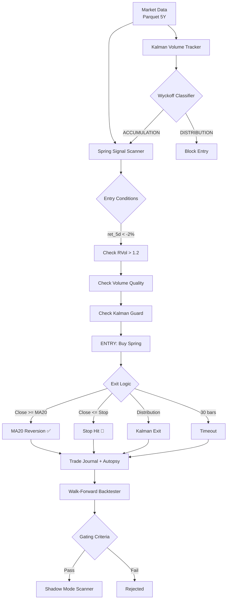
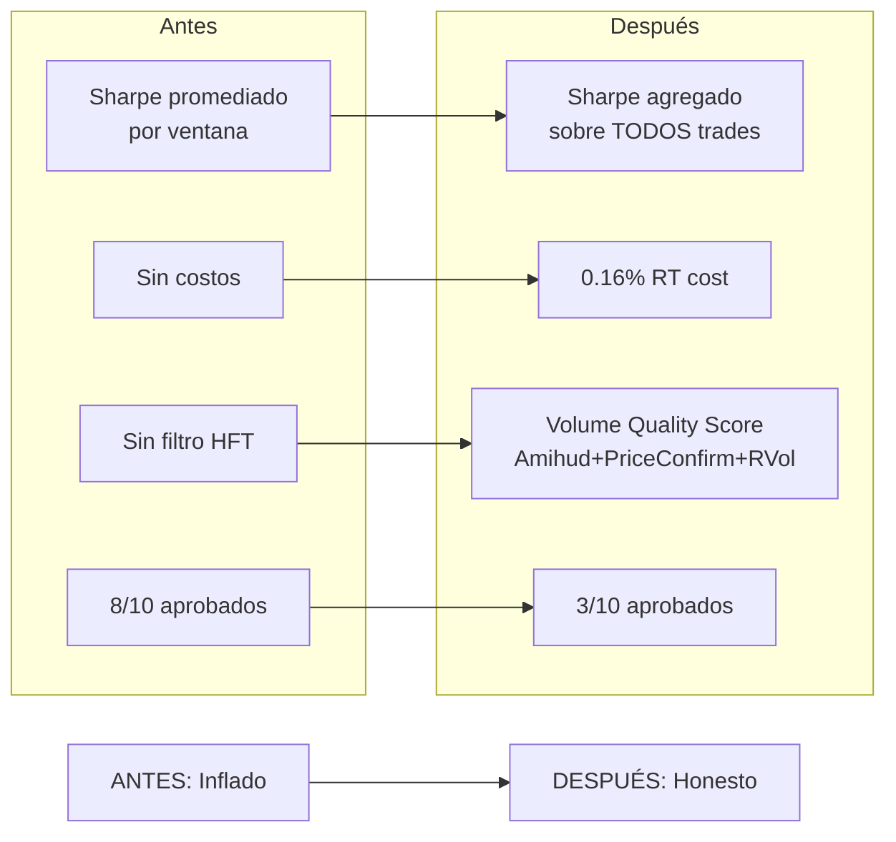
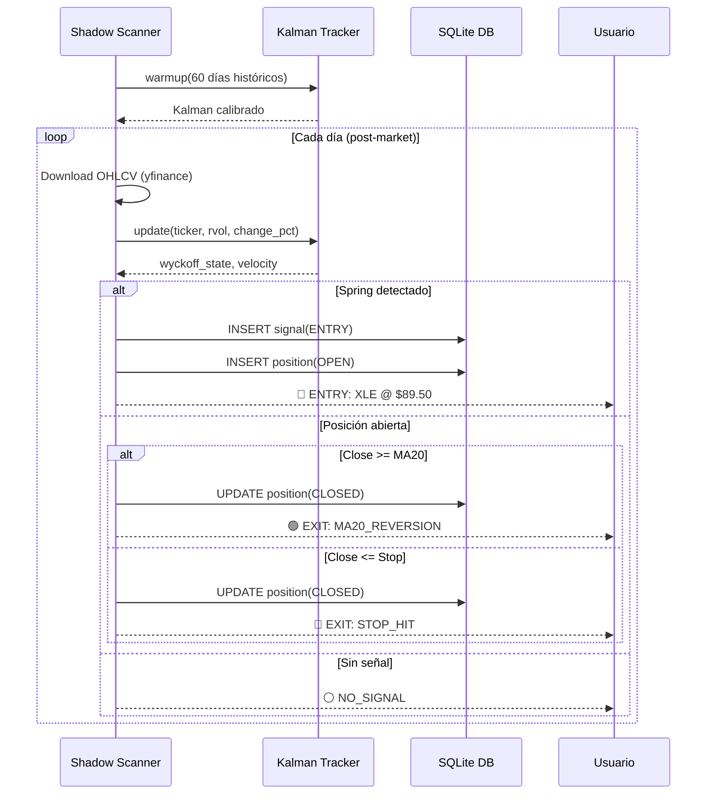
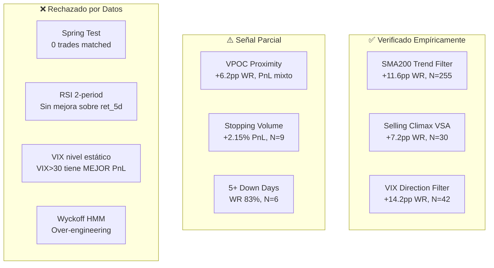
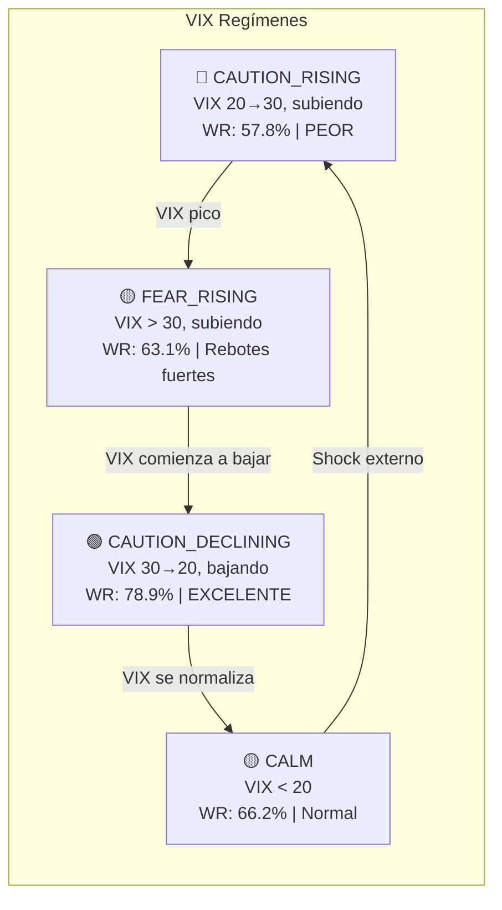
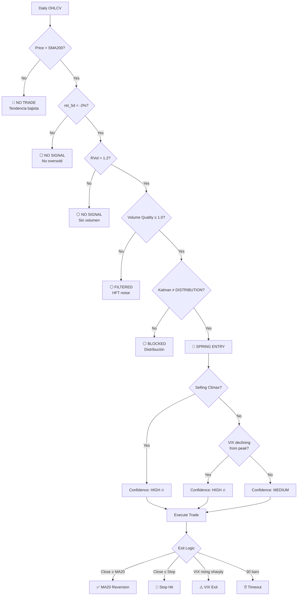

# Session: Auditoría Spring Strategy + Verificación Empírica

**Fecha:** 2026-04-17 / 2026-04-18  
**Branch:** `v4-omnidimensional`  
**Conversación ID:** `ab3f931a-684c-43dd-bfc4-999e4eee7080`

---

## Objetivo

Auditoría forense del motor de trading institucional para identificar debilidades,
corregir métricas infladas, y verificar empíricamente qué conceptos de análisis
técnico tienen efecto REAL medido con datos.

---

## Arquitectura del Motor (Estado Actual)



---

## Fase 1: Corrección de Métricas Infladas

### Problema Detectado
Las métricas del backtester estaban severamente infladas:
- **Sharpe 47+, PF 11000+** — causado por promediar ventanas con N=1-3 trades
- Sin costos de transacción
- Sin filtro de volumen HFT

### Correcciones Implementadas



### Archivos Modificados

| Archivo | Cambio |
|---|---|
| `backend/application/backtester.py` | Aggregate metrics, costs, VQ score, `_all_trades`, native bool casting |
| `backend/infrastructure/data_providers/volume_dynamics.py` | `change_pct` param en Kalman `update()` |
| `tests/test_backtester.py` | Tests actualizados para aggregate metrics |

### Resultados Post-Corrección (Métricas Honestas)

| Ticker | Trades | WR | Sharpe | PF | Return | Status |
|---|:-:|:-:|:-:|:-:|:-:|:-:|
| **XLE** | 15 | 73% | **1.59** | 1.66 | +14.3% | ✅ |
| **USO** | 19 | 63% | **1.08** | 1.48 | +18.5% | ✅ |
| **EFA** | 18 | 67% | **0.83** | 1.36 | +9.4% | ✅ |
| SPY | 14 | 64% | 0.95 | 1.39 | +6.1% | ❌ (<15 trades) |
| GLD | 7 | 57% | 1.29 | 1.57 | +4.2% | ❌ (<15 trades) |
| XLV | 11 | 64% | 1.04 | 1.43 | +5.3% | ❌ (<15 trades) |
| XLK | 14 | 50% | -0.08 | 0.97 | -0.8% | ❌ |
| XLF | 14 | 57% | -0.09 | 0.97 | -0.7% | ❌ |
| EEM | 9 | 56% | 0.30 | 1.12 | +1.9% | ❌ |
| EWY | 21 | 57% | -0.51 | 0.84 | -5.7% | ❌ |

### Gating Criteria

```python
GATING_CRITERIA = {
    'min_sharpe': 0.8,
    'max_drawdown': -20.0,
    'min_win_rate': 45.0,
    'min_profit_factor': 1.3,
    'min_trades_total': 15,  # Nuevo: mínimo estadístico
}
```

---

## Fase 2: Shadow Mode

### Nuevo Módulo: `backend/application/shadow_spring.py`

Scanner en tiempo real para los 3 tickers aprobados (XLE, USO, EFA).
Genera señales ENTRY/EXIT/HOLD sin ejecutar trades reales.



### Uso

```bash
python scripts/shadow_scan.py --warmup    # Primera vez
python scripts/shadow_scan.py             # Scan diario
python scripts/shadow_scan.py --summary   # Performance
```

---

## Fase 3: Investigación — ¿Qué Nos Falta?

Se identificaron 7 posibles mejoras y se verificó cada una contra:
1. Evidencia académica (papers peer-reviewed)
2. Evidencia empírica (simulaciones sobre nuestros datos)

### Conceptos Evaluados



---

## Fase 4: Simulaciones Empíricas (476 trades, 10 ETFs)

### Script: `scripts/hypothesis_tester.py`

Genera trades con la estrategia Spring actual y etiqueta cada trade con
factores adicionales para medir su impacto.

### Resultados Clave

#### SMA200 Trend Filter ✅

| Grupo | N | WR | Avg PnL |
|---|:-:|:-:|:-:|
| Price > SMA200 | 255 | **68.6%** | +0.585% |
| Price < SMA200 | 221 | 57.0% | +0.544% |
| **Δ** | | **+11.6pp** | +0.041% |

#### Selling Climax (VSA) ✅

Definición: `RVol > 2.0 AND close_position < 0.3 AND spread > 1.5× avg`

| Grupo | N | WR | Avg PnL |
|---|:-:|:-:|:-:|
| Selling Climax | 30 | **70.0%** | +0.789% |
| Normal | 446 | 62.8% | +0.551% |
| **Δ** | | **+7.2pp** | +0.238% |

#### VIX Direction — El Hallazgo Más Importante 🔥

No es el NIVEL del VIX, sino la DIRECCIÓN lo que predice el éxito del Spring.



| Filtro | N | WR | Avg PnL |
|---|:-:|:-:|:-:|
| Baseline | 476 | 63.2% | +0.57% |
| SMA200 only | 255 | 68.6% | +0.59% |
| **VIX declining from peak > 25** | **42** | **76.2%** | **+1.87%** |
| **VIX cruzando ABAJO de 30** | **17** | **88.2%** | **+2.93%** |
| **SMA200 + VIX declining** | **21** | **90.5%** | **+2.40%** |

**Interpretación:** Cuando el Fear & Greed marca miedo extremo y COMIENZA a bajar,
los institucionales ya empezaron a comprar. El Spring en ese momento tiene la
máxima probabilidad de éxito.

#### Volume Profile (VPOC) — Parcial ⚠️

| Grupo | N | WR | Avg PnL |
|---|:-:|:-:|:-:|
| Cerca VPOC (<2%) | 139 | **67.6%** | +0.527% |
| Lejos VPOC (>2%) | 337 | 61.4% | +0.582% |

WR mejora pero PnL no. Útil como confirmación, no como filtro principal.

---

## Decisiones de Diseño Importantes

### ¿Por qué Mean-Reversion y no Momentum?
Los ETFs tienen mecanismos de creación/redención que generan reversión a la media.
Momentum funciona en acciones individuales (3-12 meses), MR funciona en ETFs (1-5 días).

### ¿Por qué MA20 como target de salida?
La MA20 es el "fair value" natural de corto plazo. Un ETF oversold revierte
hacia su media, no hacia un múltiplo de ATR.

### ¿Por qué no usar stops fijos?
Connors documenta que stops fijos PERJUDICAN la estrategia de mean-reversion.
Usamos ATR × 2 como protección de emergencia, no como gestión activa.

### ¿Por qué "Volume Quality Score"?
50-70% del volumen diario es HFT (ida/vuelta sin convicción). El VQ Score
combina Amihud Illiquidity (¿el volumen mueve el precio?) + Price Confirmation
+ RVol para filtrar volumen ficticio.

---

## Próximos Pasos (Pendientes)

### Implementar (aprobados por datos):

1. **SMA200 Trend Filter** en `backtester.py` y `shadow_spring.py`
   - Solo entrar si `close > SMA200`
   - Impacto: +11.6pp WR

2. **Selling Climax boost** en señales de entrada
   - `RVol > 2.0 AND close_pos < 0.3 AND spread > 1.5× avg`
   - Impacto: +7.2pp WR

3. **VIX Direction Filter** en `shadow_spring.py`
   - Detectar VIX declining from peak (10-day lookback)
   - Boost de confianza cuando VIX cruza abajo de 30
   - Impacto: +14.2pp WR (hasta 90.5% con SMA200)

### Monitorear (muestra baja):

4. **VPOC proximity** como confirmación
5. **Stopping Volume** (N=9, +2.15% PnL)
6. **5+ consecutive down days** + SMA200 (N=6, WR 83%)

### Rechazados:

7. Spring Test — impracticable (0 matches)
8. RSI(2) — sin mejora medible
9. VIX como filtro negativo — datos lo contradicen
10. Wyckoff HMM — over-engineering sin base

---

## Flujo Propuesto Post-Implementación



---

## Archivos Relevantes del Proyecto

| Archivo | Propósito |
|---|---|
| `backend/application/backtester.py` | Walk-Forward Backtester con Spring strategy |
| `backend/application/shadow_spring.py` | Shadow Mode scanner en tiempo real |
| `backend/infrastructure/data_providers/volume_dynamics.py` | Kalman + Wyckoff classifier |
| `backend/application/trade_autopsy.py` | Análisis post-trade (entry efficiency, edge ratio) |
| `scripts/shadow_scan.py` | Runner diario del Shadow scanner |
| `scripts/hypothesis_tester.py` | Simulador empírico para verificar hipótesis |
| `data/historical/market_context_5y.parquet` | Datos OHLCV 5 años, 26 tickers |
| `data/historical/vix_5y.parquet` | VIX 5 años |
| `data/shadow_mode.db` | SQLite con señales y posiciones shadow |

---

## Lecciones Aprendidas

1. **No promediar métricas de ventanas con N pequeño** — usar aggregate trades
2. **No descartar sin probar** — la academia puede estar equivocada (VSA Selling Climax funciona)
3. **No implementar sin probar** — el folklore trader puede estar equivocado (Spring Test no funciona)
4. **La dirección del VIX importa más que el nivel** — VIX bajando desde pico = mejor momento
5. **Los costos importan** — 0.16% round-trip elimina muchos "edges" ilusorios
6. **El volumen PUEDE mentir** — 50-70% es HFT. Solo Amihud y RVol tienen base sólida
7. **SMA200 es el filtro más potente** — separa dips comprables de falling knives

---

## Tests

```bash
# Ejecutar toda la suite
python -m pytest tests/ -q
# Resultado: 189 passed

# Ejecutar backtest honesto
python -c "from backend.application.backtester import WalkForwardBacktester; ..."

# Ejecutar simulador empírico
python scripts/hypothesis_tester.py

# Ejecutar shadow scanner
python scripts/shadow_scan.py --warmup
```
