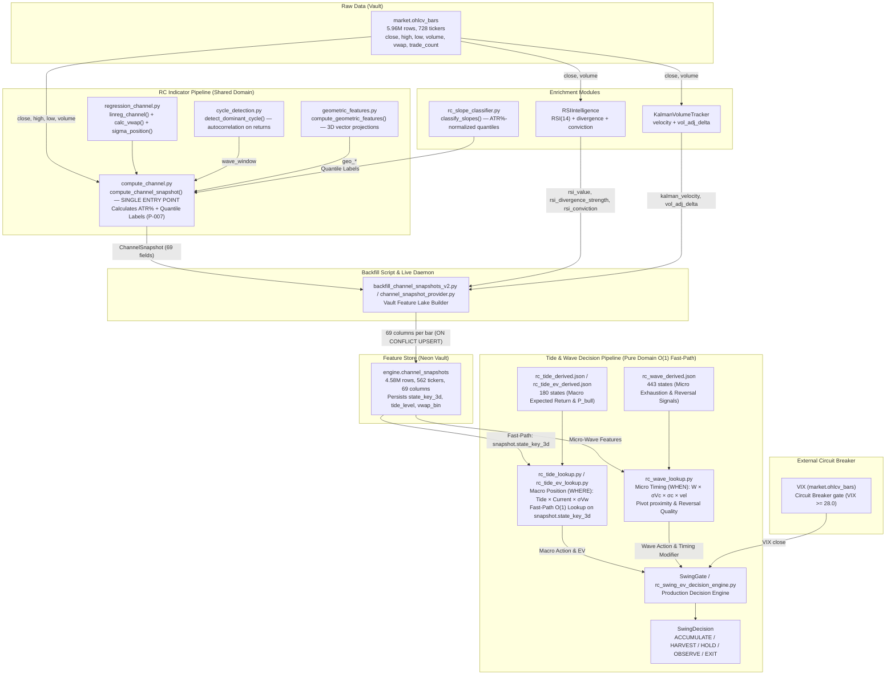

# Tide System — I/O Specification & Data Utilization Audit

> **Purpose:** Documents the exact INPUTS, PROCESSING, and OUTPUTS of every Tide system
> component, plus an audit of how much available data is actually consumed vs available.
>
> **Cross-reference:** [README.md](./README.md) for architecture, [PROPOSALS.md](./PROPOSALS.md) for open work.
>
> **Live Stats (2026-07-28):**
> - `engine.channel_snapshots`: **4,577,585 rows**, 562 tickers, 69 columns (Vault ML Feature Store)
> - `engine.ticker_fact_states`: **50,939 rows**, 366 tickers, 17 columns
> - `engine.ticker_fact_baselines`: **385 rows**, 367 tickers, 8 columns
> - `market.ohlcv_bars`: **5,964,795 rows**, 728 tickers, 10 columns
> - `market.regime_states`: Stateful-First transition history, 10 columns

---

## Table of Contents

0. [Upstream Pipeline — RC Indicator & Raw Data Sources](#0-upstream-pipeline--rc-indicator--raw-data-sources)
1. [Component I/O Diagrams](#1-component-io-diagrams)
2. [Data Source Inventory](#2-data-source-inventory)
3. [Column-Level Utilization Audit](#3-column-level-utilization-audit)
4. [Coverage Gaps & Opportunities](#4-coverage-gaps--opportunities)

---

## 0. Upstream Pipeline — RC Indicator & Raw Data Sources

> [!IMPORTANT]
> The Tide system does NOT read raw price data directly. It reads **pre-computed features**
> from `engine.channel_snapshots`, which are produced by the **Regression Channel (RC)**
> indicator pipeline. Under the **P-007 / D-014 Standard**, `engine.channel_snapshots` acts as
> an autonomous **Vault ML Feature Store** storing 69 columns, including 7 pre-classified
> labels (`atr_pct`, `tide_level`, `current_level`, `wave_level`, `vwap_bin`, `state_key_3d`, `quantile_version`).

### 0.1. End-to-End Data Flow



### 0.2. RC Indicator — The Foundation

The **Regression Channel (RC)** is the core technical indicator that decomposes price into three timescales. It is a pure statistical computation with no machine learning.

```
╔══════════════════════════════════════════════════════════════════════════╗
║  regression_channel.py — PURE STATISTICAL FUNCTIONS                    ║
╠══════════════════════════════════════════════════════════════════════════╣
║                                                                        ║
║  linreg_channel(close, window) → (reg_value, slope_norm, residual_std) ║
║  ┌──────────────────────────────────────────────────────────────────┐  ║
║  │  INPUT:  close prices (np.ndarray), window size (int)           │  ║
║  │                                                                  │  ║
║  │  MATH:   y = slope × x + intercept  (OLS linear regression)     │  ║
║  │          slope_norm = (slope / y_mean) × 100  (% per bar)       │  ║
║  │          residual_std = std(y - ŷ)  (channel width σ)           │  ║
║  │                                                                  │  ║
║  │  OUTPUT:                                                         │  ║
║  │    reg_value: regression line value at last bar (price level)    │  ║
║  │    slope_norm: direction + magnitude (% of mean price per bar)  │  ║
║  │    residual_std: channel width (σ band, 68% of prices within)   │  ║
║  └──────────────────────────────────────────────────────────────────┘  ║
║                                                                        ║
║  calc_vwap(close, high, low, volume, window) → vwap_value             ║
║  ┌──────────────────────────────────────────────────────────────────┐  ║
║  │  INPUT:  close, high, low, volume arrays + window               │  ║
║  │  MATH:   typical_price = (close + high + low) / 3               │  ║
║  │          VWAP = Σ(typical × volume) / Σ(volume)                 │  ║
║  │  OUTPUT: Volume-weighted average price (institutional fair price)│  ║
║  └──────────────────────────────────────────────────────────────────┘  ║
║                                                                        ║
║  sigma_position(price, reg_value, residual_std) → float               ║
║  ┌──────────────────────────────────────────────────────────────────┐  ║
║  │  MATH:   σ = (price - reg_value) / residual_std                 │  ║
║  │  OUTPUT: Position in channel units (-2σ = deep discount,        │  ║
║  │          +2σ = expensive, 0 = on the regression line)           │  ║
║  └──────────────────────────────────────────────────────────────────┘  ║
╚══════════════════════════════════════════════════════════════════════════╝
```

### 0.3. `compute_channel_snapshot()` — Single Entry Point

This function calls `linreg_channel()` **6 times** (3 windows × current + previous bar), `calc_vwap()` **3 times**, `detect_dominant_cycle()` **1 time**, and `compute_geometric_features()` **1 time**, producing a `ChannelSnapshot` entity with **62 fields** in one pass.

```
╔══════════════════════════════════════════════════════════════════════════╗
║  compute_channel_snapshot() — PIEZA 1 CORE COMPUTATION                 ║
╠══════════════════════════════════════════════════════════════════════════╣
║                                                                        ║
║  INPUTS (raw market data arrays):                                      ║
║  ┌──────────────────────────────────────────────────────────────────┐  ║
║  │  close: np.ndarray   — closing prices (full history up to bar)  │  ║
║  │  high: np.ndarray    — high prices                              │  ║
║  │  low: np.ndarray     — low prices                               │  ║
║  │  volume: np.ndarray  — volume                                   │  ║
║  │  idx: int            — bar index to compute at                  │  ║
║  │  tide_window: 240    — long regression window (~1 year)         │  ║
║  │  current_window: 60  — medium regression window (~quarter)      │  ║
║  │  wave_window: auto   — cycle-adaptive (8-50 bars)               │  ║
║  └──────────────────────────────────────────────────────────────────┘  ║
║                                                                        ║
║  PROCESSING (10 operations, zero duplication):                         ║
║  ┌──────────────────────────────────────────────────────────────────┐  ║
║  │  ① linreg_channel(close, 240) → tide_val, tide_slope, tide_std │  ║
║  │  ② linreg_channel(close, 60)  → curr_val, curr_slope, curr_std │  ║
║  │  ③ linreg_channel(close, W)   → wave_val, wave_slope, wave_std │  ║
║  │  ④ linreg_channel(close[:-1], 240) → prev tide slope → accel   │  ║
║  │  ⑤ linreg_channel(close[:-1], 60)  → prev curr slope → accel   │  ║
║  │  ⑥ linreg_channel(close[:-1], W)   → prev wave slope → accel   │  ║
║  │  ⑦ VWAP + std (3 windows) → vwap_sigma_tide/current/wave       │  ║
║  │  ⑧ Derived: conjugations, spreads, tensions, compression       │  ║
║  │  ⑨ Fear/Greed classification from slopes + accel                │  ║
║  │  ⑩ Geometric features (3D vector projections)                   │  ║
║  └──────────────────────────────────────────────────────────────────┘  ║
║                                                                        ║
║  OUTPUT: ChannelSnapshot (62 fields)                                   ║
║  ┌──────────────────────────────────────────────────────────────────┐  ║
║  │  Validated Forensic Grades (v13, 17 tickers, 6,775 samples):    │  ║
║  │    ★★ STRONG:  sigma_tide, vwap_sigma_wave, tide_accel          │  ║
║  │    ★  MODERATE: spread_tide_current, vwap_sigma_current,        │  ║
║  │                 conj_wave_tide, conj_current_tide               │  ║
║  │    ○  UNRATED: fear_*, vol_*, geo_*, w_duration, compression    │  ║
║  └──────────────────────────────────────────────────────────────────┘  ║
╚══════════════════════════════════════════════════════════════════════════╝
```

### 0.4. Backfill Pipeline — From Snapshot to Feature Lake

The backfill script extends `compute_channel_snapshot()` with three additional enrichment modules:

```
╔══════════════════════════════════════════════════════════════════════════╗
║  backfill_channel_snapshots_v2.py — VECTORIZED FEATURE LAKE BUILDER    ║
╠══════════════════════════════════════════════════════════════════════════╣
║                                                                        ║
║  INPUT: market.ohlcv_bars (all bars for one ticker)                    ║
║  ┌──────────────────────────────────────────────────────────────────┐  ║
║  │  Columns used from OHLCV:                                       │  ║
║  │    ✅ close   — prices for all computations                      │  ║
║  │    ✅ high    — VWAP typical price, channel width                │  ║
║  │    ✅ low     — VWAP typical price, channel width                │  ║
║  │    ✅ volume  — VWAP weighting, vol ratios, Kalman input         │  ║
║  │    ❌ open    — NOT USED anywhere in RC pipeline                 │  ║
║  │    ❌ vwap    — NOT USED (RC computes its own rolling VWAP)      │  ║
║  │    ❌ trade_count — NOT USED                                     │  ║
║  └──────────────────────────────────────────────────────────────────┘  ║
║                                                                        ║
║  PROCESSING (7 stages per ticker):                                     ║
║  ┌──────────────────────────────────────────────────────────────────┐  ║
║  │  Stage 1: detect_dominant_cycle(close) → wave_window            │  ║
║  │  Stage 2: _rolling_linreg(close, W) × 3 windows (vectorized)   │  ║
║  │           → slopes, reg_values, residual_stds for ALL bars      │  ║
║  │  Stage 3: _rolling_vwap(close,high,low,vol, W) × 3 (vectorized)│  ║
║  │           → vwap_values, vwap_stds for ALL bars                 │  ║
║  │  Stage 4: vol_surge = volume / SMA(volume, 20)                  │  ║
║  │           vol_ratio = up_vol / down_vol (5-bar rolling)         │  ║
║  │  Stage 5: RSIIntelligence.analyze() — per bar (sequential)      │  ║
║  │           → rsi_value, rsi_divergence_strength, rsi_conviction  │  ║
║  │  Stage 6: KalmanVolumeTracker.update() — per bar (sequential)   │  ║
║  │           → kalman_velocity, vol_adj_delta                      │  ║
║  │  Stage 7: Assemble 72-column row per bar, batch INSERT          │  ║
║  │           + classify_slopes() → slope_tripleta (6-level)        │  ║
║  │           + wave flip detection, fear/regime, tensions, etc.     │  ║
║  └──────────────────────────────────────────────────────────────────┘  ║
║                                                                        ║
║  OUTPUT: engine.channel_snapshots                                      ║
║  ┌──────────────────────────────────────────────────────────────────┐  ║
║  │  72 columns per bar, 562 tickers, 4.58M rows total              │  ║
║  │  UPSERT with ON CONFLICT (ticker, timeframe, timestamp)         │  ║
║  │  Fresh Neon connection per batch (SSL-safe)                      │  ║
║  └──────────────────────────────────────────────────────────────────┘  ║
╚══════════════════════════════════════════════════════════════════════════╝
```

### 0.5. Slope Classifier — 6-Level Vol-Normalized Classification

```
╔══════════════════════════════════════════════════════════════════════════╗
║  rc_slope_classifier.py — PURE DOMAIN RULE                             ║
╠══════════════════════════════════════════════════════════════════════════╣
║                                                                        ║
║  INPUT:                                                                ║
║  ┌──────────────────────────────────────────────────────────────────┐  ║
║  │  tide_slope: float    — raw 240-bar normalized slope            │  ║
║  │  current_slope: float — raw 60-bar normalized slope             │  ║
║  │  wave_slope: float    — raw cycle-adaptive normalized slope     │  ║
║  │  atr_pct: float       — 14-day ATR as % of price (e.g. 0.015)  │  ║
║  └──────────────────────────────────────────────────────────────────┘  ║
║                                                                        ║
║  PROCESSING:                                                           ║
║  ┌──────────────────────────────────────────────────────────────────┐  ║
║  │  1. slope_norm = slope / max(atr_pct, 0.005) — vol normalize   │  ║
║  │  2. Compare slope_norm against empirical quantile thresholds    │  ║
║  │     from rc_vol_normalized_thresholds.json (4.57M samples)      │  ║
║  │     Thresholds: p2.5, p10, p25, p75, p90, p97.5               │  ║
║  │  3. Classify into 7 bins per channel:                           │  ║
║  │     +++  (p97.5+)  — extreme bullish                            │  ║
║  │     ++   (p90-p97) — strong bullish                             │  ║
║  │     +    (p75-p90) — moderate bullish                           │  ║
║  │     ~    (p25-p75) — neutral (interquartile)                    │  ║
║  │     -    (p10-p25) — moderate bearish                           │  ║
║  │     --   (p2.5-p10) — strong bearish                            │  ║
║  │     ---  (below p2.5) — extreme bearish                         │  ║
║  └──────────────────────────────────────────────────────────────────┘  ║
║                                                                        ║
║  DATA DEPENDENCY:                                                      ║
║  ┌──────────────────────────────────────────────────────────────────┐  ║
║  │  rc_vol_normalized_thresholds.json (4.4 KB)                     │  ║
║  │    Pre-computed quantile thresholds from 4.57M census samples   │  ║
║  │    per channel (tide_slope_norm, current_slope_norm,            │  ║
║  │    wave_slope_norm)                                             │  ║
║  └──────────────────────────────────────────────────────────────────┘  ║
║                                                                        ║
║  OUTPUT:                                                               ║
║  ┌──────────────────────────────────────────────────────────────────┐  ║
║  │  SlopeState dataclass:                                          │  ║
║  │    tide_level: str    — e.g. "T+++"                             │  ║
║  │    current_level: str — e.g. "C---"                             │  ║
║  │    wave_level: str    — e.g. "W+"                               │  ║
║  │    tripleta: str      — e.g. "T+++/C---/W+"                    │  ║
║  │    + derived: tide_sign, current_sign, wave_sign,               │  ║
║  │      all_positive, all_negative, wave_diverges_tide             │  ║
║  └──────────────────────────────────────────────────────────────────┘  ║
║                                                                        ║
║  CONSUMERS:                                                            ║
║    • backfill_v2 → slope_tripleta column in channel_snapshots         ║
║    • rc_tide_lookup.py → classify float slopes into 6-level labels    ║
║    • rc_tide_ev_lookup.py → same                                      ║
║    • swing_entry_rules.py → wave_diverges_tide for entry timing       ║
╚══════════════════════════════════════════════════════════════════════════╝
```

### 0.6. VIX Circuit Breaker — External Data Input

```
╔══════════════════════════════════════════════════════════════════════════╗
║  VIX as Circuit Breaker Gate (NOT a state dimension)                   ║
╠══════════════════════════════════════════════════════════════════════════╣
║                                                                        ║
║  DATA SOURCE:                                                          ║
║  ┌──────────────────────────────────────────────────────────────────┐  ║
║  │  market.ohlcv_bars WHERE ticker = 'VIX'                         │  ║
║  │    Column used: close (daily VIX close)                         │  ║
║  │    17,504 rows (1990 → 2026)                                    │  ║
║  └──────────────────────────────────────────────────────────────────┘  ║
║                                                                        ║
║  CONSUMPTION:                                                          ║
║  ┌──────────────────────────────────────────────────────────────────┐  ║
║  │  rc_swing_ev_decision_engine.decide(vix=float)                  │  ║
║  │    Rule: IF vix >= 28.0 AND t_slope < -0.05 → EXIT_CRISIS      │  ║
║  │    Overrides ALL other signals (highest priority)               │  ║
║  │                                                                  │  ║
║  │  ⚠️ NOT a state dimension — validated in A/B experiment         │  ║
║  │    as a gate-only input (Decision D-001, D-002)                 │  ║
║  └──────────────────────────────────────────────────────────────────┘  ║
╚══════════════════════════════════════════════════════════════════════════╝
```

### 0.7. Markov Transition Matrix — Computed On-Demand

```
╔══════════════════════════════════════════════════════════════════════════╗
║  Markov Transition Matrix — NOT Persisted, Computed Per-Run            ║
╠══════════════════════════════════════════════════════════════════════════╣
║                                                                        ║
║  DATA SOURCE:                                                          ║
║  ┌──────────────────────────────────────────────────────────────────┐  ║
║  │  engine.channel_snapshots (in-sample subset, ≤ 2019-12-31)      │  ║
║  │    Columns used: tide_slope, current_slope, vwap_sigma_wave     │  ║
║  │    Process: classify each bar → state_key, count S_t → S_{t+1}  │  ║
║  │    Filter: only transitions with ≥ 5 observations              │  ║
║  └──────────────────────────────────────────────────────────────────┘  ║
║                                                                        ║
║  OUTPUT: Dict[str, Dict[str, float]]                                   ║
║  ┌──────────────────────────────────────────────────────────────────┐  ║
║  │  "T+|C+|~" → {"T+|C+|~": 0.72, "T+|C+|>": 0.15, ...}         │  ║
║  │  Built fresh per benchmark/evaluation run                       │  ║
║  │  Calibrated to 90.8% hit rate at P ≥ 90% bucket (OOS)          │  ║
║  └──────────────────────────────────────────────────────────────────┘  ║
║                                                                        ║
║  CONSUMPTION:                                                          ║
║  ┌──────────────────────────────────────────────────────────────────┐  ║
║  │  rc_swing_ev_decision_engine.decide(transition_matrix=dict)     │  ║
║  │    → project_next_state(state_key, TM) → TransitionProjection   │  ║
║  │    Used for PREVENTIVE HARVEST (anticipate regime reversal)     │  ║
║  └──────────────────────────────────────────────────────────────────┘  ║
╚══════════════════════════════════════════════════════════════════════════╝
```

### 0.8. JSON Fact Stores — Research/Legacy Data Sources

```
╔══════════════════════════════════════════════════════════════════════════╗
║  JSON Fact Stores — Pre-Computed Lookup Tables (NOT Vault-First)       ║
╠══════════════════════════════════════════════════════════════════════════╣
║                                                                        ║
║  Located in: backend/modules/quality_swing/domain/rules/               ║
║                                                                        ║
║  ┌──────────────────────────────────────────────────────────────────┐  ║
║  │  TIDE TABLES:                                                   │  ║
║  │    rc_tide_derived.json           (475 KB, 180 states)          │  ║
║  │    rc_tide_probability_table.json (160 KB)                      │  ║
║  │    rc_tide_ev_derived.json        (276 KB, 4-level EV cascade)  │  ║
║  │    rc_tide_ev_probability_table.json (153 KB)                   │  ║
║  │    → Consumed by: rc_tide_lookup.py, rc_tide_ev_lookup.py       │  ║
║  │                                                                  │  ║
║  │  WAVE TABLES:                                                   │  ║
║  │    rc_wave_derived.json           (1.46 MB, W×σVc×σc states)    │  ║
║  │    rc_wave_probability_table.json (1.51 MB)                     │  ║
║  │    rc_wave_ev_derived.json        (2.70 MB)                     │  ║
║  │    rc_wave_ev_probability_table.json (2.69 MB)                  │  ║
║  │    rc_wave_ev_3scales_derived.json (574 KB)                     │  ║
║  │    → Consumed by: rc_wave_lookup.py, rc_wave_ev_lookup.py       │  ║
║  │                                                                  │  ║
║  │  MULTISCALE TABLES:                                             │  ║
║  │    rc_ev_multiscale_tree.json      (21.4 MB!)                   │  ║
║  │    rc_ev_multiscale_probability_table.json (12.5 MB!)           │  ║
║  │    rc_multiscale_regime_rules.json (751 KB)                     │  ║
║  │    rc_wave_multiscale_tree.json    (131 KB)                     │  ║
║  │    → Consumed by: rc_multiscale_ev_lookup.py                    │  ║
║  │                                                                  │  ║
║  │  OTHER:                                                         │  ║
║  │    rc_vol_normalized_thresholds.json (4.4 KB, quantile thresholds)║
║  │    rc_piso_table.json             (142 KB, floor/ceiling levels) │  ║
║  │    rc_techo_table.json            (182 KB, ceiling levels)      │  ║
║  │    rc_unified_tree.json           (392 KB)                      │  ║
║  │    rc_scientific_fact_table.json   (11.5 KB)                    │  ║
║  │    rc_zigzag_audit.json           (23 KB)                       │  ║
║  └──────────────────────────────────────────────────────────────────┘  ║
║                                                                        ║
║  TOTAL: ~42 MB of pre-computed research artifacts                      ║
║  STATUS: These are CROSS-TICKER (aggregate, not per-ticker).           ║
║          Production path (rc_swing_ev_decision_engine.py) uses          ║
║          PER-TICKER tables from engine.ticker_fact_states instead.      ║
╚══════════════════════════════════════════════════════════════════════════╝
```

---

## 1. Component I/O Diagrams

### 1.1. Fact Table Generator (`generate_per_ticker_fact_tables.py`)

```
╔══════════════════════════════════════════════════════════════════════════╗
║  generate_per_ticker_fact_tables.py — SCRIPT (Daemon-class)            ║
╠══════════════════════════════════════════════════════════════════════════╣
║                                                                        ║
║  INPUTS (from Vault):                                                  ║
║  ┌──────────────────────────────────────────────────────────────────┐  ║
║  │ engine.channel_snapshots (3 of 53 columns used)                 │  ║
║  │   ✅ ticker                                                      │  ║
║  │   ✅ timestamp                                                   │  ║
║  │   ✅ tide_slope         → classified into T+/T0/T-              │  ║
║  │   ✅ current_slope      → classified into C+/C0/C-              │  ║
║  │   ✅ vwap_sigma_wave    → EWM(5) → classified into <</</>/>>/~  │  ║
║  │   ❌ wave_slope, sigma_*, reg_value_*, residual_std_*,          │  ║
║  │      vwap_tide, vwap_current, tide_accel, current_accel,        │  ║
║  │      wave_accel, conj_*, spread_*, vwap_spread_*, fear_*,       │  ║
║  │      regime, wave_flip*, vol_up_down_ratio, below/above_vwaps,  │  ║
║  │      tension_*, compression_ratio, rsi_*, kalman_*, geo_*,      │  ║
║  │      vol_surge, w_duration                                      │  ║
║  ├──────────────────────────────────────────────────────────────────┤  ║
║  │ market.ohlcv_bars (1 of 7 columns used)                         │  ║
║  │   ✅ close              → forward returns pct_change(20d)       │  ║
║  │   ❌ open, high, low, volume, timeframe, ticker (implicit)      │  ║
║  └──────────────────────────────────────────────────────────────────┘  ║
║                                                                        ║
║  PROCESSING:                                                           ║
║  ┌──────────────────────────────────────────────────────────────────┐  ║
║  │ 1. Merge snapshots with OHLCV bars on (ticker, timestamp)       │  ║
║  │ 2. Compute fwd_ret = close.pct_change(20d).shift(-20d)          │  ║
║  │ 3. EWM(span=5) smooth on vwap_sigma_wave                       │  ║
║  │ 4. Classify 3D state: T+/T0/T- × C+/C0/C- × <</<//~/>/>>      │  ║
║  │ 5. Group by state_key → compute per-state statistics:           │  ║
║  │    n, p_cielo, p_infierno, e_ret_cielo, e_ret_infierno,        │  ║
║  │    ev_net, variance, std_dev, sharpe, omega, rr_asymmetry,      │  ║
║  │    kelly_f                                                      │  ║
║  │ 6. Compute L0 global baseline (unconditional mean)              │  ║
║  │ 7. Filter: n >= 10 (minimum sample size)                        │  ║
║  └──────────────────────────────────────────────────────────────────┘  ║
║                                                                        ║
║  OUTPUTS (to Vault):                                                   ║
║  ┌──────────────────────────────────────────────────────────────────┐  ║
║  │ engine.ticker_fact_states (16 columns, 50,939 rows, 366 tickers)│  ║
║  │   ticker, state_key, calibration_cutoff, lookforward_days,      │  ║
║  │   n, p_cielo, p_infierno, e_ret_cielo, e_ret_infierno,         │  ║
║  │   ev_net, variance, std_dev, sharpe, omega, rr_asymmetry,       │  ║
║  │   kelly_f                                                       │  ║
║  │   ⚠️ PENDING: e_days, ev_per_day (Proposal P-002)               │  ║
║  ├──────────────────────────────────────────────────────────────────┤  ║
║  │ engine.ticker_fact_baselines (7 columns, 366 rows)              │  ║
║  │   ticker, calibration_cutoff, lookforward_days, n, ev_net,      │  ║
║  │   variance, p_cielo                                             │  ║
║  └──────────────────────────────────────────────────────────────────┘  ║
╚══════════════════════════════════════════════════════════════════════════╝
```

---

### 1.2. Decision Engine (`rc_swing_ev_decision_engine.py`)

```
╔══════════════════════════════════════════════════════════════════════════╗
║  rc_swing_ev_decision_engine.decide() — DOMAIN RULE (Pure)             ║
╠══════════════════════════════════════════════════════════════════════════╣
║                                                                        ║
║  INPUTS (function parameters):                                         ║
║  ┌──────────────────────────────────────────────────────────────────┐  ║
║  │  ticker: str          — stock symbol (e.g. "AAPL")              │  ║
║  │  timestamp: str       — bar date ("2024-01-15")                 │  ║
║  │  t_slope: float       — raw tide slope from channel_snapshots   │  ║
║  │  c_slope: float       — raw current slope                       │  ║
║  │  svw_filtered: float  — EWM(5)-smoothed vwap_sigma_wave        │  ║
║  │  svw_drift: float     — dσ_vw/dt (rate of change of σVw)       │  ║
║  │  vix: float           — current VIX value (from ohlcv_bars)     │  ║
║  │  transition_matrix: dict — pre-built Markov matrix (optional)   │  ║
║  └──────────────────────────────────────────────────────────────────┘  ║
║                                                                        ║
║  INTERNAL DATA (loaded lazily from Vault on first call per ticker):    ║
║  ┌──────────────────────────────────────────────────────────────────┐  ║
║  │  engine.ticker_fact_states  → fact_entries dict (per-state EV)   │  ║
║  │    Columns used: state_key, n, p_cielo, p_infierno,             │  ║
║  │    e_ret_cielo, e_ret_infierno, ev_net, variance, std_dev,      │  ║
║  │    sharpe, omega, rr_asymmetry, kelly_f                         │  ║
║  │    ⚠️ NOT YET: e_days, ev_per_day                               │  ║
║  ├──────────────────────────────────────────────────────────────────┤  ║
║  │  engine.ticker_fact_baselines → L0 global baseline              │  ║
║  │    Columns used: n, ev_net, variance, p_cielo                   │  ║
║  └──────────────────────────────────────────────────────────────────┘  ║
║                                                                        ║
║  PROCESSING CHAIN:                                                     ║
║  ┌──────────────────────────────────────────────────────────────────┐  ║
║  │  Step 1: _classify_state(t, c, svw) → state_key "T+|C-|<<"     │  ║
║  │  Step 2: lookup_ev(ticker, ...) → EVLookupResult                │  ║
║  │          Cascade: L2(3D exact) → L1(T|C with ~) → L0(global)   │  ║
║  │  Step 3: _apply_drift_modifier(Ω, ev, drift) → Ω_modified      │  ║
║  │  Step 4: project_next_state(state_key, TM) → TransitionProj    │  ║
║  │  Step 5: kelly_size(ev, σ², Ω, ticker) → f*                    │  ║
║  │  Step 6: Decision logic (crisis → harvest → accumulate → hold)  │  ║
║  └──────────────────────────────────────────────────────────────────┘  ║
║                                                                        ║
║  OUTPUT:                                                               ║
║  ┌──────────────────────────────────────────────────────────────────┐  ║
║  │  SwingDecision dataclass:                                       │  ║
║  │    ticker: str                                                  │  ║
║  │    timestamp: str                                               │  ║
║  │    action: str       — ACCUMULATE / HARVEST / HOLD / OBSERVE /  │  ║
║  │                        EXIT_CRISIS                              │  ║
║  │    sizing_fraction: float — Half-Kelly f*/2 ∈ [-0.25, +0.25]   │  ║
║  │    ev_net: float     — E[R|S_t] for this state                  │  ║
║  │    omega: float      — Ω after drift modification               │  ║
║  │    kelly_raw: float  — raw Half-Kelly before clamping           │  ║
║  │    state_key: str    — matched 3D state (or L0_GLOBAL)          │  ║
║  │    fallback_level: str — L2 / L1 / L0 / NONE                   │  ║
║  │    n_samples: int    — sample count for matched state           │  ║
║  │    transition_next: str — Markov-predicted S_{t+1}              │  ║
║  │    transition_prob: float — probability of S_{t+1}              │  ║
║  │    reasoning: str    — human-readable decision explanation      │  ║
║  └──────────────────────────────────────────────────────────────────┘  ║
╚══════════════════════════════════════════════════════════════════════════╝
```

---

### 1.3. Legacy EV Lookup (`rc_tide_ev_lookup.py`)

```
╔══════════════════════════════════════════════════════════════════════════╗
║  rc_tide_ev_lookup.lookup_real_ev() — DOMAIN RULE (JSON-Based)         ║
╠══════════════════════════════════════════════════════════════════════════╣
║                                                                        ║
║  INPUTS:                                                               ║
║  ┌──────────────────────────────────────────────────────────────────┐  ║
║  │  level: str          — "zz25", "zz50", "zz75" (zigzag scale)   │  ║
║  │  t_slope: str|float  — tide slope (6-level or raw float)       │  ║
║  │  c_slope: str|float  — current slope                           │  ║
║  │  svw: str|float      — vwap sigma wave                         │  ║
║  │  min_l3_samples: int — minimum N for L3 match (default 1)      │  ║
║  │  atr_pct: float      — for float→level classification          │  ║
║  └──────────────────────────────────────────────────────────────────┘  ║
║                                                                        ║
║  DATA SOURCE (JSON, NOT Vault — Rule 13 violation):                    ║
║  ┌──────────────────────────────────────────────────────────────────┐  ║
║  │  rc_tide_ev_derived.json (276 KB)                               │  ║
║  │    l3_full_state: dict  — T|C|σVw → {zz25, zz50, zz75}         │  ║
║  │    l2_mid_macro: dict   — T|C → {zz25, zz50, zz75}             │  ║
║  │    l1_macro: dict       — T → {zz25, zz50, zz75}               │  ║
║  │    l0_global: dict      — {zz25, zz50, zz75}                   │  ║
║  │  Each level contains:                                           │  ║
║  │    p_bull, p_bear, ev_net, e_ret_max, e_ret_min, e_days,        │  ║
║  │    ev_per_day, rr_asymmetry, sharpe, n, is_rare_state           │  ║
║  └──────────────────────────────────────────────────────────────────┘  ║
║                                                                        ║
║  PROCESSING:                                                           ║
║    L3(T|C|σVw) → L2(T|C) → L1(T) → L0(global) fallback cascade      ║
║    + Action taxonomy mapping (8 action codes)                          ║
║                                                                        ║
║  OUTPUT:                                                               ║
║  ┌──────────────────────────────────────────────────────────────────┐  ║
║  │  RealEVSignal dataclass:                                        │  ║
║  │    state_key, level, fallback_level, signal, action_code,       │  ║
║  │    p_bull, p_bear, ev, sharpe, e_ret_min, e_ret_max,            │  ║
║  │    e_days, rr_asymmetry, ev_per_day, n_samples, is_rare_state,  │  ║
║  │    is_unobserved_state, fallback_reason                         │  ║
║  └──────────────────────────────────────────────────────────────────┘  ║
╚══════════════════════════════════════════════════════════════════════════╝
```

---

### 1.4. Legacy Tide Lookup (`rc_tide_lookup.py`)

```
╔══════════════════════════════════════════════════════════════════════════╗
║  rc_tide_lookup.lookup_tide_signal() — DOMAIN RULE (JSON-Based)        ║
╠══════════════════════════════════════════════════════════════════════════╣
║                                                                        ║
║  INPUTS:                                                               ║
║  ┌──────────────────────────────────────────────────────────────────┐  ║
║  │  tide_level: str|float     — e.g. "T+++" or raw slope float    │  ║
║  │  current_level: str|float  — e.g. "C---" or raw slope float    │  ║
║  │  vwap_sigma_wave: str|float — σVw bin or continuous value       │  ║
║  └──────────────────────────────────────────────────────────────────┘  ║
║                                                                        ║
║  DATA SOURCE (JSON):                                                   ║
║  ┌──────────────────────────────────────────────────────────────────┐  ║
║  │  rc_tide_derived.json (475 KB) — 180 states pre-computed        │  ║
║  │  Per state:                                                     │  ║
║  │    identity: signal, zone, regime, conviction, conviction_score, │  ║
║  │             signal_confidence, predictive_edge, rotation_flag   │  ║
║  │    direction: p_bull, odds, lift_vs_band, z_score               │  ║
║  │    turn_risk: bottom_25, top_25, asymmetry_pp                   │  ║
║  │    composition: momentum_purity, capitulation_purity            │  ║
║  │    frequency: N, rank                                           │  ║
║  └──────────────────────────────────────────────────────────────────┘  ║
║                                                                        ║
║  OUTPUT:                                                               ║
║  ┌──────────────────────────────────────────────────────────────────┐  ║
║  │  TideSignal dataclass (30+ fields):                             │  ║
║  │    state_key, signal, action_code, urgency_level, scope_level,  │  ║
║  │    zone, regime, conviction, conviction_score, signal_confidence,│  ║
║  │    p_bull, odds, lift_vs_band, z_score, bottom_25_pct,          │  ║
║  │    top_25_pct, asymmetry_pp, momentum_purity,                   │  ║
║  │    capitulation_purity, n_samples, rank, predictive_edge,       │  ║
║  │    rotation_flag, reading, ev, sharpe, rr_asymmetry,            │  ║
║  │    fatigue_type                                                 │  ║
║  └──────────────────────────────────────────────────────────────────┘  ║
╚══════════════════════════════════════════════════════════════════════════╝
```

---

### 1.5. Forensic Benchmark (`eval_swing_forensic_benchmark.py`)

```
╔══════════════════════════════════════════════════════════════════════════╗
║  eval_swing_forensic_benchmark.py — SCRIPT (Evaluation)                ║
╠══════════════════════════════════════════════════════════════════════════╣
║                                                                        ║
║  INPUTS (from Vault):                                                  ║
║  ┌──────────────────────────────────────────────────────────────────┐  ║
║  │ engine.channel_snapshots (3 of 53 columns used)                 │  ║
║  │   ✅ tide_slope, current_slope, vwap_sigma_wave                  │  ║
║  ├──────────────────────────────────────────────────────────────────┤  ║
║  │ market.ohlcv_bars (1 of 7 columns used)                         │  ║
║  │   ✅ close (stock price + VIX)                                   │  ║
║  ├──────────────────────────────────────────────────────────────────┤  ║
║  │ engine.ticker_fact_states (via decision engine, all cols)        │  ║
║  │ engine.ticker_fact_baselines (via decision engine, all cols)     │  ║
║  └──────────────────────────────────────────────────────────────────┘  ║
║                                                                        ║
║  PROCESSING:                                                           ║
║  ┌──────────────────────────────────────────────────────────────────┐  ║
║  │  1. Load OOS data (post-2020)                                   │  ║
║  │  2. Build in-sample Markov transition matrix (pre-2020)         │  ║
║  │  3. For each OOS bar, call decide() → SwingDecision             │  ║
║  │  4. Simulate share accumulation/harvest at close prices         │  ║
║  │  5. Track 5 modules:                                            │  ║
║  │     a. Share accumulation vs Buy & Hold                         │  ║
║  │     b. Year-by-year Δ shares                                   │  ║
║  │     c. Per-signal statistics                                    │  ║
║  │     d. E[R] predictive accuracy                                 │  ║
║  │     e. Markov transition accuracy                               │  ║
║  └──────────────────────────────────────────────────────────────────┘  ║
║                                                                        ║
║  OUTPUTS (console report):                                             ║
║  ┌──────────────────────────────────────────────────────────────────┐  ║
║  │  Δ shares vs B&H, annual breakdown, signal accuracy,            │  ║
║  │  E[R] prediction correlation, Markov calibration table          │  ║
║  └──────────────────────────────────────────────────────────────────┘  ║
╚══════════════════════════════════════════════════════════════════════════╝
```

---

### 1.6. Swing Entry Rules (`swing_entry_rules.py`)

```
╔══════════════════════════════════════════════════════════════════════════╗
║  swing_entry_rules.is_accumulate_signal() — DOMAIN RULE (Pure)         ║
╠══════════════════════════════════════════════════════════════════════════╣
║                                                                        ║
║  INPUTS:                                                               ║
║  ┌──────────────────────────────────────────────────────────────────┐  ║
║  │  sigma_pos: float          — σ position in RC channel           │  ║
║  │  fear: TickerSentimentBias — bias entity (optional)             │  ║
║  │  below_vwap: bool          — price below all VWAPs?             │  ║
║  │  hookup: bool              — close > prev_close?                │  ║
║  │  vol_regime_label: str     — "NORMAL"/"ELEVATED"/"CRISIS"       │  ║
║  │  observer_recovery: float  — recovery metric                    │  ║
║  │  vel_sigma_c: float        — velocity of σ current              │  ║
║  │  vel_svw: float            — velocity of σVw                    │  ║
║  │  transition: SlopeTransition — slope regime transitions         │  ║
║  │  dual_prob: DualProbability  — P(bull) from probability table   │  ║
║  │  tide_signal: TideSignal     — from rc_tide_lookup.py           │  ║
║  │  wave_signal: WaveSignal     — from rc_wave_lookup.py           │  ║
║  │  real_ev_signal: RealEVSignal — from rc_tide_ev_lookup.py       │  ║
║  └──────────────────────────────────────────────────────────────────┘  ║
║                                                                        ║
║  OUTPUT:                                                               ║
║  ┌──────────────────────────────────────────────────────────────────┐  ║
║  │  tuple[bool, float, str]                                        │  ║
║  │    is_entry: bool    — should we accumulate?                    │  ║
║  │    conviction: float — sizing conviction ∈ [0.0, 1.0]          │  ║
║  │    reason: str       — human-readable reason                    │  ║
║  └──────────────────────────────────────────────────────────────────┘  ║
╚══════════════════════════════════════════════════════════════════════════╝
```

---

## 2. Data Source Inventory

### 2.1. `engine.channel_snapshots` — 53 Columns, Feature Lake

This is the richest data source in the Tide pipeline. It contains **53 computed features** per bar per ticker. Here is the complete column inventory:

| # | Column | Type | Family | Description |
|:---:|---|---|---|---|
| 1 | `ticker` | TEXT | Identity | Stock symbol |
| 2 | `timeframe` | TEXT | Identity | Always `1d` |
| 3 | `timestamp` | TIMESTAMPTZ | Identity | Bar date |
| 4 | `schema_version` | SMALLINT | Meta | Schema version |
| 5 | `computed_at` | TIMESTAMPTZ | Meta | Computation timestamp |
| 6 | `tide_window` | SMALLINT | RC Windows | Tide regression window (240) |
| 7 | `current_window` | SMALLINT | RC Windows | Current regression window (60) |
| 8 | `wave_window` | SMALLINT | RC Windows | Wave regression window (adaptive cycle) |
| 9 | `sigma_tide` | FLOAT | σ Position | Price position in Tide channel (σ units) |
| 10 | `sigma_current` | FLOAT | σ Position | Price position in Current channel |
| 11 | `sigma_wave` | FLOAT | σ Position | Price position in Wave channel |
| 12 | `reg_value_tide` | FLOAT | RC Values | Tide regression line value |
| 13 | `reg_value_current` | FLOAT | RC Values | Current regression line value |
| 14 | `reg_value_wave` | FLOAT | RC Values | Wave regression line value |
| 15 | `residual_std_tide` | FLOAT | RC Width | Tide channel width (residual σ) |
| 16 | `residual_std_current` | FLOAT | RC Width | Current channel width |
| 17 | `residual_std_wave` | FLOAT | RC Width | Wave channel width |
| 18 | `vwap_sigma_tide` | FLOAT | VWAP Position | Price vs Tide VWAP (σ units) |
| 19 | `vwap_sigma_current` | FLOAT | VWAP Position | Price vs Current VWAP |
| 20 | `vwap_sigma_wave` | FLOAT | VWAP Position | **USED** — Price vs Wave VWAP |
| 21 | `vwap_tide` | FLOAT | VWAP Levels | Tide VWAP absolute value |
| 22 | `vwap_current` | FLOAT | VWAP Levels | Current VWAP absolute value |
| 23 | `vwap_wave` | FLOAT | VWAP Levels | Wave VWAP absolute value |
| 24 | `tide_slope` | FLOAT | Slopes | **USED** — 240-bar regression slope |
| 25 | `current_slope` | FLOAT | Slopes | **USED** — 60-bar regression slope |
| 26 | `wave_slope` | FLOAT | Slopes | Cycle-adaptive slope |
| 27 | `tide_accel` | FLOAT | Acceleration | 2nd derivative of tide regression |
| 28 | `current_accel` | FLOAT | Acceleration | 2nd derivative of current |
| 29 | `wave_accel` | FLOAT | Acceleration | 2nd derivative of wave |
| 30 | `conj_wave_current` | FLOAT | Conjugation | Wave×Current slope alignment |
| 31 | `conj_wave_tide` | FLOAT | Conjugation | Wave×Tide slope alignment |
| 32 | `conj_current_tide` | FLOAT | Conjugation | Current×Tide slope alignment |
| 33 | `spread_tide_current` | FLOAT | Spread | Slope spread: tide - current |
| 34 | `spread_tide_wave` | FLOAT | Spread | Slope spread: tide - wave |
| 35 | `spread_current_wave` | FLOAT | Spread | Slope spread: current - wave |
| 36 | `vwap_spread_tide_current` | FLOAT | VWAP Spread | VWAP spread: tide - current |
| 37 | `vwap_spread_tide_wave` | FLOAT | VWAP Spread | VWAP spread: tide - wave |
| 38 | `vwap_spread_current_wave` | FLOAT | VWAP Spread | VWAP spread: current - wave |
| 39 | `fear_level` | SMALLINT | Sentiment | Fear level (0-10 scale) |
| 40 | `fear_label` | TEXT | Sentiment | Fear label text |
| 41 | `regime` | TEXT | Regime | Market regime classification |
| 42 | `wave_flip` | BOOL | Inflection | Wave channel direction change |
| 43 | `wave_flip_direction` | SMALLINT | Inflection | Direction of wave flip (+1/-1) |
| 44 | `vol_up_down_ratio` | FLOAT | Volume | Up/Down volume ratio |
| 45 | `below_all_vwaps` | BOOL | Position | Price below all 3 VWAPs |
| 46 | `above_all_vwaps` | BOOL | Position | Price above all 3 VWAPs |
| 47 | `tension_tide` | FLOAT | Tension | Slope - VWAP slope (tide) |
| 48 | `tension_current` | FLOAT | Tension | Slope - VWAP slope (current) |
| 49 | `tension_wave` | FLOAT | Tension | Slope - VWAP slope (wave) |
| 50 | `compression_ratio` | FLOAT | Volatility | Channel compression metric |
| 51 | `rsi_value` | FLOAT | RSI | RSI(14) value |
| 52 | `rsi_divergence_strength` | FLOAT | RSI | RSI divergence magnitude |
| 53 | `rsi_conviction` | FLOAT | RSI | RSI conviction score |
| 54 | `kalman_velocity` | FLOAT | Kalman | Kalman filter velocity |
| 55 | `vol_adj_delta` | FLOAT | Kalman | Volume-adjusted delta |
| 56 | `geo_state_norm` | FLOAT | Geometry | Geometric state norm |
| 57 | `geo_velocity_align` | FLOAT | Geometry | Velocity alignment score |
| 58 | `geo_exit_align` | FLOAT | Geometry | Exit alignment score |
| 59 | `geo_accel_align` | FLOAT | Geometry | Acceleration alignment |
| 60 | `geo_phase_angle` | FLOAT | Geometry | Phase angle of price motion |
| 61 | `vol_surge` | FLOAT | Volume | Volume surge indicator |
| 62 | `w_duration` | INT | Duration | Wave cycle duration (bars) |
| 63 | `obs_recovery_score` | FLOAT | Observer | Unified observer recovery score |
| 64 | `obs_velocity_norm` | FLOAT | Observer | Normalized velocity metric |
| 65 | `obs_state` | TEXT | Observer | Observer state classification |
| 66 | `obs_kf_consensus` | INT | Observer | Kalman filter consensus |
| 67 | `obs_vel_sigma_c` | FLOAT | Observer | Velocity of σ current |
| 68 | `obs_vel_svw` | FLOAT | Observer | Velocity of σVw |
| 69 | `obs_vel_tension_w` | FLOAT | Observer | Velocity of wave tension |
| 70 | `obs_vel_rsi` | FLOAT | Observer | Velocity of RSI |
| 71 | `obs_vel_conj_wt` | FLOAT | Observer | Velocity of wave-tide conjugation |
| 72 | `slope_tripleta` | TEXT | Classified | Pre-classified slope tripleta (e.g. `T+/C-/W---`) |

---

### 2.2. `market.ohlcv_bars` — 7 Columns, Price Data

| Column | Used by Tide? | Consumer |
|---|:---:|---|
| `ticker` | ✅ | All queries (implicit join) |
| `time` | ✅ | Timestamp alignment |
| `open` | ❌ | Not used in Tide pipeline |
| `high` | ❌ | Not used in Tide pipeline |
| `low` | ❌ | Not used in Tide pipeline |
| `close` | ✅ | Forward returns, VIX values |
| `volume` | ❌ | Not used in Tide pipeline |
| `timeframe` | ✅ | Filter `1d` |

---

## 3. Column-Level Utilization Audit

### 3.1. `engine.channel_snapshots` — Utilization by Family

| Family | Total Columns | Used by Tide | % Used | Details |
|---|:---:|:---:|:---:|---|
| **Identity** | 3 | 3 | 100% | ticker, timeframe, timestamp |
| **Meta** | 2 | 0 | 0% | schema_version, computed_at |
| **RC Windows** | 3 | 0 | 0% | tide_window, current_window, wave_window |
| **σ Position** | 3 | 0 | 0% | sigma_tide, sigma_current, sigma_wave |
| **RC Values** | 3 | 0 | 0% | reg_value_tide/current/wave |
| **RC Width** | 3 | 0 | 0% | residual_std_tide/current/wave |
| **VWAP Position** | 3 | **1** | 33% | Only `vwap_sigma_wave` |
| **VWAP Levels** | 3 | 0 | 0% | vwap_tide/current/wave (absolute values) |
| **Slopes** | 3 | **2** | 67% | `tide_slope` + `current_slope` (not `wave_slope`) |
| **Acceleration** | 3 | 0 | 0% | tide_accel, current_accel, wave_accel |
| **Conjugation** | 3 | 0 | 0% | conj_wave_current, conj_wave_tide, conj_current_tide |
| **Spread** | 3 | 0 | 0% | spread_tide_current/wave, spread_current_wave |
| **VWAP Spread** | 3 | 0 | 0% | vwap_spread_tide_current/wave/current_wave |
| **Sentiment** | 3 | 0 | 0% | fear_level, fear_label, regime |
| **Inflection** | 2 | 0 | 0% | wave_flip, wave_flip_direction |
| **Volume** | 1 | 0 | 0% | vol_up_down_ratio |
| **Position** | 2 | 0 | 0% | below_all_vwaps, above_all_vwaps |
| **Tension** | 3 | 0 | 0% | tension_tide/current/wave |
| **Compression** | 1 | 0 | 0% | compression_ratio |
| **RSI** | 3 | 0 | 0% | rsi_value, rsi_divergence_strength, rsi_conviction |
| **Kalman** | 2 | 0 | 0% | kalman_velocity, vol_adj_delta |
| **Geometry** | 5 | 0 | 0% | geo_state_norm, geo_velocity_align, etc. |
| **Volume Surge** | 1 | 0 | 0% | vol_surge |
| **Duration** | 1 | 0 | 0% | w_duration |
| **Observer** | 9 | 0 | 0% | obs_recovery_score, obs_velocity_norm, etc. |
| **Classified** | 1 | 0 | 0% | slope_tripleta (pre-computed classification) |
| **TOTAL** | **72** | **6** | **8.3%** | |

### 3.2. Summary

> [!WARNING]
> **The Tide decision pipeline uses only 3 features out of 72 actual columns (4.2%)**
> from `engine.channel_snapshots`: `tide_slope`, `current_slope`, and `vwap_sigma_wave`.
>
> An additional 69 features — including RSI intelligence, Kalman filters, geometric analysis,
> volume dynamics, tension metrics, conjugation, spreads, inflection detection, and the
> full Unified Observer suite — are computed and persisted but **completely unused** by
> the Tide fact generator and decision engine.
>
> Additionally, `market.ohlcv_bars` has 10 columns but Tide uses only 2 (`close` and `time`),
> ignoring `open`, `high`, `low`, `volume`, `vwap`, and `trade_count`.

---

## 4. Coverage Gaps & Opportunities

### 4.1. Data Available but Not Used

The following feature families represent rich, validated signals that are computed daily and stored in the Vault but are invisible to the Tide EV pipeline:

| Feature Family | Columns | Potential Value for Tide | Validated Elsewhere? |
|---|:---:|---|---|
| **RSI Intelligence** | 3 | RSI 84% WR in COST (forensic validated). Could gate ACCUMULATE signals. | ✅ Oracle Forensic |
| **Kalman Velocity** | 2 | Kalman + RSI = 93.5% WR "Golden Combo." Could confirm dip entries. | ✅ Oracle Forensic |
| **σ Position** (sigma_tide/current/wave) | 3 | Direct channel depth. Could replace/complement σVw for overbought/oversold detection. | ✅ Used by `swing_entry_rules.py` |
| **Wave Slope** | 1 | Counter-trend detection (wave diverges tide = pullback). Used in `rc_slope_classifier.py`. | ✅ Used by slope classifier |
| **Acceleration** (tide/current/wave) | 3 | Rate of change of trend. Could detect momentum exhaustion before slope itself turns. | ❓ Not validated independently |
| **Conjugation** | 3 | Cross-timescale alignment. When all 3 slopes agree = high conviction. | ❓ Partially validated in research |
| **Tension** | 3 | Slope vs VWAP slope divergence. Detects price-anchor disconnects. | ❓ Not validated independently |
| **Compression Ratio** | 1 | Low compression → imminent breakout. Classic volatility squeeze signal. | ❓ Not validated independently |
| **Wave Flip** | 2 | Inflection point detection. Used by `swing_entry_rules.py` as bonus. | ✅ Used by swing entry rules |
| **Fear Level/Label** | 2 | Sentiment context for contrarian entries. | ✅ Used by `fear_level.py` |
| **Vol Up/Down Ratio** | 1 | Buying vs selling pressure. Institutional flow proxy. | ❓ Not validated independently |
| **Below/Above All VWAPs** | 2 | Extreme positioning. Binary extremity filter. | ⚠️ Available, not consumed |
| **Spreads** (slope + VWAP) | 6 | Inter-timescale divergence quantification. | ❓ Research only |
| **Geometric Features** | 5 | Multi-dimensional price structure analysis. | ❓ Not validated independently |
| **Volume Surge** | 1 | Spike detection. Event-driven signal. | ❓ Not validated independently |
| **Wave Duration** | 1 | Cycle timing. Could inform `e_days` calculation. | ⚠️ Could support P-002 |

### 4.2. Recommendations

> [!TIP]
> **Quick wins (validated signals, low integration cost):**
> 1. **RSI Gate:** Add `rsi_value` as a confirmation filter for ACCUMULATE signals. Already validated at 84% WR.
> 2. **Kalman Confirmation:** Use `kalman_velocity` as a secondary confirmation in BUY_DIP scenarios. 93.5% WR when combined with RSI.
> 3. **Wave Duration for e_days:** `w_duration` could directly feed into the dynamic duration calculation (P-002), providing a cycle-aware pivot horizon.

> [!IMPORTANT]
> **Before expanding feature consumption, follow the hypothesis-governance protocol:**
> Each new feature input must go through Oracle → Walk-Forward → DSR validation.
> Adding raw features without empirical validation risks overfitting and noise amplification.

---

*Last updated: 2026-07-28T10:35Z*
*Version: 1.0.0*
