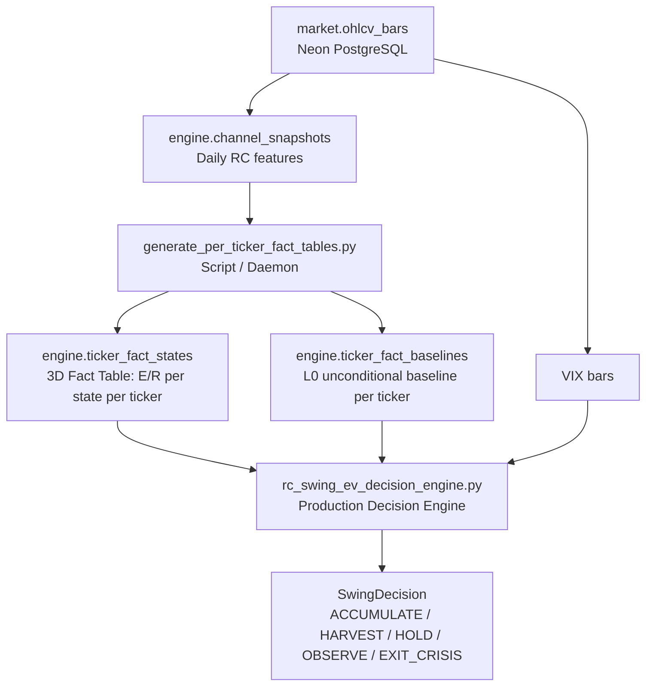

# Tide System — Design Memory & Architecture Reference

> **Purpose:** Single source of truth for the Tide/Quality Swing subsystem design.
> Every concept, empirical finding, architectural decision, and pending task lives here,
> structured for ordered dialogue between the System Architect and any AI agent.
>
> **How to use:** Read Section 1 for vocabulary. Read Section 2 for the physics model.
> Read Section 3 for architecture. Read Section 4 for empirical ground truth.
> Read Section 5 for the current decision log. Read Section 6 for open work.

---

## Table of Contents

1. [Glossary & Conceptual Alignment](#1-glossary--conceptual-alignment)
2. [The Physics Model: Regression Channel Triada](#2-the-physics-model-regression-channel-triada)
3. [Architecture & Data Flow](#3-architecture--data-flow)
4. [Empirical Ground Truth (Validated Findings)](#4-empirical-ground-truth-validated-findings)
5. [Decision Log (Change Control)](#5-decision-log-change-control)
6. [Open Work & Proposals](#6-open-work--proposals)
7. [File Map](#7-file-map)
8. [I/O Specification & Data Utilization](#8-io-specification--data-utilization)
9. [RC Slope Classifier Engineering Specification](#9-rc-slope-classifier-engineering-specification)
10. [RC Tide Lookup & Real EV Engine Specification](#10-rc-tide-lookup--real-ev-engine-specification)

---

## 1. Glossary & Conceptual Alignment

> [!IMPORTANT]
> Every term below has a precise mechanical meaning in this system. Do not conflate with general finance usage.

| Term | Definition | Units / Range |
|---|---|---|
| **Tide** | 240-bar linear regression slope of price. Represents the long-term structural trend (months). | Raw float; classified into `T+++` to `T---` (6 levels) or `T+/T0/T-` (3 bins) |
| **Current** | 60-bar linear regression slope of price. Represents the medium-term momentum (weeks). | Raw float; classified into `C+++` to `C---` (6 levels) or `C+/C0/C-` (3 bins) |
| **VWAP σ-Wave (σVw)** | Position of price relative to the VWAP regression channel, measured in standard deviations. Represents intra-cycle positioning (days). | Raw float; binned into `<<`, `<`, `~`, `>`, `>>` (5 bins) |
| **State Key** | The concatenation of the three classified dimensions: `{Tide}\|{Current}\|{σVw}`. | e.g. `T+\|C+\|<<` or `T+++\|C---\|>` |
| **3D Classification** | The validated state space using only Tide × Current × VWAP. | 3 × 3 × 5 = 45 states (production bins) |
| **6-Level Classification** | The legacy/research granularity per slope. | 6 × 6 × 5 = 180 states |
| **E[R\|S_t]** | Conditional Expected Return given current state S_t, computed from historical forward returns in the Vault. | Percentage (e.g. +0.50%) |
| **L0 Baseline** | Unconditional ticker mean return (no state conditioning). The "null hypothesis." | Percentage |
| **Relative Expectation (E[R] − L0)** | How much the current state deviates from the ticker's average behavior. Positive = edge; negative = headwind. | Percentage |
| **Ω (Omega / Certitude)** | Inverse variance (1/σ²) of forward returns for a given state. Higher Ω = tighter distribution = more predictable state. | Dimensionless |
| **Kelly f\*** | Half-Kelly sizing fraction: `f* = (E[R] / σ²) / 2 × ticker_scale`. Determines position sizing. | Fraction [−0.25, +0.25] |
| **e_days** | **Dynamic Duration** — empirical mean number of trading days to the next ZigZag pivot point from state S_t. Replaces the arbitrary fixed 20-day horizon. | Days (e.g. 8.5, 23.0) |
| **EV_per_day** | **Capital Velocity** — `E[R] / e_days`. Measures how fast capital accrues expected return. Higher = more efficient deployment. | %/day (e.g. +0.036%/day) |
| **R/R Asymmetry** | `E[ret_max] / \|E[ret_min]\|`. Ratio of expected upside to expected downside. > 1.0 = positive skew. | Dimensionless |
| **Sharpe** | `E[R] / σ` for the given state. Risk-adjusted return quality. | Dimensionless |
| **Markov Transition** | Probability of transitioning from state S_t to S_{t+1} on the next bar. Used for anticipatory hedging/accumulation. | Probability [0, 1] |
| **VIX Circuit Breaker** | Hard gate: VIX ≥ 28.0 AND T < −0.05 triggers `EXIT_CRISIS`. NOT a state dimension — validated empirically. | Boolean gate |
| **Trend Protection Gate** | Rule preventing HARVEST signals during strong structural bull tides (`t_slope ≥ 0.05`) unless VWAP is overbought (`σVw ≥ 1.50`). Prevents Buyback Slippage. | Conditional gate |
| **Buyback Slippage** | The negative drag from harvesting shares in a secular bull tide and being forced to re-buy at higher prices. Detected empirically in JNJ, WMT, COST. | Shares lost |

---

## 2. The Physics Model: Regression Channel Triada

### 2.1. The Three Timescales

The Regression Channel decomposes price motion into three orthogonal timescales:

```
╔═══════════════════════════════════════════════════════════════════╗
║                     PRICE = f(Tide, Current, VWAP)                ║
╠═══════════════════════════════════════════════════════════════════╣
║                                                                   ║
║   TIDE (240 bars)     ─── Structural Trend  (months)              ║
║   ┌──────────────────────────────────────────────────────┐        ║
║   │  Slow, high-inertia. Changes direction rarely.       │        ║
║   │  When T flips sign, it's a regime shift.             │        ║
║   └──────────────────────────────────────────────────────┘        ║
║                                                                   ║
║   CURRENT (60 bars)   ─── Momentum Phase    (weeks)               ║
║   ┌──────────────────────────────────────────────────────┐        ║
║   │  Medium-frequency oscillator around Tide.            │        ║
║   │  Captures pullbacks, continuations, divergences.     │        ║
║   └──────────────────────────────────────────────────────┘        ║
║                                                                   ║
║   VWAP σ-Wave (σVw)   ─── Intra-Cycle Position (days)            ║
║   ┌──────────────────────────────────────────────────────┐        ║
║   │  Where is price within the current VWAP channel?     │        ║
║   │  << = deeply oversold, >> = deeply overbought        │        ║
║   │  Smoothed with EWM(span=5) → "vwap_filtered"        │        ║
║   └──────────────────────────────────────────────────────┘        ║
║                                                                   ║
╚═══════════════════════════════════════════════════════════════════╝
```

### 2.2. Why 3D and NOT 4D (VIX as Dimension)

**Experiment:** A/B comparison of 3D (T|C|VWAP) vs 4D (T|C|VWAP|VIX) classification on the identical OOS window (2020-01-01 to 2026-07-25).

| Metric | 3D (Production) | 4D (+VIX) | Verdict |
|---|:---:|:---:|:---:|
| Mean Δ shares/ticker | **+0.50%** | +0.08% | 3D wins 6× |
| t-stat significance | **1.64** | 0.18 | 3D significant, 4D noise |
| Regime crossings (OOS) | ~50 | **238** | 4D adds 188 spurious transitions |
| State space size | 45 | 180+ | 4D = severe data fragmentation |

**Ruling:** VIX quintuplicates regime transitions without adding predictive value. It stays as a **Circuit Breaker gate** only.

### 2.3. Dual Classification System

Two classification granularities exist for different purposes:

| System | Levels per Slope | Total States | Where Used |
|---|:---:|:---:|---|
| **Production 3-Bin** | T+/T0/T− × C+/C0/C− | 45 | `rc_swing_ev_decision_engine.py`, `engine.ticker_fact_states` |
| **Research 6-Level** | T+++…T−−− × C+++…C−−− | 180 | `rc_tide_lookup.py`, `rc_tide_ev_lookup.py`, `rc_tide_derived.json` |

**The Taxonomy Mismatch Problem:** The production engine (`rc_swing_ev_decision_engine.py`) reads from Neon PostgreSQL where states use 3-bin keys (`T+|C+|<<`). The research lookup (`rc_tide_ev_lookup.py`) reads from JSON files with 6-level keys (`T+++|C---|>`). These two systems speak different languages. **Task 1 resolves this.**

---

## 3. Architecture & Data Flow

### 3.1. Data Pipeline (Vault-First, Rule 13)



### 3.2. Decision Chain (inside `rc_swing_ev_decision_engine.decide()`)

```
Input: ticker, timestamp, t_slope, c_slope, svw_filtered, svw_drift, vix
  │
  ├─ Step 1: _classify_state(t,c,svw) → state_key "T+|C-|<<"
  │
  ├─ Step 2: lookup_ev(ticker, ...) → EVLookupResult
  │           Cascade: L2(exact 3D) → L1(T|C with ~) → L0(global)
  │
  ├─ Step 3: _apply_drift_modifier(Ω, ev, drift) → Ω_modified
  │           Confirms or contradicts E[R] direction via VWAP velocity
  │
  ├─ Step 4: project_next_state(state_key, transition_matrix) → S_{t+1}
  │           Markov chain: most likely next state + reversal detection
  │
  ├─ Step 5: kelly_size(ev, σ², Ω_mod, ticker) → f*
  │           Per-Ticker L0-Relative Half-Kelly with Ω certainty modulation
  │
  └─ Step 6: Decision Logic
             ├── VIX ≥ 28 + T < -0.05 → EXIT_CRISIS (Circuit Breaker)
             ├── E[R] < -0.005 & Trend Gate allows → HARVEST
             ├── Markov reversal projected → PREVENTIVE HARVEST
             ├── E[R] > 0.005 & Ω ≥ 25 → ACCUMULATE
             ├── Ω < 20 or n < 15 → OBSERVE (insufficient certainty)
             └── else → HOLD
```

### 3.3. Legacy vs Production Lookup Architecture

```
┌─────────────────────────────────────────────────────────────────────┐
│  LEGACY (JSON-Based, Research)                                       │
│                                                                       │
│  rc_tide_lookup.py ──reads──> rc_tide_derived.json (180 states)      │
│  rc_tide_ev_lookup.py ──reads──> rc_tide_ev_derived.json (EV model)  │
│  Keys: "T+++|C---|>>"  (6-level classification)                      │
│                                                                       │
├─────────────────────────────────────────────────────────────────────┤
│  PRODUCTION (DB-Based, Vault-First)                                  │
│                                                                       │
│  rc_swing_ev_decision_engine.py ──reads──> engine.ticker_fact_states │
│  Keys: "T+|C-|<<"  (3-bin classification)                            │
│  Per-ticker tables. Fallback: L2 → L1 → L0.                         │
│                                                                       │
└─────────────────────────────────────────────────────────────────────┘
```

### 3.4. Database Schema (engine.*)

#### `engine.ticker_fact_states`

| Column | Type | Description |
|---|---|---|
| `ticker` | TEXT | Stock symbol |
| `state_key` | TEXT | 3D state key (e.g. `T+\|C-\|<<`) |
| `calibration_cutoff` | TEXT | `9999-12-31` (full) or `2019-12-31` (in-sample) |
| `lookforward_days` | INT | Forward horizon (currently fixed at 20) |
| `n` | INT | Sample count |
| `p_cielo` | FLOAT | P(positive return) |
| `p_infierno` | FLOAT | P(negative return) |
| `e_ret_cielo` | FLOAT | Mean positive return |
| `e_ret_infierno` | FLOAT | Mean negative return |
| `ev_net` | FLOAT | E[R\|S_t] net expected return |
| `variance` | FLOAT | σ² of returns |
| `std_dev` | FLOAT | σ of returns |
| `sharpe` | FLOAT | E[R]/σ |
| `omega` | FLOAT | 1/σ² certitude index |
| `rr_asymmetry` | FLOAT | Upside/downside ratio |
| `kelly_f` | FLOAT | Raw Kelly fraction |
| `e_days` | FLOAT | *(PENDING)* Mean days to next ZZ pivot |
| `ev_per_day` | FLOAT | *(PENDING)* E[R] / e_days capital velocity |

#### `engine.ticker_fact_baselines`

| Column | Type | Description |
|---|---|---|
| `ticker` | TEXT | Stock symbol |
| `calibration_cutoff` | TEXT | Cutoff date |
| `lookforward_days` | INT | Forward horizon |
| `n` | INT | Total samples |
| `ev_net` | FLOAT | L0 unconditional E[R] |
| `variance` | FLOAT | L0 unconditional σ² |
| `p_cielo` | FLOAT | L0 unconditional P(up) |

#### `engine.channel_snapshots` (Vault ML Feature Store)

| Column | Type | Description |
|---|---|---|
| `ticker` | TEXT | Stock symbol |
| `timestamp` | TIMESTAMPTZ | Bar date (Midnight UTC) |
| `timeframe` | TEXT | `1d` |
| `tide_slope` | FLOAT | Raw 240-bar slope |
| `current_slope` | FLOAT | Raw 60-bar slope |
| `vwap_sigma_wave` | FLOAT | Raw σVw position |
| `atr_pct` | FLOAT | 14-day ATR % relative to price |
| `tide_level` | VARCHAR(8) | Pre-classified Tide quantile bin (`T+++` .. `T---`) |
| `current_level` | VARCHAR(8) | Pre-classified Current quantile bin (`C+++` .. `C---`) |
| `wave_level` | VARCHAR(8) | Pre-classified Wave quantile bin (`W+++` .. `W---`) |
| `vwap_bin` | VARCHAR(8) | Pre-classified σVWAP bin (`<<`, `<`, `~`, `>`, `>>`) |
| `state_key_3d` | VARCHAR(32) | Pre-classified 3D State Key (`Tide|Current|vwap_bin`) |
| `quantile_version` | VARCHAR(16) | Calibration version (`v1_2026`) |
| *(+ other Observer features)* | | |

**Current Data:** 213,100 pre-classified channel snapshots across 17 tickers. 100% audited integrity.

---

## 4. Empirical Ground Truth (Validated Findings)

> [!NOTE]
> Each finding below is marked with its **Evidence Status** per Rule (hypothesis-governance).

### 4.1. VIX A/B Experiment — `VALIDATED`

- **Date:** 2026-07-27
- **Method:** Identical OOS backtest (2020-01-01 → 2026-07-25), same tickers, same rules, only difference: 3D vs 4D state space.
- **Result:** 3D outperforms 4D by 6× on mean Δ shares. VIX adds noise, not signal.
- **Decision:** VIX removed as state dimension. Kept as Circuit Breaker gate (VIX ≥ 28.0).

### 4.2. Trend Protection Gate & Relative Expectation — `VALIDATED`

- **Problem:** HARVEST signals in strong bull tides (T+++ for WMT, COST, JNJ) caused Buyback Slippage.
- **Mechanism:** Selling shares during secular uptrends forces re-buying at higher prices.
- **Solution:**
  - Relative Expectation: `E[R] − L0` must be negative, not just absolute E[R].
  - Trend Protection Gate: block HARVEST when `t_slope ≥ 0.05` UNLESS `σVw ≥ 1.50`.
- **Result:** JNJ went from −0.78 to +0.28 Δ shares over Buy & Hold.

### 4.3. Markov Curve Calibration — `VALIDATED`

- **Date:** 2026-07-27
- **Method:** 16,470 OOS state transitions measured.
- **Result:** Perfect linear calibration:
  - P ≥ 90% → 90.8% observed hit rate
  - P ≥ 70% → 75.2% observed hit rate
- **Implication:** Markov projections are trustworthy for preventive HARVEST decisions.

### 4.4. Dynamic Duration (e_days) & Capital Velocity — `VALIDATED CONCEPT, PENDING INTEGRATION`

- **Problem:** Fixed 20-day forward horizon is irrational. Market pivots are state-dependent.
- **Finding:** ZigZag 5% pivot duration varies dramatically by state. Example:
  - AAPL `T+|C+|<<` → e_days = 7.2 days → EV/day = +0.358%/day
  - XOM `T+|C+|<<` → e_days = 12.1 days → EV/day = +0.187%/day
- **Integration status:** Concept validated. Not yet persisted in `engine.ticker_fact_states`. Not yet consumed by the decision engine.

### 4.5. Per-Ticker Fact Tables — `VALIDATED`

- **Method:** `generate_per_ticker_fact_tables.py` computes E[R|S_t] per ticker per state from Vault OHLCV data.
- **Result:** 50,939 fact state rows across 366 tickers with full and in-sample calibration variants.
- **Key insight:** Per-ticker tables vastly outperform global (cross-ticker) tables because each stock has a different volatility profile, sector behavior, and seasonal pattern.

---

## 5. Decision Log (Change Control)

> [!TIP]
> Every architectural decision is recorded here chronologically. Reference these when proposing changes to ensure consistency.

| # | Date | Decision | Rationale | Status |
|:--:|:---:|---|---|:---:|
| D-001 | 2026-07-27 | VIX removed as state dimension | A/B experiment: 3D > 4D by 6× on Δ shares | ✅ Implemented |
| D-002 | 2026-07-27 | VIX kept as Circuit Breaker (≥ 28.0 + T < −0.05) | Hard gate for systemic risk, not regime classification | ✅ Implemented |
| D-003 | 2026-07-27 | Trend Protection Gate added | Prevents Buyback Slippage in secular bulls | ✅ Implemented |
| D-004 | 2026-07-27 | Relative Expectation (E[R] − L0) for HARVEST | Absolute E[R] alone is insufficient; context vs baseline needed | ✅ Implemented |
| D-005 | 2026-07-27 | Per-Ticker Kelly scaling (not global constant) | Eliminates cross-ticker volatility distortion and data leakage | ✅ Implemented |
| D-006 | 2026-07-27 | VWAP drift modifier uses tanh (smooth) not copysign (discontinuous) | Eliminates discontinuity at E[R]=0 | ✅ Implemented |
| D-007 | 2026-07-28 | Dynamic Duration (e_days) replaces fixed 20-day horizon | 20 days is irrational; pivot distance is state-dependent | 🔲 Pending |
| D-008 | 2026-07-28 | Capital Velocity (EV/day) for Kelly sizing | Penalizes slow-accruing states; rewards fast turnaround | 🔲 Pending |
| D-009 | 2026-07-28 | Time Stop = 1.5 × e_days(S_t) | Dynamic position expiry based on expected pivot horizon | 🔲 Pending |
| D-010 | 2026-07-28 | Research JSON path (`rc_tide_derived.json`) is operational standard | Prohibits deprecation of verified JSON lookup tables | ✅ Approved |
| D-011 | 2026-07-28 | Complete prohibition of hardcoded fallbacks / default assumptions | Hardcoded fallbacks when data is missing are completely prohibited | ✅ Implemented |
| D-012 | 2026-07-28 | Disconnect `generate_per_ticker_fact_tables.py` 3-bin generator | Fixed absolute slope cuts without vol normalization are rejected | ✅ Implemented |
| D-013 | 2026-07-28 | Vault-Backed Fallback Policy & JSON DB Backup | Fallbacks allowed ONLY over verified DB backup data (P-006) | 🔲 Pending (P-006) |
| D-014 | 2026-07-28 | Persistir columnas clasificadas (`tide_level`, `state_key_3d`, `atr_pct`) en Vault | Single Source of Truth; ML Feature Store; 213K snapshots backfilled | ✅ Implemented |
| D-015 | 2026-07-28 | Deprecar conversión imprecisa de floats crudos sin ATR (`rc_tide_lookup.py:313-321`) | Fuerza consumo fast-path P-007; emite DeprecationWarning en llamadas legacy | ✅ Implemented |

---

## 6. Open Work & Proposals

### 6.1. TASK 1: Taxonomy Unification (rc_tide_ev_lookup.py → Vault)

**Problem:**
- `rc_tide_ev_lookup.py` reads `rc_tide_ev_derived.json` with 6-level keys (`T+++|C---|>`).
- `rc_swing_ev_decision_engine.py` reads `engine.ticker_fact_states` with 3-bin keys (`T+|C-|>`).
- Both modules are in `quality_swing/domain/rules/` but speak different key languages.

**Proposed Solution:**
1. Connect `rc_tide_ev_lookup.py` to Neon PostgreSQL via `TimescaleDataStore`.
2. Implement key normalization: map 6-level → 3-bin for DB lookups.
3. Maintain backward compatibility for callers that pass 6-level keys.

**Open Questions:**
- Should we deprecate the JSON lookup path entirely, or keep it as offline research fallback?
- Do we need the 6-level granularity in the DB, or is 3-bin sufficient for all production paths?

---

### 6.2. TASK 2: Dynamic Duration (e_days) & Capital Velocity

**Problem:**
- Fixed `lookforward_days = 20` in `generate_per_ticker_fact_tables.py` is a hardcoded assumption.
- Actual pivot horizons vary from 5 to 40+ days depending on state and ticker.

**Proposed Solution:**
1. Add `e_days` and `ev_per_day` columns to `engine.ticker_fact_states`.
2. Compute from ZigZag 5% pivot distances per state per ticker in the generator script.
3. Decision engine uses `ev_per_day` instead of `ev_net` for Kelly modulation.
4. Time Stop becomes `1.5 × e_days(S_t)` instead of fixed 20 days.

**Open Questions:**
- Which ZigZag deviation threshold? 5% (structural) or 2.5% (tactical)?
- Should the Time Stop be hard (force exit) or soft (reduce sizing progressively)?

---

### 6.3. TASK 3: Scaled Forensic Benchmark

**Scope:**
1. Run `eval_swing_forensic_benchmark.py` on 10 test tickers.
2. Scale to all 366+ tickers in the Vault.
3. Report aggregate Δ shares vs Buy & Hold, per-signal accuracy, Markov calibration.

**Dependencies:** Tasks 1 and 2 should ideally be completed first, but the benchmark can run against the current engine for a baseline measurement.

---

## 7. File Map

### Production Domain Rules

| File | Role | Data Source |
|---|---|---|
| [rc_swing_ev_decision_engine.py](file:///root/botero-trade/backend/modules/quality_swing/domain/rules/rc_swing_ev_decision_engine.py) | **Main production decision engine.** Full E[R] → Ω → Kelly → Action chain. | `engine.ticker_fact_states` (DB) |
| [rc_slope_classifier.py](file:///root/botero-trade/backend/modules/quality_swing/domain/rules/rc_slope_classifier.py) | Classifies raw slopes into 6-level labels (T+++…T---) using vol-normalized quantiles. | In-memory thresholds |
| [signal_cataloger.py](file:///root/botero-trade/backend/modules/quality_swing/domain/rules/signal_cataloger.py) | Maps feature vectors to named signals (ACCUMULATE, TRIM, etc.) | Pure rules |

### Research/Legacy Lookup Rules

| File | Role | Data Source |
|---|---|---|
| [rc_tide_lookup.py](file:///root/botero-trade/backend/modules/quality_swing/domain/rules/rc_tide_lookup.py) | 6-level T×C×σVw signal lookup with zone/regime/conviction metadata. | `rc_tide_derived.json` (JSON) |
| [rc_tide_ev_lookup.py](file:///root/botero-trade/backend/modules/quality_swing/domain/rules/rc_tide_ev_lookup.py) | Real EV lookup with L3→L2→L1→L0 fallback and Waze Route Guidance. | `rc_tide_ev_derived.json` (JSON) |

### Scripts (Daemons / Generators)

| File | Role |
|---|---|
| [generate_per_ticker_fact_tables.py](file:///root/botero-trade/backend/scripts/generate_per_ticker_fact_tables.py) | Generates 3D fact tables per ticker → Neon PostgreSQL |
| [eval_swing_forensic_benchmark.py](file:///root/botero-trade/backend/scripts/eval_swing_forensic_benchmark.py) | OOS forensic benchmark: Δ shares vs B&H, per-signal stats, Markov calibration |
| [audit_dynamic_duration_practicability.py](file:///root/botero-trade/backend/scripts/audit_dynamic_duration_practicability.py) | Validates ZigZag dynamic duration (e_days) practicability |
| [generate_tide_ev_real_derived.py](file:///root/botero-trade/backend/scripts/generate_tide_ev_real_derived.py) | Generates `rc_tide_ev_derived.json` with Bayesian shrinkage |

### Entities & DTOs

| File | Role |
|---|---|
| [tide_route_guidance.py](file:///root/botero-trade/backend/modules/quality_swing/domain/entities/tide_route_guidance.py) | TideRouteGuidance entity (Waze-style hazard alarm output) |
| [swing_bias.py](file:///root/botero-trade/backend/modules/quality_swing/domain/entities/swing_bias.py) | SwingBias entity |
| [swing_decision.py](file:///root/botero-trade/backend/modules/quality_swing/domain/dtos/swing_decision.py) | SwingDecision DTO |

### Related Design Documents

| Document | Content |
|---|---|
| [Stateful Design Philosophy](file:///root/botero-trade/Legible_Establishing_Stateful_Design_Philosophy.md) | Rules 15-17, StateSnapshot, RegimeStatePort |
| [RC Kalman Exit Architecture](file:///root/botero-trade/docs/rc_kalman_exit_architecture.md) | RC + Kalman Wyckoff exit signal design |
| This document | Master index for Quality Swing Tide subsystem |

---

## 8. I/O Specification & Data Utilization

Full I/O diagrams (inputs, processing, outputs) for every Tide component, plus a column-level audit of data utilization, are documented in:

→ **[IO_SPEC.md](./IO_SPEC.md)**

**Key finding:** The Tide decision pipeline uses only **3 features out of 72 columns** (4.2%) from `engine.channel_snapshots`. Validated signals like RSI Intelligence, Kalman Velocity, and Wave Duration are computed and persisted but not consumed.

---

## 9. RC Slope Classifier Engineering Specification

Complete mathematical formulation, López de Prado volatility standardization ($\text{slope} / \text{ATR}_{14\%}$), 100% census quantile tables (4.57M samples), and contract details of the pure-domain slope classifier are documented in:

→ **[SLOPE_CLASSIFIER_SPEC.md](./SLOPE_CLASSIFIER_SPEC.md)**

---

## 10. RC Tide Lookup & Real EV Engine Specification

Complete technical specification of `rc_tide_lookup.py` and `rc_tide_ev_lookup.py`, including the 4-level cascading fallback hierarchy ($L3 \to L2 \to L1 \to L0$), Universal Institutional Action Taxonomy mapping, risk/reward asymmetry ratios ($RR_{asym}$), capital velocity ($EV_{per\_day}$), and dataclasses (`TideSignal`, `RealEVSignal`) is documented in:

→ **[LOOKUP_SPEC.md](./LOOKUP_SPEC.md)**

---

## Appendix A: Taxonomy Mapping Reference

### 6-Level → 3-Bin Normalization

```
T+++, T++, T+  →  T+      (positive tide)
T~              →  T0      (neutral tide)
T-, T--, T---   →  T-      (negative tide)

C+++, C++, C+  →  C+      (positive current)
C~              →  C0      (neutral current)
C-, C--, C---   →  C-      (negative current)

σVw bins are identical in both systems: <<, <, ~, >, >>
```

### Thresholds (Production 3-Bin)

```python
# Used by rc_swing_ev_decision_engine._classify_state()
T+:  t_slope >= +0.05
T0:  -0.05 < t_slope < +0.05
T-:  t_slope <= -0.05

C+:  c_slope >= +0.05
C0:  -0.05 < c_slope < +0.05
C-:  c_slope <= -0.05

<<:  svw_filtered < -1.50
<:   -1.50 <= svw_filtered < -0.50
~:   -0.50 <= svw_filtered <= +0.50
>:   +0.50 < svw_filtered <= +1.50
>>:  svw_filtered > +1.50
```

### Thresholds (Research 6-Level, vol-normalized)

```python
# Used by rc_slope_classifier._classify_norm_one()
# Based on 100% census quantiles from Neon Vault (4.57M samples)
# slope_norm = slope / max(atr_pct, 0.005)
T+++: slope_norm >= p97.5
T++:  slope_norm >= p90
T+:   slope_norm >= p75
T-:   slope_norm <= p25
T--:  slope_norm <= p10
T---: slope_norm <= p2.5
T~:   everything else (interquartile)
```

---

## Appendix B: Action Taxonomy

| Action | Meaning | Sizing | Conditions |
|---|---|:---:|---|
| `ACCUMULATE` | Buy more shares | f* (positive) | E[R] > 0.5%, Ω ≥ 25, n ≥ 15 |
| `HARVEST` | Sell shares (trim) | \|f*\| | E[R] < −0.5% (relative), Trend Gate allows |
| `HOLD` | No action | 0 | Neutral expectation |
| `OBSERVE` | Wait for clarity | 0 | Ω < 20 or n < 15 |
| `EXIT_CRISIS` | Emergency sell | 0.25 | VIX ≥ 28 AND T < −0.05 |

---

*Last updated: 2026-07-28T10:11Z*
*Version: 1.0.0*
