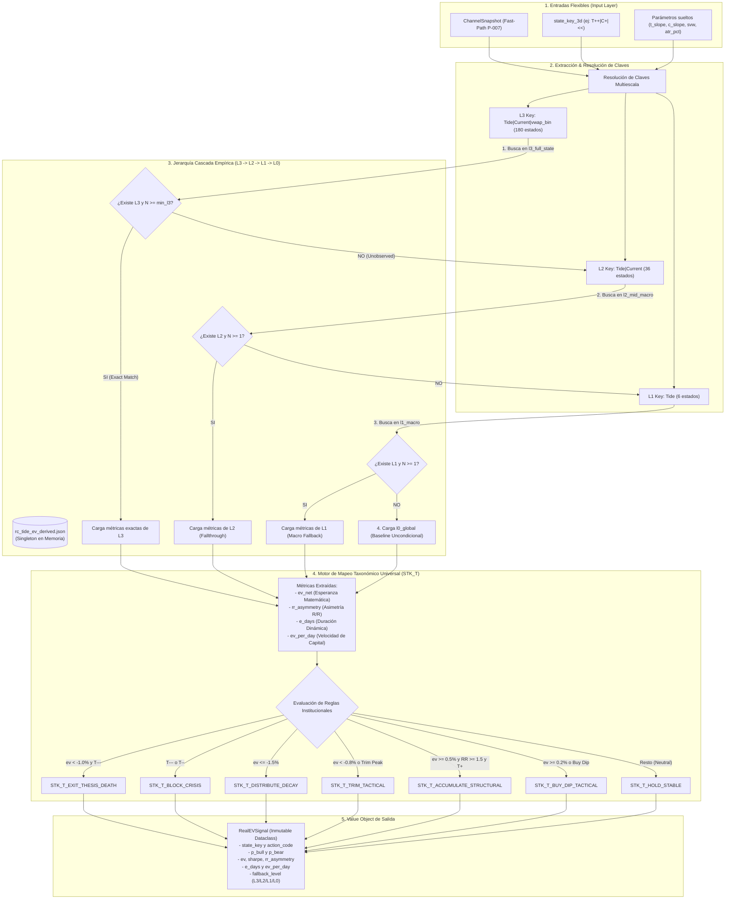

# Real EV Lookup Engine (`rc_tide_ev_lookup.py`) — Engineering & Mathematical Specification

> **Purpose:** Comprehensive engineering, mathematical, and architectural specification of the **Point-in-Time Real EV Lookup Engine** (`rc_tide_ev_lookup.py`), which queries empirical expected value distributions from `rc_tide_ev_derived.json`.
>
> **Cross-references:**
> - Master Index: [README.md](./README.md)
> - Signal Lookup Spec: [LOOKUP_SPEC.md](./LOOKUP_SPEC.md)
> - Slope Classifier Spec: [SLOPE_CLASSIFIER_SPEC.md](./SLOPE_CLASSIFIER_SPEC.md)
> - I/O Specification: [IO_SPEC.md](./IO_SPEC.md)

---

## Table of Contents

1. [Executive Summary & Clean Architecture Position](#1-executive-summary--clean-architecture-position)
2. [Architectural Diagram & Data Flow](#2-architectural-diagram--data-flow)
3. [Value Object Specification (`RealEVSignal`)](#3-value-object-specification-realevsignal)
4. [Cascading Fallback Hierarchy ($L3 \to L2 \to L1 \to L0$)](#4-cascading-fallback-hierarchy-l3-%E2%86%92-l2-%E2%86%92-l1-%E2%86%92-l0)
5. [Universal Institutional Action Taxonomy (`STK_T_*`)](#5-universal-institutional-action-taxonomy-stk_t_)
6. [Fast-Path Execution Standard (P-007 / D-014)](#6-fast-path-execution-standard-p-007--d-014)
7. [Strict No-Fallback & Zero-Bias Directives](#7-strict-no-fallback--zero-bias-directives)

---

## 1. Executive Summary & Clean Architecture Position

The **Real EV Lookup Engine** (`rc_tide_ev_lookup.py`) is a pure domain rule located at:
`backend/modules/quality_swing/domain/rules/rc_tide_ev_lookup.py`

It converts 3D macro market states into point-in-time quantitative expected return distributions, risk-adjusted Sharpe ratios, risk/reward asymmetry ratios, and dynamic capital velocity metrics.

### Key Principles:
- **Pure Function / Zero I/O at Runtime:** Loads `rc_tide_ev_derived.json` once lazily as a singleton and performs $O(1)$ memory lookups during execution.
- **Cascading Empirical Fallbacks:** Handles unobserved or rare states through a 4-tier statistical hierarchy ($L3 \to L2 \to L1 \to L0$) derived strictly from empirical census distributions.
- **Universal Taxonomy Compliance:** Emits 8 standardized institutional action codes (`STK_T_*`) mapped to expected return and trend alignment.
- **Vault Feature Store Integration (P-007 / D-014):** Directly consumes `snapshot.state_key_3d` generated by `compute_channel_snapshot()`, bypassing on-the-fly re-computations.

---

## 2. Architectural Diagram & Data Flow



---

## 3. Value Object Specification (`RealEVSignal`)

The output of `lookup_real_ev()` is an immutable dataclass value object:

```python
@dataclass(frozen=True)
class RealEVSignal:
    state_key: str          # e.g. "T+++|C+++|<"
    level: str              # "zz25", "zz50", "zz75"
    fallback_level: str     # "L3", "L2", "L1", "L0"
    signal: str             # "ACCUMULATE", "BUY_DIP", "NEUTRAL", "TRIM", "BLOCK", "EXIT_THESIS"
    action_code: str        # Taxonomy action code (e.g. STK_BUY_DIP_TACTICAL)
    
    p_bull: float           # P(next = MIN / floor)
    p_bear: float           # P(next = MAX / ceiling)
    ev: float               # Point-in-Time Real EV net
    sharpe: float           # Real EV / std(real_return)
    e_ret_min: float        # Expected real drawdown to next MIN pivot
    e_ret_max: float        # Expected real gain to next MAX pivot
    e_days: float           # Expected days to next pivot (Dynamic Duration)
    rr_asymmetry: float     # E[ret_max] / |E[ret_min]|
    ev_per_day: float       # EV / e_days (Capital Velocity)
    n_samples: int          # Sample size for this state/level
    is_rare_state: bool     # Low-N tail event flag
    
    is_unobserved_state: bool = False
    fallback_reason: str = "EXACT_L3_MATCH"
```

### Calculated Field Formulas:

1. **Point-in-Time Expected Return ($EV$):**
   $$EV = E[R \mid S_t]$$
2. **Sharpe Ratio ($S_{state}$):**
   $$\text{Sharpe} = \frac{E[R \mid S_t]}{\sigma(R \mid S_t)}$$
3. **Risk/Reward Asymmetry ($RR_{asym}$):**
   $$RR_{asym} = \frac{E[\text{ret\_max} \mid S_t]}{|E[\text{ret\_min} \mid S_t]|}$$
4. **Capital Velocity ($EV_{per\_day}$):**
   $$EV_{per\_day} = \frac{EV}{e\_days}$$

---

## 4. Cascading Fallback Hierarchy ($L3 \to L2 \to L1 \to L0$)

When querying a state $S_t$, the engine executes a multi-tier fallback sequence:

| Tier | Level Name | Key Format | State Count | Condition |
|:---:|---|---|:---:|---|
| **L3** | Full State | `Tide|Current|vwap_bin` | 180 states | $N \ge \text{min\_l3\_samples}$ |
| **L2** | Mid-Macro | `Tide|Current` | 36 states | $N < \text{min\_l3\_samples}$ or L3 unobserved |
| **L1** | Macro | `Tide` | 6 states | L2 unobserved |
| **L0** | Global Baseline | `GLOBAL` | 1 state | L1 unobserved (unconditional census mean) |

---

## 5. Universal Institutional Action Taxonomy (`STK_T_*`)

The engine maps mathematical metrics into 8 standardized institutional action codes:

| Action Code | Signal | Technical / Quantitative Trigger |
|---|---|---|
| `STK_T_EXIT_THESIS_DEATH` | `EXIT_THESIS` | `resolved_t in ("T---", "T--") and ev < -0.010` |
| `STK_T_BLOCK_CRISIS` | `BLOCK` | `resolved_t in ("T---", "T--")` |
| `STK_T_DISTRIBUTE_DECAY` | `DISTRIBUTE` | `ev <= -0.015` |
| `STK_T_TRIM_TACTICAL` | `TRIM` | `ev < -0.008 or (vwap_bin in (">>", ">") and T in ("T+++", "T+"))` |
| `STK_T_ACCUMULATE_STRUCTURAL` | `ACCUMULATE` | `T in ("T+", "T++", "T+++") and ev >= 0.005 and rr_asymmetry >= 1.5` |
| `STK_T_BUY_DIP_TACTICAL` | `BUY_DIP` | `ev >= 0.002 or (vwap_bin in ("<<", "<") and ev > 0.0)` |
| `STK_T_HOLD_STABLE` | `NEUTRAL` | Default / Interquartile range without edge |

---

## 6. Fast-Path Execution Standard (P-007 / D-014)

Under **P-007 / D-014**, `lookup_real_ev()` prioritizes `snapshot.state_key_3d`:

```python
# Fast path (P-007)
snap_arg = kwargs.get("snapshot") or kwargs.get("snap")
state_key_arg = kwargs.get("state_key_3d") or kwargs.get("state_key")

if snap_arg and getattr(snap_arg, "state_key_3d", None):
    state_key_arg = snap_arg.state_key_3d
```

This bypasses on-the-fly slope binning and executes a zero-cost $O(1)$ memory lookup against pre-classified labels stored in `ChannelSnapshot`.

---

## 7. Strict No-Fallback & Zero-Bias Directives

1. **No Dummy/Hardcoded Assumptions:** If `rc_tide_ev_derived.json` is missing or unreadable, `_ensure_table_loaded()` raises a `FileNotFoundError`. Invented numbers or default fallbacks in Python code are forbidden.
2. **Empirical Census Only:** Fallbacks ($L3 \to L2 \to L1 \to L0$) draw strictly from pre-computed empirical census distributions in `rc_tide_ev_derived.json`.
3. **Traceability:** Every `RealEVSignal` includes `fallback_level` and `fallback_reason` for post-hoc forensic auditing.

---

*Specification Version: 1.0.0 (P-007 / D-014 Compliant)*  
*Last Updated: 2026-07-28T21:16Z*  
*Author: Botero Trade Engine Architecture Team*
