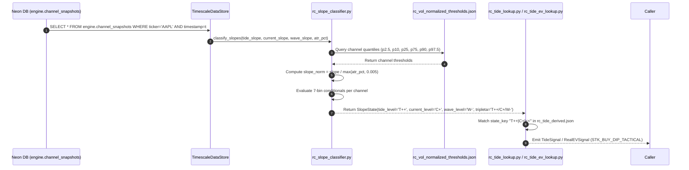

# RC Slope Classifier — Engineering & Physics Specification

> **Purpose:** Detailed technical, mathematical, and architectural specification of the **Regression Channel (RC) Slope Classifier** (`rc_slope_classifier.py`).
>
> **Cross-references:** 
> - Master Index: [README.md](./README.md)
> - I/O Specification: [IO_SPEC.md](./IO_SPEC.md)
> - Proposals & Open Tasks: [PROPOSALS.md](./PROPOSALS.md)

---

## Table of Contents

1. [Executive Summary & Clean Architecture Position](#1-executive-summary--clean-architecture-position)
2. [Mathematical Formulation](#2-mathematical-formulation)
3. [Empirical Quantile Calibration (Neon Vault Census)](#3-empirical-quantile-calibration-neon-vault-census)
4. [Data Contract & Value Object (`SlopeState`)](#4-data-contract--value-object-slopestate)
5. [End-to-End Execution Flow](#5-end-to-end-execution-flow)
6. [Integration Architecture & Vault Persistence](#6-integration-architecture--vault-persistence)
7. [Strict No-Fallback & Zero-Bias Directives](#7-strict-no-fallback--zero-bias-directives)

---

## 1. Executive Summary & Clean Architecture Position

The **RC Slope Classifier** is a pure domain rule located at `backend/modules/quality_swing/domain/rules/rc_slope_classifier.py`. It converts raw, continuous regression slopes across three timescales ($TIDE$, $CURRENT$, $WAVE$) into discrete, volatility-standardized 6-level regime labels (`+++`, `++`, `+`, `~`, `-`, `--`, `---`).

### Key Properties:
- **Pure Function / Zero Side Effects:** Operates strictly on numerical inputs and loaded quantile configurations.
- **López de Prado Volatility Standardization:** Normalizes slopes by local asset volatility ($\text{ATR}_{14\%}$) to make trend strength comparable across heterogeneous asset classes (e.g. NVDA vs KO).
- **100% Census Quantiles:** Uses asymmetric quantile thresholds derived from 4,577,585 daily observations across 562 tickers in Neon Vault (1999–2026).
- **Rule 13 (Vault-First) & Strict No-Fallback Compliant:** Prohibits dummy/hardcoded fallbacks; relies strictly on verified configuration data (`rc_vol_normalized_thresholds.json`) or database backups.

---

## 2. Mathematical Formulation

The classification pipeline processes slope data through **4 mathematical transformations**:

```
 ┌────────────────┐     ┌─────────────────────┐     ┌───────────────────────┐     ┌───────────────────────┐
 │ OLS Regression │ ──> │ Price Normalization │ ──> │ Volatility Filtering  │ ──> │ Quantile Binning      │
 │  slope_raw     │     │ slope (% per bar)   │     │ slope_norm = slope/ATR│     │  T++/C+/W- (SlopeState│
 └────────────────┘     └─────────────────────┘     └───────────────────────┘     └───────────────────────┘
```

### 2.1. OLS Linear Regression ($slope_{raw}$)
For a lookback window $N \in \{240, 60, W_{cycle}\}$ over prices $y_i$:

$$\text{slope}_{raw} = \frac{\sum_{i=0}^{N-1} (x_i - \bar{x})(y_i - \bar{y})}{\sum_{i=0}^{N-1} (x_i - \bar{x})^2}, \quad x_i \in [0, N-1]$$

### 2.2. Price Normalization ($\text{slope}$)
Normalizes raw slope into percentage price change per bar:

$$\text{slope} = \left( \frac{\text{slope}_{raw}}{\bar{y}} \right) \times 100 \quad [\% \text{ per bar}]$$

### 2.3. Volatility Standardization ($\text{slope\_norm}$)
To eliminate cross-asset volatility distortion (López de Prado methodology), the price-normalized slope is divided by the asset's local 14-day Average True Range percentage ($\text{ATR}_{14\%} = \frac{\text{ATR}_{14}}{\text{Close}}$):

$$\text{atr\_eff} = \max(\text{atr\_pct}, 0.005)$$

$$\text{slope\_norm} = \frac{\text{slope}}{\text{atr\_eff}}$$

> [!NOTE]
> **Sanitization & Floor:**
> 1. Auto-sanitization: If `atr_pct > 1.0` (passed as percentage integer like `1.5%`), it is automatically divided by 100 (`1.5 / 100 = 0.015`).
> 2. Volatility Floor: $\text{atr\_eff} \ge 0.005$ (0.5% floor) prevents numerical explosion or division by zero in ultra-low volatility assets (e.g. Treasury ETFs, fiat pairs).

---

## 3. Empirical Quantile Calibration (Neon Vault Census)

Each of the three regression channels ($TIDE$, $CURRENT$, $WAVE$) has an independent variance profile:
- $TIDE$ (240d) smooths price over 1 year $\implies$ lower slope variance.
- $CURRENT$ (60d) captures quarterly momentum $\implies$ medium slope variance.
- $WAVE$ (15d) surfs local cycles $\implies$ high slope variance.

Therefore, **each channel is evaluated against its own empirical quantile distribution** loaded from `rc_vol_normalized_thresholds.json` (4,577,585 census samples):

### 3.1. Quantile Thresholds Table

| Channel | Key in JSON | `p2_5` (---) | `p10` (--) | `p25` (-) | `p75` (+) | `p90` (++) | `p97_5` (+++) |
|:---:|---|:---:|:---:|:---:|:---:|:---:|:---:|
| **TIDE (240d)** | `tide_slope_norm` | $\le -7.1072$ | $-3.7897$ | $-0.8920$ | $\ge 5.8933$ | $\ge 9.0233$ | $\ge 13.1020$ |
| **CURRENT (60d)** | `current_slope_norm` | $\le -15.6977$ | $-9.3049$ | $-3.7779$ | $\ge 9.7130$ | $\ge 15.8825$ | $\ge 23.2615$ |
| **WAVE (15d)** | `wave_slope_norm` | $\le -27.8913$ | $-15.9596$ | $-6.9303$ | $\ge 13.2749$ | $\ge 23.3902$ | $\ge 36.8241$ |

### 3.2. 7-Bin Regime Classification Rules

For a given $\text{slope\_norm}$ and channel quantile thresholds $\{p_{2.5}, p_{10}, p_{25}, p_{75}, p_{90}, p_{97.5}\}$:

```python
if slope_norm >= p97_5:
    return "+++"  # Extreme Bullish (Top 2.5% tail)
elif slope_norm >= p90:
    return "++"   # Unusual Bullish (Top 10% tail)
elif slope_norm >= p75:
    return "+"    # Moderate Bullish (Top 25%)
elif slope_norm <= p2_5:
    return "---"  # Extreme Bearish (Bottom 2.5% tail)
elif slope_norm <= p10:
    return "--"   # Unusual Bearish (Bottom 10% tail)
elif slope_norm <= p25:
    return "-"    # Moderate Bearish (Bottom 25%)
else:
    return "~"    # Neutral Range (Interquartile 25% - 75%)
```

---

## 4. Data Contract & Value Object (`SlopeState`)

The output of `classify_slopes()` is an immutable dataclass value object:

```python
@dataclass(frozen=True)
class SlopeState:
    tide_level: str      # T+++, T++, T+, T~, T-, T--, T---
    current_level: str   # C+++, C++, C+, C-, C--, C---
    wave_level: str      # W+++, W++, W+, W-, W--, W---
    tripleta: str        # e.g. "T++/C+/W-"
```

---

## 5. End-to-End Execution Flow



---

## 6. Integration Architecture & Vault Persistence (P-007 / D-014 Standard)

### 6.1. Implemented Vault Feature Store Schema
In accordance with P-007 / D-014, `engine.channel_snapshots` in Neon PostgreSQL has been upgraded to an autonomous ML Feature Store by persisting 7 pre-classified columns at insertion time:

```sql
ALTER TABLE engine.channel_snapshots
ADD COLUMN IF NOT EXISTS atr_pct DOUBLE PRECISION DEFAULT 0.01,
ADD COLUMN IF NOT EXISTS tide_level VARCHAR(8),
ADD COLUMN IF NOT EXISTS current_level VARCHAR(8),
ADD COLUMN IF NOT EXISTS wave_level VARCHAR(8),
ADD COLUMN IF NOT EXISTS vwap_bin VARCHAR(8),
ADD COLUMN IF NOT EXISTS state_key_3d VARCHAR(32),
ADD COLUMN IF NOT EXISTS quantile_version VARCHAR(16) DEFAULT 'v1_2026';

CREATE INDEX IF NOT EXISTS idx_cs_state_key_3d 
ON engine.channel_snapshots (state_key_3d, ticker, timestamp);
```

### 6.2. At-Insertion Classification Integrity
`compute_channel_snapshot()` computes `atr_pct` and classifies the bar at calculation time. `TimescaleDataStore.save_snapshots_batch()` and backfill scripts persist these labels directly. This guarantees 100% deterministic slope classification and zero runtime latency when consumers query `ChannelSnapshot.state_key_3d`.

---

## 7. Strict No-Fallback & Zero-Bias Directives

As mandated by system directives:

1. **Complete Prohibition of Hardcoded Fallbacks:** Hardcoded fallback values, dummy defaults, or invented assumptions in code (e.g. `q.get("p97_5", 5.0)`) are strictly forbidden.
2. **Verified Backup Fallback Only:** Fallback logic is permitted **ONLY** over verified backup datasets stored in the database (Neon Vault).
3. **Absence of Data Behavior:** If `rc_vol_normalized_thresholds.json` or required quantile keys (`p97_5`, `p90`, `p75`, `p25`, `p10`, `p2_5`) are missing or unreadable, `rc_slope_classifier.py` MUST raise an explicit exception (`FileNotFoundError`, `KeyError`, or `ValueError`) and halt execution.

---

*Specification Version: 1.1.0 (P-007 / D-014 Standard)*  
*Last Updated: 2026-07-28T20:05Z*  
*Author: Botero Trade Engine Architecture Team*
